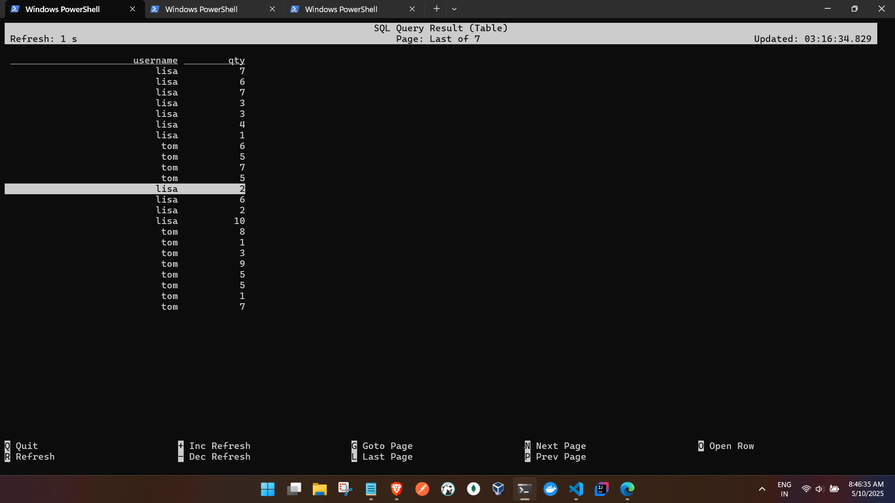

1. Flatten the nested json Demo

- Flink SQL
```
PS C:\Users\ashfa> docker exec -it docker-jobmanager-1 ./bin/sql-client.sh
WARNING: Unknown module: jdk.compiler specified to --add-exports


                                   ▒▓██▓██▒
                               ▓████▒▒█▓▒▓███▓▒
                            ▓███▓░░        ▒▒▒▓██▒  ▒
                          ░██▒   ▒▒▓▓█▓▓▒░      ▒████
                          ██▒         ░▒▓███▒    ▒█▒█▒
                            ░▓█            ███   ▓░▒██
                              ▓█       ▒▒▒▒▒▓██▓░▒░▓▓█
                            █░ █   ▒▒░       ███▓▓█ ▒█▒▒▒
                            ████░   ▒▓█▓      ██▒▒▒ ▓███▒
                         ░▒█▓▓██       ▓█▒    ▓█▒▓██▓ ░█░
                   ▓░▒▓████▒ ██         ▒█    █▓░▒█▒░▒█▒
                  ███▓░██▓  ▓█           █   █▓ ▒▓█▓▓█▒
                ░██▓  ░█░            █  █▒ ▒█████▓▒ ██▓░▒
               ███░ ░ █░          ▓ ░█ █████▒░░    ░█░▓  ▓░
              ██▓█ ▒▒▓▒          ▓███████▓░       ▒█▒ ▒▓ ▓██▓
           ▒██▓ ▓█ █▓█       ░▒█████▓▓▒░         ██▒▒  █ ▒  ▓█▒
           ▓█▓  ▓█ ██▓ ░▓▓▓▓▓▓▓▒              ▒██▓           ░█▒
           ▓█    █ ▓███▓▒░              ░▓▓▓███▓          ░▒░ ▓█
           ██▓    ██▒    ░▒▓▓███▓▓▓▓▓██████▓▒            ▓███  █
          ▓███▒ ███   ░▓▓▒░░   ░▓████▓░                  ░▒▓▒  █▓
          █▓▒▒▓▓██  ░▒▒░░░▒▒▒▒▓██▓░                            █▓
          ██ ▓░▒█   ▓▓▓▓▒░░  ▒█▓       ▒▓▓██▓    ▓▒          ▒▒▓
          ▓█▓ ▓▒█  █▓░  ░▒▓▓██▒            ░▓█▒   ▒▒▒░▒▒▓█████▒
           ██░ ▓█▒█▒  ▒▓▓▒  ▓█                █░      ░░░░   ░█▒
           ▓█   ▒█▓   ░     █░                ▒█              █▓
            █▓   ██         █░                 ▓▓        ▒█▓▓▓▒█░
             █▓ ░▓██░       ▓▒                  ▓█▓▒░░░▒▓█░    ▒█
              ██   ▓█▓░      ▒                    ░▒█▒██▒      ▓▓
               ▓█▒   ▒█▓▒░                         ▒▒ █▒█▓▒▒░░▒██
                ░██▒    ▒▓▓▒                     ▓██▓▒█▒ ░▓▓▓▓▒█▓
                  ░▓██▒                          ▓░  ▒█▓█  ░░▒▒▒
                      ▒▓▓▓▓▓▒▒▒▒▒▒▒▒▒▒▒▒▒▒▒▒▒▒▒▒▒▒▒░░▓▓  ▓░▒█░

    ______ _ _       _       _____  ____  _         _____ _ _            _  BETA
   |  ____| (_)     | |     / ____|/ __ \| |       / ____| (_)          | |
   | |__  | |_ _ __ | | __ | (___ | |  | | |      | |    | |_  ___ _ __ | |_
   |  __| | | | '_ \| |/ /  \___ \| |  | | |      | |    | | |/ _ \ '_ \| __|
   | |    | | | | | |   <   ____) | |__| | |____  | |____| | |  __/ | | | |_
   |_|    |_|_|_| |_|_|\_\ |_____/ \___\_\______|  \_____|_|_|\___|_| |_|\__|

        Welcome! Enter 'HELP;' to list all available commands. 'QUIT;' to exit.

Command history file path: /root/.flink-sql-history

Flink SQL> ADD JAR '/opt/flink/custom-lib/flink-sql-connector-kafka-3.3.0-1.19.jar';
[INFO] Execute statement succeed.

Flink SQL> CREATE TABLE user_orders (
  username STRING,
   id       STRING,
   orders   ARRAY<ROW<
                orderid STRING,
                orderName STRING,
                orderQty INT
              >>
 ) WITH (
   'connector'                  = 'kafka',
   'topic'                      = 'my-topic',
   'properties.bootstrap.servers' = 'kafka:9093',
   'format'                     = 'json',
   'scan.startup.mode'          = 'earliest-offset'
 );


[INFO] Execute statement succeed.

Flink SQL> CREATE VIEW exploded_orders AS
 SELECT
   username,
   orderQty AS qty
 FROM user_orders
 CROSS JOIN UNNEST(orders) AS T(orderid, orderName, orderQty);

[INFO] Execute statement succeed.

Flink SQL> CREATE VIEW user_totals AS
 SELECT
   username,
   SUM(qty) AS totalQty
 FROM exploded_orders
GROUP BY username;

[INFO] Execute statement succeed.


Flink SQL> SELECT
  username,
   orderQty AS qty
 FROM user_orders
 CROSS JOIN UNNEST(orders) AS T(orderid, orderName, orderQty);

[INFO] Result retrieval cancelled.

```


-- producer
```
C:\tmp\Apache-Flink\code\flink-sql\kafka-scripts>python NestJsonprod.py
Sent: {"username": "lisa", "id": "id50", "orders": [{"orderid": "khoo5l", "orderName": "laptop", "orderQty": 7}, {"orderid": "qwa1dm", "orderName": "watch", "orderQty": 6}, {"orderid": "u8qnod", "orderName": "headphones", "orderQty": 7}, {"orderid": "xaynqx", "orderName": "watch", "orderQty": 3}, {"orderid": "n0ttd5", "orderName": "tablet", "orderQty": 3}]}
Sent: {"username": "lisa", "id": "id55", "orders": [{"orderid": "tyz3jd", "orderName": "phone", "orderQty": 4}, {"orderid": "fhxrx9", "orderName": "headphones", "orderQty": 1}]}
Sent: {"username": "tom", "id": "id57", "orders": [{"orderid": "5305o5", "orderName": "laptop", "orderQty": 6}, {"orderid": "i370gd", "orderName": "phone", "orderQty": 5}, {"orderid": "2lqzg8", "orderName": "watch", "orderQty": 7}, {"orderid": "ww3izn", "orderName": "headphones", "orderQty": 5}]}
Sent: {"username": "lisa", "id": "id49", "orders": [{"orderid": "l7houo", "orderName": "phone", "orderQty": 2}, {"orderid": "lk5qgl", "orderName": "headphones", "orderQty": 6}, {"orderid": "6kd1ez", "orderName": "watch", "orderQty": 2}, {"orderid": "tqlrln", "orderName": "phone", "orderQty": 10}]}
Sent: {"username": "tom", "id": "id91", "orders": [{"orderid": "bsawjk", "orderName": "headphones", "orderQty": 8}, {"orderid": "nytc8c", "orderName": "watch", "orderQty": 1}, {"orderid": "fchxc7", "orderName": "tablet", "orderQty": 3}]}
Sent: {"username": "tom", "id": "id33", "orders": [{"orderid": "nhxlkf", "orderName": "watch", "orderQty": 9}, {"orderid": "1mjvch", "orderName": "laptop", "orderQty": 5}, {"orderid": "mw4be9", "orderName": "laptop", "orderQty": 5}, {"orderid": "1jmihw", "orderName": "tablet", "orderQty": 1}, {"orderid": "wdfh4t", "orderName": "watch", "orderQty": 7}]}

C:\tmp\Apache-Flink\code\flink-sql\kafka-scripts>

```


-OP



2.