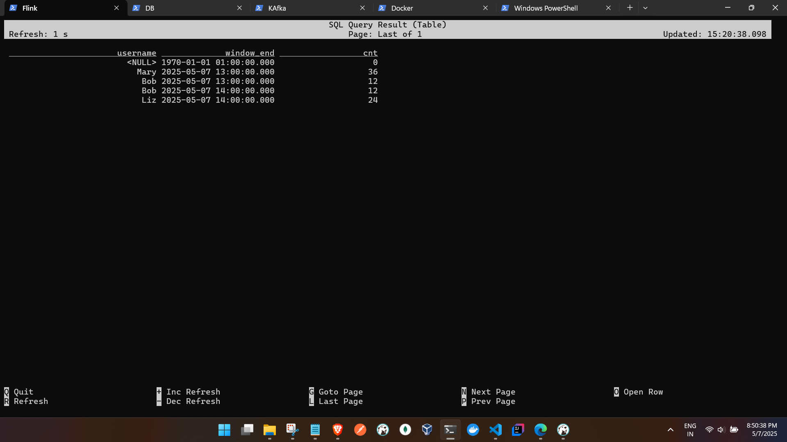
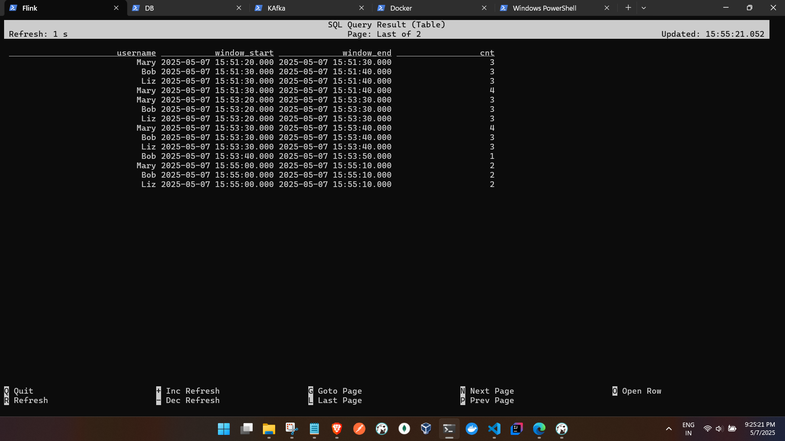
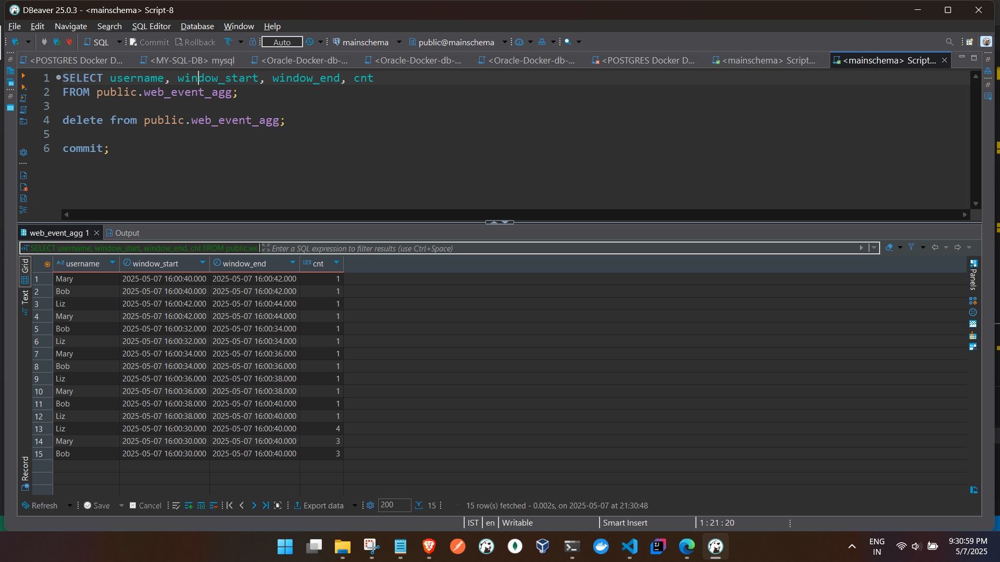

- Source  - > tumbling window -> Dynamic table  

- Producing the data from (../kafka-scripts/TWUserAction.py)

- 1 hour window 

- source 
```

Flink SQL> CREATE TABLE kafka_web_events_q (
>   username STRING,
>   event_time TIMESTAMP(3),
>   page_url STRING,
>   WATERMARK FOR event_time AS event_time
> ) WITH (
>   'connector' = 'kafka',
>   'topic' = 'user-topic',
>   'properties.bootstrap.servers' = 'kafka:9093',
>   'properties.group.id' = 'flink-web-group',
>   'scan.startup.mode' = 'earliest-offset',
>   'format' = 'json',
>   'json.timestamp-format.standard' = 'ISO-8601',
>   'json.ignore-parse-errors' = 'true'
> );
[INFO] Execute statement succeed.


Flink SQL> SELECT
>   username,
>   TUMBLE_END(event_time, INTERVAL '1' HOUR) AS window_end,
>   COUNT(page_url) AS cnt
> FROM kafka_web_events_q
> GROUP BY
>   username,
>   TUMBLE(event_time, INTERVAL '1' HOUR);
[INFO] Result retrieval cancelled.


```

OP




#### Kafka -> Tumbling Window -> Dynamic Table 

- 10 seconds window
```

Source 

CREATE TABLE kafka_web_events_q (
  username STRING,
  event_time TIMESTAMP(3),  
  page_url STRING,
  WATERMARK FOR event_time AS event_time 
) WITH (
  'connector' = 'kafka',
  'topic' = 'user-topic',
  'properties.bootstrap.servers' = 'kafka:9093',
  'properties.group.id' = 'flink-web-group',
  'scan.startup.mode' = 'earliest-offset',
  'format' = 'json',
  'json.timestamp-format.standard' = 'ISO-8601', 
  'json.ignore-parse-errors' = 'true'
);


Dynamic table


Flink SQL> SELECT
>   username,
>   TUMBLE_START(event_time, INTERVAL '10' SECOND) AS window_start,
>   TUMBLE_END(event_time, INTERVAL '10' SECOND) AS window_end,
>   COUNT(page_url) AS cnt
> FROM kafka_web_events_q
> GROUP BY
>   username,
>   TUMBLE(event_time, INTERVAL '10' SECOND);
>
[INFO] Result retrieval cancelled.


```

OP




#### Kafka -> Tumbling Window -> DB Table 


```

source 
CREATE TABLE kafka_web_events_q (
  username STRING,
  event_time TIMESTAMP(3),  
  page_url STRING,
  WATERMARK FOR event_time AS event_time 
) WITH (
  'connector' = 'kafka',
  'topic' = 'user-topic',
  'properties.bootstrap.servers' = 'kafka:9093',
  'properties.group.id' = 'flink-web-group',
  'scan.startup.mode' = 'earliest-offset',
  'format' = 'json',
  'json.timestamp-format.standard' = 'ISO-8601', 
  'json.ignore-parse-errors' = 'true'
);


DB

mainschema=# CREATE TABLE web_event_agg (
  username TEXT,
  window_start TIMESTAMP(3),
  window_end TIMESTAMP(3),
  cnt INTEGER
);


sink 

Flink SQL> CREATE TABLE web_event_agg (
>   username STRING,
>   window_start TIMESTAMP,
>   window_end TIMESTAMP,
>   cnt BIGINT
> ) WITH (
>   'connector' = 'jdbc',
>   'url' = 'jdbc:postgresql://postgres:5432/mainschema',
>   'table-name' = 'web_event_agg',
>   'username' = 'postgres',
>   'password' = 'admin',
>   'driver' = 'org.postgresql.Driver'
> );
>
[INFO] Execute statement succeed.


job statement with 2 secs window

Flink SQL> INSERT INTO web_event_agg
> SELECT
>   username,
>   TUMBLE_START(event_time, INTERVAL '2' SECOND) AS window_start,
>   TUMBLE_END(event_time, INTERVAL '2' SECOND) AS window_end,
>   COUNT(page_url) AS cnt
> FROM kafka_web_events_q
> GROUP BY
>   username,
>   TUMBLE(event_time, INTERVAL '2' SECOND);
>
[INFO] Submitting SQL update statement to the cluster...
[INFO] SQL update statement has been successfully submitted to the cluster:
Job ID: 66440f38665d0d188278c64153a212a5


for 10 secs 

 INSERT INTO web_event_agg

 SELECT
username,
  TUMBLE_START(event_time, INTERVAL '10' SECOND) AS window_start,
TUMBLE_END(event_time, INTERVAL '10' SECOND) AS window_end,
 COUNT(page_url) AS cnt
FROM kafka_web_events_q
GROUP BY
 username,
TUMBLE(event_time, INTERVAL '10' SECOND);

```

DB OP




users total action  performed in each window time stored in DB 