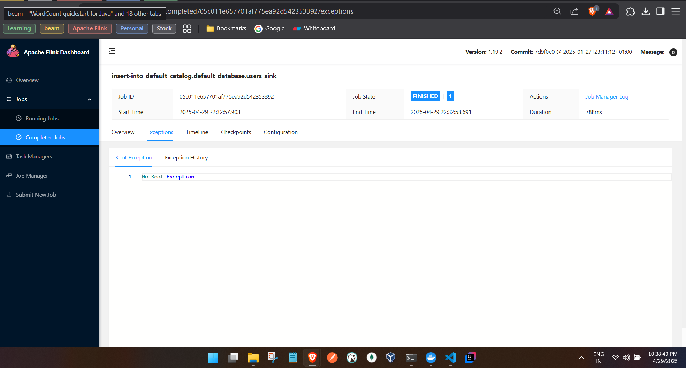

```
C:\tmp\flink-sql\docker>docker-compose up -d


 ✔ Network docker_default          Created                                                                                                                    0.0s 
 ✔ Container docker-postgres-1     Started                                                                                                                    0.6s 
 ✔ Container docker-zookeeper-1    Started                                                                                                                    0.5s 
 ✔ Container docker-kafka-1        Started                                                                                                                    0.6s 
 ✔ Container docker-jobmanager-1   Started                                                                                                                    0.7s 
 ✔ Container docker-taskmanager-1  Started                                                                                                                    1.1s 
 ✔ Container docker-taskmanager-2  Started                                                                                                                    0.8s
```


```

(base) PS C:\Users\ashfa> docker exec -it docker-jobmanager-1 ./bin/sql-client.sh

WARNING: Unknown module: jdk.compiler specified to --add-exports

                                   ▒▓██▓██▒
                               ▓████▒▒█▓▒▓███▓▒
                            ▓███▓░░        ▒▒▒▓██▒  ▒
                          ░██▒   ▒▒▓▓█▓▓▒░      ▒████
                          ██▒         ░▒▓███▒    ▒█▒█▒
                            ░▓█            ███   ▓░▒██
                              ▓█       ▒▒▒▒▒▓██▓░▒░▓▓█
                            █░ █   ▒▒░       ███▓▓█ ▒█▒▒▒
                            ████░   ▒▓█▓      ██▒▒▒ ▓███▒
                         ░▒█▓▓██       ▓█▒    ▓█▒▓██▓ ░█░
                   ▓░▒▓████▒ ██         ▒█    █▓░▒█▒░▒█▒
                  ███▓░██▓  ▓█           █   █▓ ▒▓█▓▓█▒
                ░██▓  ░█░            █  █▒ ▒█████▓▒ ██▓░▒
               ███░ ░ █░          ▓ ░█ █████▒░░    ░█░▓  ▓░
              ██▓█ ▒▒▓▒          ▓███████▓░       ▒█▒ ▒▓ ▓██▓
           ▒██▓ ▓█ █▓█       ░▒█████▓▓▒░         ██▒▒  █ ▒  ▓█▒
           ▓█▓  ▓█ ██▓ ░▓▓▓▓▓▓▓▒              ▒██▓           ░█▒
           ▓█    █ ▓███▓▒░              ░▓▓▓███▓          ░▒░ ▓█
           ██▓    ██▒    ░▒▓▓███▓▓▓▓▓██████▓▒            ▓███  █
          ▓███▒ ███   ░▓▓▒░░   ░▓████▓░                  ░▒▓▒  █▓
          █▓▒▒▓▓██  ░▒▒░░░▒▒▒▒▓██▓░                            █▓
          ██ ▓░▒█   ▓▓▓▓▒░░  ▒█▓       ▒▓▓██▓    ▓▒          ▒▒▓
          ▓█▓ ▓▒█  █▓░  ░▒▓▓██▒            ░▓█▒   ▒▒▒░▒▒▓█████▒
           ██░ ▓█▒█▒  ▒▓▓▒  ▓█                █░      ░░░░   ░█▒
           ▓█   ▒█▓   ░     █░                ▒█              █▓
            █▓   ██         █░                 ▓▓        ▒█▓▓▓▒█░
             █▓ ░▓██░       ▓▒                  ▓█▓▒░░░▒▓█░    ▒█
              ██   ▓█▓░      ▒                    ░▒█▒██▒      ▓▓
               ▓█▒   ▒█▓▒░                         ▒▒ █▒█▓▒▒░░▒██
                ░██▒    ▒▓▓▒                     ▓██▓▒█▒ ░▓▓▓▓▒█▓
                  ░▓██▒                          ▓░  ▒█▓█  ░░▒▒▒
                      ▒▓▓▓▓▓▒▒▒▒▒▒▒▒▒▒▒▒▒▒▒▒▒▒▒▒▒▒▒░░▓▓  ▓░▒█░

    ______ _ _       _       _____  ____  _         _____ _ _            _  BETA
   |  ____| (_)     | |     / ____|/ __ \| |       / ____| (_)          | |
   | |__  | |_ _ __ | | __ | (___ | |  | | |      | |    | |_  ___ _ __ | |_
   |  __| | | | '_ \| |/ /  \___ \| |  | | |      | |    | | |/ _ \ '_ \| __|
   | |    | | | | | |   <   ____) | |__| | |____  | |____| | |  __/ | | | |_
   |_|    |_|_|_| |_|_|\_\ |_____/ \___\_\______|  \_____|_|_|\___|_| |_|\__|

        Welcome! Enter 'HELP;' to list all available commands. 'QUIT;' to exit.

Command history file path: /root/.flink-sql-history

Flink SQL> ADD JAR '/opt/flink/custom-lib/flink-sql-connector-kafka-3.3.0-1.19.jar';
[INFO] Execute statement succeed.

Flink SQL> ADD JAR '/opt/flink/custom-lib/flink-connector-jdbc-3.3.0-1.19.jar';
[INFO] Execute statement succeed.

Flink SQL> ADD JAR '/opt/flink/custom-lib/postgresql-42.6.0.jar';
[INFO] Execute statement succeed.


- we have to add jdbc, postgres and kafka connector (for kafka jobs) jar files to the flink lib so we copied to a custom folder and pasted to lib in container.

- create a sink and map to jdbc connector 

Flink SQL> CREATE TABLE users_sink (
>   name STRING,
>   email STRING
> ) WITH (
>   'connector' = 'jdbc',
>   'url' = 'jdbc:postgresql://postgres:5432/mainschema',
>   'table-name' = 'users',
>   'username' = 'postgres',
>   'password' = 'admin',
>   'driver' = 'org.postgresql.Driver'
> );
>
[INFO] Execute statement succeed.


-- add data to sink

Flink SQL> INSERT INTO users_sink
> SELECT * FROM (
>   VALUES
>     ('Ashfaq', 'ashfaq@example.com'),
>     ('John Doe', 'john@example.com'),
>     ('Alice', 'alice@example.com')
> ) AS t(name, email);
>
[INFO] Submitting SQL update statement to the cluster...
[INFO] SQL update statement has been successfully submitted to the cluster:
Job ID: 05c011e657701af775ea92d542353392


Flink SQL>
```


- Flink UI 




```
DB

PS C:\Users\ashfa> docker exec -it docker-postgres-1 psql -U postgres
psql (17.0 (Debian 17.0-1.pgdg120+1))
Type "help" for help.
postgres=# \l
                                                     List of databases
    Name    |  Owner   | Encoding | Locale Provider |  Collate   |   Ctype    | Locale | ICU Rules |   Access privileges
------------+----------+----------+-----------------+------------+------------+--------+-----------+-----------------------
 mainschema | postgres | UTF8     | libc            | en_US.utf8 | en_US.utf8 |        |           |
 postgres   | postgres | UTF8     | libc            | en_US.utf8 | en_US.utf8 |        |           |
 template0  | postgres | UTF8     | libc            | en_US.utf8 | en_US.utf8 |        |           | =c/postgres          +
            |          |          |                 |            |            |        |           | postgres=CTc/postgres
 template1  | postgres | UTF8     | libc            | en_US.utf8 | en_US.utf8 |        |           | =c/postgres          +
            |          |          |                 |            |            |        |           | postgres=CTc/postgres
(4 rows)


postgres=# \c mainschema
You are now connected to database "mainschema" as user "postgres".
mainschema=# \dt;
         List of relations
 Schema | Name  | Type  |  Owner
--------+-------+-------+----------
 public | users | table | postgres
(1 row)

mainschema=# select * from users;
   name   |       email
----------+--------------------
 Ashfaq   | ashfaq@example.com
 John Doe | john@example.com
 Alice    | alice@example.com
(3 rows)

mainschema=#