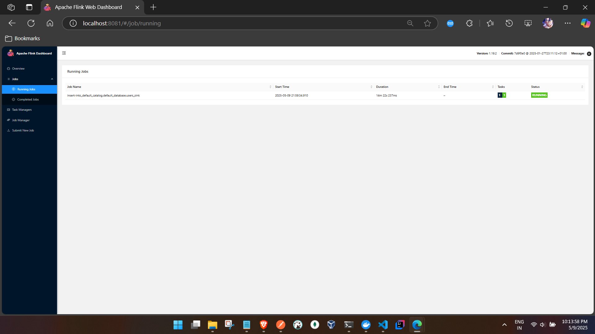

1.custom lib to lib jar paste

```
JM 

PS C:\Users\ashfa>  docker exec -it docker-jobmanager-1 /bin/bash
root@ba5c1e4d4c87:/opt/flink# cp /opt/flink/custom-lib/*.jar /opt/flink/lib/
root@ba5c1e4d4c87:/opt/flink# ls
bin  conf  custom-lib  examples  lib  LICENSE  licenses  log  NOTICE  opt  plugins  README.txt
root@ba5c1e4d4c87:/opt/flink# ls lib
flink-cep-1.19.2.jar                  flink-dist-1.19.2.jar                       flink-sql-gateway-api-1.19.2.jar       log4j-1.2-api-2.17.1.jar
flink-connector-files-1.19.2.jar      flink-json-1.19.2.jar                       flink-table-api-java-uber-1.19.2.jar   log4j-api-2.17.1.jar
flink-connector-jdbc-3.3.0-1.19.jar   flink-scala_2.12-1.19.2.jar                 flink-table-planner-loader-1.19.2.jar  log4j-core-2.17.1.jar
flink-connector-kafka-3.3.0-1.19.jar  flink-sql-connector-kafka-3.3.0-1.19.jar    flink-table-runtime-1.19.2.jar         log4j-slf4j-impl-2.17.1.jar
flink-csv-1.19.2.jar                  flink-sql-connector-mongodb-1.2.0-1.19.jar  kafka-clients-3.4.0.jar                postgresql-42.6.0.jar
root@ba5c1e4d4c87:/opt/flink#

TM 1

PS C:\Users\ashfa>  docker exec -it  docker-taskmanager-1 /bin/bash
root@1348bfe41022:/opt/flink# cp /opt/flink/custom-lib/*.jar /opt/flink/lib/
root@1348bfe41022:/opt/flink# ls lib
flink-cep-1.19.2.jar                  flink-dist-1.19.2.jar                       flink-sql-gateway-api-1.19.2.jar       log4j-1.2-api-2.17.1.jar
flink-connector-files-1.19.2.jar      flink-json-1.19.2.jar                       flink-table-api-java-uber-1.19.2.jar   log4j-api-2.17.1.jar
flink-connector-jdbc-3.3.0-1.19.jar   flink-scala_2.12-1.19.2.jar                 flink-table-planner-loader-1.19.2.jar  log4j-core-2.17.1.jar
flink-connector-kafka-3.3.0-1.19.jar  flink-sql-connector-kafka-3.3.0-1.19.jar    flink-table-runtime-1.19.2.jar         log4j-slf4j-impl-2.17.1.jar
flink-csv-1.19.2.jar                  flink-sql-connector-mongodb-1.2.0-1.19.jar  kafka-clients-3.4.0.jar                postgresql-42.6.0.jar
root@1348bfe41022:/opt/flink#


TM2 
PS C:\Users\ashfa> docker exec -it  docker-taskmanager-2 /bin/bash
root@5f040271727d:/opt/flink#  cp /opt/flink/custom-lib/*.jar /opt/flink/lib/
root@5f040271727d:/opt/flink# ls lib
flink-cep-1.19.2.jar                  flink-dist-1.19.2.jar                       flink-sql-gateway-api-1.19.2.jar       log4j-1.2-api-2.17.1.jar
flink-connector-files-1.19.2.jar      flink-json-1.19.2.jar                       flink-table-api-java-uber-1.19.2.jar   log4j-api-2.17.1.jar
flink-connector-jdbc-3.3.0-1.19.jar   flink-scala_2.12-1.19.2.jar                 flink-table-planner-loader-1.19.2.jar  log4j-core-2.17.1.jar
flink-connector-kafka-3.3.0-1.19.jar  flink-sql-connector-kafka-3.3.0-1.19.jar    flink-table-runtime-1.19.2.jar         log4j-slf4j-impl-2.17.1.jar
flink-csv-1.19.2.jar                  flink-sql-connector-mongodb-1.2.0-1.19.jar  kafka-clients-3.4.0.jar                postgresql-42.6.0.jar
root@5f040271727d:/opt/flink#

```


2. cp the kafka connector to the plugins folder and restart the containers
```

PS C:\tmp\Apache-Flink\code\flink-sql\docker\jars> docker exec -it docker-jobmanager-1 ls -la /opt/flink/lib/flink-connector-kafka-3.3.0-1.19.jar
-rwxr-xr-x 1 root root 464075 May  9 15:30 /opt/flink/lib/flink-connector-kafka-3.3.0-1.19.jar


PS C:\tmp\Apache-Flink\code\flink-sql\docker\jars> docker exec -it docker-jobmanager-1 cp /opt/flink/lib/flink-connector-kafka-3.3.0-1.19.jar /opt/flink/plugins/

PS C:\tmp\Apache-Flink\code\flink-sql\docker\jars> docker exec -it docker-taskmanager-1 cp /opt/flink/lib/flink-connector-kafka-3.3.0-1.19.jar /opt/flink/plugins/

PS C:\tmp\Apache-Flink\code\flink-sql\docker\jars> docker exec -it docker-taskmanager-2 cp /opt/flink/lib/flink-connector-kafka-3.3.0-1.19.jar /opt/flink/plugins/


- restart

PS C:\tmp\Apache-Flink\code\flink-sql\docker\jars> docker restart docker-jobmanager-1
docker-jobmanager-1
PS C:\tmp\Apache-Flink\code\flink-sql\docker\jars> docker restart docker-taskmanager-1
docker-taskmanager-1
PS C:\tmp\Apache-Flink\code\flink-sql\docker\jars> docker restart docker-taskmanager-2
docker-taskmanager-2
PS C:\tmp\Apache-Flink\code\flink-sql\docker\jars>


```

3. SQL gateway:

```

PS C:\Users\ashfa>  docker exec -it docker-jobmanager-1 /bin/bash
root@ba5c1e4d4c87:/opt/flink# ./bin/sql-gateway.sh start-foreground -Dsql-gateway.endpoint.rest.address=0.0.0.0 -Dsql-gateway.endpoint.rest.port=8083
Starting sql-gateway as a console application on host ba5c1e4d4c87.
WARNING: Unknown module: jdk.compiler specified to --add-exports
WARNING: Unknown module: jdk.compiler specified to --add-exports
WARNING: Unknown module: jdk.compiler specified to --add-exports
WARNING: Unknown module: jdk.compiler specified to --add-exports
WARNING: Unknown module: jdk.compiler specified to --add-exports
2025-05-09 16:27:57,370 INFO  org.apache.flink.table.gateway.SqlGateway                    [] - --------------------------------------------------------------------------------
2025-05-09 16:27:57,371 INFO  org.apache.flink.table.gateway.SqlGateway                    [] -  Starting SqlGateway (Version: 1.19.2, Scala: 2.12, Rev:7d9f0e0, Date:2025-01-27T23:11:12+01:00)
2025-05-09 16:27:57,372 INFO  org.apache.flink.table.gateway.SqlGateway                    [] -  OS current user: root
2025-05-09 16:27:57,372 INFO  org.apache.flink.table.gateway.SqlGateway                    [] -  Current Hadoop/Kerberos user: <no hadoop dependency found>
2025-05-09 16:27:57,372 INFO  org.apache.flink.table.gateway.SqlGateway                    [] -  JVM: OpenJDK 64-Bit Server VM - Eclipse Adoptium - 17/17.0.14+7
2025-05-09 16:27:57,372 INFO  org.apache.flink.table.gateway.SqlGateway                    [] -  Arch: amd64
2025-05-09 16:27:57,372 INFO  org.apache.flink.table.gateway.SqlGateway                    [] -  Maximum heap size: 1954 MiBytes
2025-05-09 16:27:57,373 INFO  org.apache.flink.table.gateway.SqlGateway                    [] -  JAVA_HOME: /opt/java/openjdk
2025-05-09 16:27:57,373 INFO  org.apache.flink.table.gateway.SqlGateway                    [] -  No Hadoop Dependency available
2025-05-09 16:27:57,373 INFO  org.apache.flink.table.gateway.SqlGateway                    [] -  JVM Options:
2025-05-09 16:27:57,373 INFO  org.apache.flink.table.gateway.SqlGateway                    [] -     -XX:+IgnoreUnrecognizedVMOptions
2025-05-09 16:27:57,373 INFO  org.apache.flink.table.gateway.SqlGateway                    [] -     --add-exports=java.base/sun.net.util=ALL-UNNAMED
2025-05-09 16:27:57,374 INFO  org.apache.flink.table.gateway.SqlGateway                    [] -     --add-exports=java.rmi/sun.rmi.registry=ALL-UNNAMED
2025-05-09 16:27:57,374 INFO  org.apache.flink.table.gateway.SqlGateway                    [] -     --add-exports=jdk.compiler/com.sun.tools.javac.api=ALL-UNNAMED
2025-05-09 16:27:57,374 INFO  org.apache.flink.table.gateway.SqlGateway                    [] -     --add-exports=jdk.compiler/com.sun.tools.javac.file=ALL-UNNAMED
2025-05-09 16:27:57,374 INFO  org.apache.flink.table.gateway.SqlGateway                    [] -     --add-exports=jdk.compiler/com.sun.tools.javac.parser=ALL-UNNAMED
2025-05-09 16:27:57,374 INFO  org.apache.flink.table.gateway.SqlGateway                    [] -     --add-exports=jdk.compiler/com.sun.tools.javac.tree=ALL-UNNAMED
2025-05-09 16:27:57,374 INFO  org.apache.flink.table.gateway.SqlGateway                    [] -     --add-exports=jdk.compiler/com.sun.tools.javac.util=ALL-UNNAMED
2025-05-09 16:27:57,374 INFO  org.apache.flink.table.gateway.SqlGateway                    [] -     --add-exports=java.security.jgss/sun.security.krb5=ALL-UNNAMED
2025-05-09 16:27:57,374 INFO  org.apache.flink.table.gateway.SqlGateway                    [] -     --add-opens=java.base/java.lang=ALL-UNNAMED
2025-05-09 16:27:57,375 INFO  org.apache.flink.table.gateway.SqlGateway                    [] -     --add-opens=java.base/java.net=ALL-UNNAMED
2025-05-09 16:27:57,376 INFO  org.apache.flink.table.gateway.SqlGateway                    [] -     --add-opens=java.base/java.io=ALL-UNNAMED
2025-05-09 16:27:57,376 INFO  org.apache.flink.table.gateway.SqlGateway                    [] -     --add-opens=java.base/java.nio=ALL-UNNAMED
2025-05-09 16:27:57,376 INFO  org.apache.flink.table.gateway.SqlGateway                    [] -     --add-opens=java.base/sun.nio.ch=ALL-UNNAMED
2025-05-09 16:27:57,376 INFO  org.apache.flink.table.gateway.SqlGateway                    [] -     --add-opens=java.base/java.lang.reflect=ALL-UNNAMED
2025-05-09 16:27:57,376 INFO  org.apache.flink.table.gateway.SqlGateway                    [] -     --add-opens=java.base/java.text=ALL-UNNAMED
2025-05-09 16:27:57,377 INFO  org.apache.flink.table.gateway.SqlGateway                    [] -     --add-opens=java.base/java.time=ALL-UNNAMED
2025-05-09 16:27:57,377 INFO  org.apache.flink.table.gateway.SqlGateway                    [] -     --add-opens=java.base/java.util=ALL-UNNAMED
2025-05-09 16:27:57,377 INFO  org.apache.flink.table.gateway.SqlGateway                    [] -     --add-opens=java.base/java.util.concurrent=ALL-UNNAMED
2025-05-09 16:27:57,377 INFO  org.apache.flink.table.gateway.SqlGateway                    [] -     --add-opens=java.base/java.util.concurrent.atomic=ALL-UNNAMED
2025-05-09 16:27:57,377 INFO  org.apache.flink.table.gateway.SqlGateway                    [] -     --add-opens=java.base/java.util.concurrent.locks=ALL-UNNAMED
2025-05-09 16:27:57,378 INFO  org.apache.flink.table.gateway.SqlGateway                    [] -     -Dlog.file=/opt/flink/log/flink--sql-gateway-0-ba5c1e4d4c87.log
2025-05-09 16:27:57,378 INFO  org.apache.flink.table.gateway.SqlGateway                    [] -     -Dlog4j.configuration=file:/opt/flink/conf/log4j-console.properties
2025-05-09 16:27:57,378 INFO  org.apache.flink.table.gateway.SqlGateway                    [] -     -Dlog4j.configurationFile=file:/opt/flink/conf/log4j-console.properties
2025-05-09 16:27:57,378 INFO  org.apache.flink.table.gateway.SqlGateway                    [] -     -Dlogback.configurationFile=file:/opt/flink/conf/logback-console.xml
2025-05-09 16:27:57,378 INFO  org.apache.flink.table.gateway.SqlGateway                    [] -  Program Arguments:
2025-05-09 16:27:57,380 INFO  org.apache.flink.table.gateway.SqlGateway                    [] -     -Dsql-gateway.endpoint.rest.address=0.0.0.0
2025-05-09 16:27:57,380 INFO  org.apache.flink.table.gateway.SqlGateway                    [] -     -Dsql-gateway.endpoint.rest.port=8083
2025-05-09 16:27:57,380 INFO  org.apache.flink.table.gateway.SqlGateway                    [] -  Classpath: /opt/flink/lib/flink-cep-1.19.2.jar:/opt/flink/lib/flink-connector-files-1.19.2.jar:/opt/flink/lib/flink-connector-jdbc-3.3.0-1.19.jar:/opt/flink/lib/flink-connector-kafka-3.3.0-1.19.jar:/opt/flink/lib/flink-csv-1.19.2.jar:/opt/flink/lib/flink-json-1.19.2.jar:/opt/flink/lib/flink-scala_2.12-1.19.2.jar:/opt/flink/lib/flink-sql-connector-kafka-3.3.0-1.19.jar:/opt/flink/lib/flink-sql-connector-mongodb-1.2.0-1.19.jar:/opt/flink/lib/flink-sql-gateway-api-1.19.2.jar:/opt/flink/lib/flink-table-api-java-uber-1.19.2.jar:/opt/flink/lib/flink-table-planner-loader-1.19.2.jar:/opt/flink/lib/flink-table-runtime-1.19.2.jar:/opt/flink/lib/kafka-clients-3.4.0.jar:/opt/flink/lib/log4j-1.2-api-2.17.1.jar:/opt/flink/lib/log4j-api-2.17.1.jar:/opt/flink/lib/log4j-core-2.17.1.jar:/opt/flink/lib/log4j-slf4j-impl-2.17.1.jar:/opt/flink/lib/postgresql-42.6.0.jar:/opt/flink/lib/flink-dist-1.19.2.jar:/opt/flink/opt/flink-sql-gateway-1.19.2.jar:/opt/flink/opt/flink-python-1.19.2.jar:::
2025-05-09 16:27:57,380 INFO  org.apache.flink.table.gateway.SqlGateway                    [] - --------------------------------------------------------------------------------
2025-05-09 16:27:57,381 INFO  org.apache.flink.table.gateway.SqlGateway                    [] - Registered UNIX signal handlers for [TERM, HUP, INT]
2025-05-09 16:27:57,390 INFO  org.apache.flink.configuration.GlobalConfiguration           [] - Using standard YAML parser to load flink configuration file from /opt/flink/conf/config.yaml.
2025-05-09 16:27:57,421 INFO  org.apache.flink.configuration.GlobalConfiguration           [] - Loading configuration property: blob.server.port, 6124
2025-05-09 16:27:57,422 INFO  org.apache.flink.configuration.GlobalConfiguration           [] - Loading configuration property: taskmanager.memory.process.size, 1728m
2025-05-09 16:27:57,422 INFO  org.apache.flink.configuration.GlobalConfiguration           [] - Loading configuration property: taskmanager.bind-host, 0.0.0.0
2025-05-09 16:27:57,422 INFO  org.apache.flink.configuration.GlobalConfiguration           [] - Loading configuration property: jobmanager.execution.failover-strategy, region
2025-05-09 16:27:57,422 INFO  org.apache.flink.configuration.GlobalConfiguration           [] - Loading configuration property: jobmanager.rpc.address, jobmanager
2025-05-09 16:27:57,422 INFO  org.apache.flink.configuration.GlobalConfiguration           [] - Loading configuration property: jobmanager.memory.process.size, 1600m
2025-05-09 16:27:57,423 INFO  org.apache.flink.configuration.GlobalConfiguration           [] - Loading configuration property: jobmanager.rpc.port, 6123
2025-05-09 16:27:57,423 INFO  org.apache.flink.configuration.GlobalConfiguration           [] - Loading configuration property: query.server.port, 6125
2025-05-09 16:27:57,423 INFO  org.apache.flink.configuration.GlobalConfiguration           [] - Loading configuration property: rest.bind-address, 0.0.0.0
2025-05-09 16:27:57,423 INFO  org.apache.flink.configuration.GlobalConfiguration           [] - Loading configuration property: jobmanager.bind-host, 0.0.0.0
2025-05-09 16:27:57,424 INFO  org.apache.flink.configuration.GlobalConfiguration           [] - Loading configuration property: parallelism.default, 1
2025-05-09 16:27:57,424 INFO  org.apache.flink.configuration.GlobalConfiguration           [] - Loading configuration property: taskmanager.numberOfTaskSlots, 1
2025-05-09 16:27:57,424 INFO  org.apache.flink.configuration.GlobalConfiguration           [] - Loading configuration property: rest.address, 0.0.0.0
2025-05-09 16:27:57,424 INFO  org.apache.flink.configuration.GlobalConfiguration           [] - Loading configuration property: env.java.opts.all, --add-exports=java.base/sun.net.util=ALL-UNNAMED --add-exports=java.rmi/sun.rmi.registry=ALL-UNNAMED --add-exports=jdk.compiler/com.sun.tools.javac.api=ALL-UNNAMED --add-exports=jdk.compiler/com.sun.tools.javac.file=ALL-UNNAMED --add-exports=jdk.compiler/com.sun.tools.javac.parser=ALL-UNNAMED --add-exports=jdk.compiler/com.sun.tools.javac.tree=ALL-UNNAMED --add-exports=jdk.compiler/com.sun.tools.javac.util=ALL-UNNAMED --add-exports=java.security.jgss/sun.security.krb5=ALL-UNNAMED --add-opens=java.base/java.lang=ALL-UNNAMED --add-opens=java.base/java.net=ALL-UNNAMED --add-opens=java.base/java.io=ALL-UNNAMED --add-opens=java.base/java.nio=ALL-UNNAMED --add-opens=java.base/sun.nio.ch=ALL-UNNAMED --add-opens=java.base/java.lang.reflect=ALL-UNNAMED --add-opens=java.base/java.text=ALL-UNNAMED --add-opens=java.base/java.time=ALL-UNNAMED --add-opens=java.base/java.util=ALL-UNNAMED --add-opens=java.base/java.util.concurrent=ALL-UNNAMED --add-opens=java.base/java.util.concurrent.atomic=ALL-UNNAMED --add-opens=java.base/java.util.concurrent.locks=ALL-UNNAMED
2025-05-09 16:27:57,447 INFO  org.apache.flink.client.cli.CliFrontend                      [] - Loading FallbackYarnSessionCli
2025-05-09 16:27:57,464 INFO  org.apache.flink.core.fs.FileSystem                          [] - Hadoop is not in the classpath/dependencies. The extended set of supported File Systems via Hadoop is not available.
2025-05-09 16:27:57,475 INFO  org.apache.flink.core.plugin.DefaultPluginManager            [] - Plugin loader with ID not found, creating it: external-resource-gpu
2025-05-09 16:27:57,480 INFO  org.apache.flink.core.plugin.DefaultPluginManager            [] - Plugin loader with ID not found, creating it: metrics-prometheus
2025-05-09 16:27:57,480 INFO  org.apache.flink.core.plugin.DefaultPluginManager            [] - Plugin loader with ID not found, creating it: metrics-datadog
2025-05-09 16:27:57,480 INFO  org.apache.flink.core.plugin.DefaultPluginManager            [] - Plugin loader with ID not found, creating it: metrics-graphite
2025-05-09 16:27:57,481 INFO  org.apache.flink.core.plugin.DefaultPluginManager            [] - Plugin loader with ID not found, creating it: metrics-jmx
2025-05-09 16:27:57,481 INFO  org.apache.flink.core.plugin.DefaultPluginManager            [] - Plugin loader with ID not found, creating it: metrics-influx
2025-05-09 16:27:57,482 INFO  org.apache.flink.core.plugin.DefaultPluginManager            [] - Plugin loader with ID not found, creating it: metrics-slf4j
2025-05-09 16:27:57,482 INFO  org.apache.flink.core.plugin.DefaultPluginManager            [] - Plugin loader with ID not found, creating it: metrics-statsd
2025-05-09 16:27:57,504 INFO  org.apache.flink.table.gateway.service.context.DefaultContext [] - Execution config: {execution.savepoint.ignore-unclaimed-state=false, execution.attached=true, execution.savepoint-restore-mode=NO_CLAIM, execution.shutdown-on-attached-exit=false, pipeline.jars=[], pipeline.classpaths=[], execution.target=remote}
2025-05-09 16:27:57,507 INFO  org.apache.flink.table.gateway.api.utils.ThreadUtils         [] - Created thread pool sql-gateway-operation-pool with core size 5, max size 500 and keep alive time 300000ms.
2025-05-09 16:27:57,821 INFO  org.apache.flink.configuration.Configuration                 [] - Config uses fallback configuration key 'rest.port' instead of key 'rest.bind-port'
2025-05-09 16:27:57,835 INFO  org.apache.flink.table.gateway.rest.SqlGatewayRestEndpoint   [] - Upload directory /tmp/flink-web-upload does not exist.
2025-05-09 16:27:57,836 INFO  org.apache.flink.table.gateway.rest.SqlGatewayRestEndpoint   [] - Created directory /tmp/flink-web-upload for file uploads.
2025-05-09 16:27:57,837 INFO  org.apache.flink.table.gateway.rest.SqlGatewayRestEndpoint   [] - Starting rest endpoint.
2025-05-09 16:27:58,031 INFO  org.apache.flink.table.gateway.rest.SqlGatewayRestEndpoint   [] - Rest endpoint listening at 0.0.0.0:8083
2025-05-09 16:28:08,886 INFO  org.apache.flink.table.gateway.service.session.SessionManagerImpl [] - Session ac21ba76-2e03-4281-b595-30627a963e82 is opened, and the number of current sessions is 1.
2025-05-09 16:29:23,312 INFO  org.apache.flink.api.java.typeutils.TypeExtractor            [] - class org.apache.flink.sql.parser.ddl.SqlCreateCatalog does not contain a setter for field catalogName
2025-05-09 16:29:23,313 INFO  org.apache.flink.api.java.typeutils.TypeExtractor            [] - Class class org.apache.flink.sql.parser.ddl.SqlCreateCatalog cannot be used as a POJO type because not all fields are valid POJO fields, and must be processed as GenericType. Please read the Flink documentation on "Data Types & Serialization" for details of the effect on performance and schema evolution.
2025-05-09 16:29:23,314 INFO  org.apache.flink.api.java.typeutils.TypeExtractor            [] - class org.apache.flink.sql.parser.ddl.SqlCreateView does not contain a setter for field viewName
2025-05-09 16:29:23,314 INFO  org.apache.flink.api.java.typeutils.TypeExtractor            [] - Class class org.apache.flink.sql.parser.ddl.SqlCreateView cannot be used as a POJO type because not all fields are valid POJO fields, and must be processed as GenericType. Please read the Flink documentation on "Data Types & Serialization" for details of the effect on performance and schema evolution.
2025-05-09 16:29:23,315 INFO  org.apache.flink.api.java.typeutils.TypeExtractor            [] - class org.apache.flink.sql.parser.ddl.SqlAlterViewRename does not contain a getter for field newViewIdentifier
2025-05-09 16:29:23,315 INFO  org.apache.flink.api.java.typeutils.TypeExtractor            [] - class org.apache.flink.sql.parser.ddl.SqlAlterViewRename does not contain a setter for field newViewIdentifier
2025-05-09 16:29:23,315 INFO  org.apache.flink.api.java.typeutils.TypeExtractor            [] - Class class org.apache.flink.sql.parser.ddl.SqlAlterViewRename cannot be used as a POJO type because not all fields are valid POJO fields, and must be processed as GenericType. Please read the Flink documentation on "Data Types & Serialization" for details of the effect on performance and schema evolution.
2025-05-09 16:29:23,316 INFO  org.apache.flink.api.java.typeutils.TypeExtractor            [] - class org.apache.flink.sql.parser.ddl.SqlAlterViewProperties does not contain a setter for field propertyList
2025-05-09 16:29:23,316 INFO  org.apache.flink.api.java.typeutils.TypeExtractor            [] - Class class org.apache.flink.sql.parser.ddl.SqlAlterViewProperties cannot be used as a POJO type because not all fields are valid POJO fields, and must be processed as GenericType. Please read the Flink documentation on "Data Types & Serialization" for details of the effect on performance and schema evolution.
2025-05-09 16:29:23,317 INFO  org.apache.flink.api.java.typeutils.TypeExtractor            [] - class org.apache.flink.sql.parser.ddl.SqlAlterViewAs does not contain a setter for field newQuery
2025-05-09 16:29:23,317 INFO  org.apache.flink.api.java.typeutils.TypeExtractor            [] - Class class org.apache.flink.sql.parser.ddl.SqlAlterViewAs cannot be used as a POJO type because not all fields are valid POJO fields, and must be processed as GenericType. Please read the Flink documentation on "Data Types & Serialization" for details of the effect on performance and schema evolution.
2025-05-09 16:29:23,318 INFO  org.apache.flink.api.java.typeutils.TypeExtractor            [] - class org.apache.flink.sql.parser.ddl.SqlAddPartitions does not contain a setter for field ifPartitionNotExists
2025-05-09 16:29:23,318 INFO  org.apache.flink.api.java.typeutils.TypeExtractor            [] - Class class org.apache.flink.sql.parser.ddl.SqlAddPartitions cannot be used as a POJO type because not all fields are valid POJO fields, and must be processed as GenericType. Please read the Flink documentation on "Data Types & Serialization" for details of the effect on performance and schema evolution.
2025-05-09 16:29:23,319 INFO  org.apache.flink.api.java.typeutils.TypeExtractor            [] - class org.apache.flink.sql.parser.ddl.SqlDropPartitions does not contain a setter for field ifExists
2025-05-09 16:29:23,319 INFO  org.apache.flink.api.java.typeutils.TypeExtractor            [] - Class class org.apache.flink.sql.parser.ddl.SqlDropPartitions cannot be used as a POJO type because not all fields are valid POJO fields, and must be processed as GenericType. Please read the Flink documentation on "Data Types & Serialization" for details of the effect on performance and schema evolution.
2025-05-09 16:29:23,320 INFO  org.apache.flink.api.java.typeutils.TypeExtractor            [] - class org.apache.flink.sql.parser.dql.SqlShowPartitions does not contain a getter for field tableIdentifier
2025-05-09 16:29:23,320 INFO  org.apache.flink.api.java.typeutils.TypeExtractor            [] - class org.apache.flink.sql.parser.dql.SqlShowPartitions does not contain a setter for field tableIdentifier
2025-05-09 16:29:23,320 INFO  org.apache.flink.api.java.typeutils.TypeExtractor            [] - Class class org.apache.flink.sql.parser.dql.SqlShowPartitions cannot be used as a POJO type because not all fields are valid POJO fields, and must be processed as GenericType. Please read the Flink documentation on "Data Types & Serialization" for details of the effect on performance and schema evolution.
2025-05-09 16:29:23,321 INFO  org.apache.flink.api.java.typeutils.TypeExtractor            [] - class org.apache.flink.sql.parser.dml.SqlTruncateTable does not contain a getter for field tableNameIdentifier
2025-05-09 16:29:23,321 INFO  org.apache.flink.api.java.typeutils.TypeExtractor            [] - class org.apache.flink.sql.parser.dml.SqlTruncateTable does not contain a setter for field tableNameIdentifier
2025-05-09 16:29:23,321 INFO  org.apache.flink.api.java.typeutils.TypeExtractor            [] - Class class org.apache.flink.sql.parser.dml.SqlTruncateTable cannot be used as a POJO type because not all fields are valid POJO fields, and must be processed as GenericType. Please read the Flink documentation on "Data Types & Serialization" for details of the effect on performance and schema evolution.
2025-05-09 16:29:23,321 INFO  org.apache.flink.api.java.typeutils.TypeExtractor            [] - class org.apache.flink.sql.parser.dql.SqlShowFunctions does not contain a setter for field requireUser
2025-05-09 16:29:23,322 INFO  org.apache.flink.api.java.typeutils.TypeExtractor            [] - Class class org.apache.flink.sql.parser.dql.SqlShowFunctions cannot be used as a POJO type because not all fields are valid POJO fields, and must be processed as GenericType. Please read the Flink documentation on "Data Types & Serialization" for details of the effect on performance and schema evolution.
2025-05-09 16:29:23,322 INFO  org.apache.flink.api.java.typeutils.TypeExtractor            [] - class org.apache.flink.sql.parser.dql.SqlShowProcedures does not contain a getter for field databaseName
2025-05-09 16:29:23,322 INFO  org.apache.flink.api.java.typeutils.TypeExtractor            [] - class org.apache.flink.sql.parser.dql.SqlShowProcedures does not contain a setter for field databaseName
2025-05-09 16:29:23,322 INFO  org.apache.flink.api.java.typeutils.TypeExtractor            [] - Class class org.apache.flink.sql.parser.dql.SqlShowProcedures cannot be used as a POJO type because not all fields are valid POJO fields, and must be processed as GenericType. Please read the Flink documentation on "Data Types & Serialization" for details of the effect on performance and schema evolution.
2025-05-09 16:29:23,323 INFO  org.apache.flink.api.java.typeutils.TypeExtractor            [] - class org.apache.flink.sql.parser.ddl.SqlReplaceTableAs does not contain a setter for field tableName
2025-05-09 16:29:23,323 INFO  org.apache.flink.api.java.typeutils.TypeExtractor            [] - Class class org.apache.flink.sql.parser.ddl.SqlReplaceTableAs cannot be used as a POJO type because not all fields are valid POJO fields, and must be processed as GenericType. Please read the Flink documentation on "Data Types & Serialization" for details of the effect on performance and schema evolution.
2025-05-09 16:29:23,324 INFO  org.apache.flink.api.java.typeutils.TypeExtractor            [] - class org.apache.flink.sql.parser.dql.SqlShowDatabases does not contain a setter for field preposition
2025-05-09 16:29:23,324 INFO  org.apache.flink.api.java.typeutils.TypeExtractor            [] - Class class org.apache.flink.sql.parser.dql.SqlShowDatabases cannot be used as a POJO type because not all fields are valid POJO fields, and must be processed as GenericType. Please read the Flink documentation on "Data Types & Serialization" for details of the effect on performance and schema evolution.
2025-05-09 16:29:34,799 INFO  org.apache.flink.client.program.rest.RestClusterClient       [] - Submitting job 'insert-into_default_catalog.default_database.users_sink' (26de10369971f5c7ee1278e54205c30f).
2025-05-09 16:29:34,937 INFO  org.apache.flink.client.program.rest.RestClusterClient       [] - Successfully submitted job 'insert-into_default_catalog.default_database.users_sink' (26de10369971f5c7ee1278e54205c30f) to 'http://0.0.0.0:8081'.


```


4. Requests

a. session 

```
http://localhost:8083/v1/sessions

req 
{
  "sessionName": "test-session"
}


resp 

{
    "sessionHandle": "ac21ba76-2e03-4281-b595-30627a963e82"
}


```

b. source 


```


http://localhost:8083/v1/sessions/ac21ba76-2e03-4281-b595-30627a963e82/statements


req

{
  "statement": "CREATE TABLE kafka_users (name STRING, email STRING, role STRING) WITH ('connector' = 'kafka', 'topic' = 'my-topic', 'properties.bootstrap.servers' = 'kafka:9093', 'properties.group.id' = 'flink-group', 'scan.startup.mode' = 'earliest-offset', 'format' = 'json', 'json.ignore-parse-errors' = 'true')"
}

res
{
    "operationHandle": "cd5db138-081e-469b-831e-af68b188fc26"
}
```
c. sink 

```
http://localhost:8083/v1/sessions/ac21ba76-2e03-4281-b595-30627a963e82/statements


{
  "statement": "CREATE TABLE users_sink (name STRING, email STRING) WITH ('connector' = 'jdbc', 'url' = 'jdbc:postgresql://postgres:5432/mainschema', 'table-name' = 'users', 'username' = 'postgres', 'password' = 'admin', 'driver' = 'org.postgresql.Driver')"
}


{
    "operationHandle": "835f188f-6c42-4334-bf8a-4596976289e5"
}


```

d. submit job with conditions

```

http://localhost:8083/v1/sessions/ac21ba76-2e03-4281-b595-30627a963e82/statements

req
{
  "statement": "INSERT INTO users_sink SELECT name, email FROM kafka_users WHERE role = 'developer'"
}


resp 
{
    "operationHandle": "cbf80ee2-fca4-4062-8955-7c9b11dea0b9"
}


```


- Job 

a. source 

```
C:\tmp\Apache-Flink\code\flink-sql\kafka-scripts>python producer.py
Sending: {'name': 'Elizabeth Kennedy', 'email': 'averykevin@example.org', 'role': 'architect'}
Sending: {'name': 'Laura Mueller', 'email': 'osbornvictoria@example.com', 'role': 'manager'}
Sending: {'name': 'Timothy Ortiz', 'email': 'vargasbrittney@example.org', 'role': 'developer'}
Sending: {'name': 'Laura Mueller', 'email': 'osbornvictoria@example.com', 'role': 'manager'}
Sending: {'name': 'Timothy Ortiz', 'email': 'vargasbrittney@example.org', 'role': 'developer'}
Sending: {'name': 'Abigail Arnold', 'email': 'tinawatkins@example.net', 'role': 'tester'}
Sending: {'name': 'Timothy Ortiz', 'email': 'vargasbrittney@example.org', 'role': 'developer'}
Sending: {'name': 'Abigail Arnold', 'email': 'tinawatkins@example.net', 'role': 'tester'}
Sending: {'name': 'Adam Singh', 'email': 'charlenerussell@example.net', 'role': 'manager'}
Sending: {'name': 'Abigail Arnold', 'email': 'tinawatkins@example.net', 'role': 'tester'}
Sending: {'name': 'Adam Singh', 'email': 'charlenerussell@example.net', 'role': 'manager'}
Sending: {'name': 'Michael Smith', 'email': 'jennifer89@example.com', 'role': 'manager'}
Sending: {'name': 'Adam Singh', 'email': 'charlenerussell@example.net', 'role': 'manager'}
Sending: {'name': 'Michael Smith', 'email': 'jennifer89@example.com', 'role': 'manager'}
Sending: {'name': 'Jordan Fernandez', 'email': 'larry92@example.net', 'role': 'analyst'}
Sending: {'name': 'Michael Smith', 'email': 'jennifer89@example.com', 'role': 'manager'}
Sending: {'name': 'Jordan Fernandez', 'email': 'larry92@example.net', 'role': 'analyst'}
Sending: {'name': 'Timothy Jones', 'email': 'jordantiffany@example.org', 'role': 'developer'}
Sending: {'name': 'Jordan Fernandez', 'email': 'larry92@example.net', 'role': 'analyst'}
Sending: {'name': 'Timothy Jones', 'email': 'jordantiffany@example.org', 'role': 'developer'}
Sending: {'name': 'Timothy Jones', 'email': 'jordantiffany@example.org', 'role': 'developer'}
Sending: {'name': 'Sean Garcia', 'email': 'bsanchez@example.org', 'role': 'analyst'}
Sending: {'name': 'Sean Garcia', 'email': 'bsanchez@example.org', 'role': 'analyst'}
Sending: {'name': 'Sarah Joseph', 'email': 'alison08@example.org', 'role': 'analyst'}
Sending: {'name': 'Sarah Joseph', 'email': 'alison08@example.org', 'role': 'analyst'}
 All messages sent.
 All messages sent.

C:\tmp\Apache-Flink\code\flink-sql\kafka-scripts>
``` 


b. sink
```
PS C:\Users\ashfa>  docker exec -it docker-postgres-1 psql -U postgres -d mainschema

mainschema=# \dt;
         List of relations
 Schema | Name  | Type  |  Owner
--------+-------+-------+----------
 public | users | table | postgres
(1 row)

mainschema=# select * from users;
 name | email
------+-------
(0 rows)

mainschema=# select * from users;
     name      |           email
---------------+----------------------------
 Timothy Ortiz | vargasbrittney@example.org
 Timothy Jones | jordantiffany@example.org
(2 rows)
```

- Flink UI:


