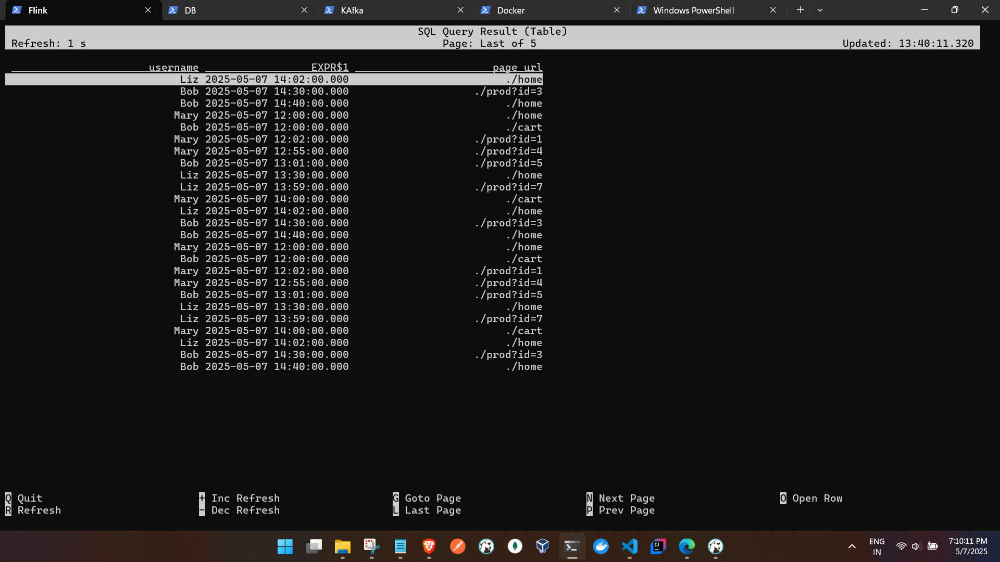
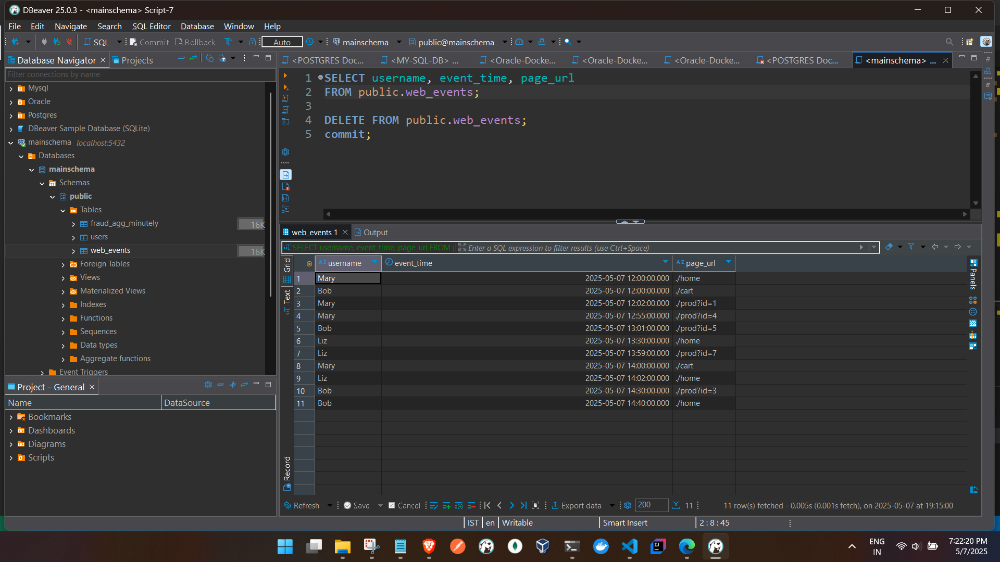

kafka to live query :

(../kafka-scripts/TWUserAction.py)
sending to kafka topic : user-topic


```
C:\tmp\flink-sql\kafka-scripts>python TWUserAction.py
All events sent to Kafka topic 'user-topic'.


Source

Flink SQL> CREATE TABLE kafka_web_events (
>   username STRING,
>   event_time STRING,
>   page_url STRING
> ) WITH (
>   'connector' = 'kafka',
>   'topic' = 'user-topic',
>   'properties.bootstrap.servers' = 'kafka:9093',
>   'properties.group.id' = 'flink-web-group',
>   'scan.startup.mode' = 'earliest-offset',
>   'format' = 'json',
>   'json.ignore-parse-errors' = 'true'
> );
[INFO] Execute statement succeed.


Querying Flink SQL:

Flink SQL> SELECT
>   username,
>   TO_TIMESTAMP(event_time, 'yyyy-MM-dd''T''HH:mm:ss'),
>   page_url
> FROM kafka_web_events;
>
[INFO] Result retrieval cancelled.


```


Query OP:


Kafka to db:


```

same source as above

Sink 

Flink SQL> CREATE TABLE web_events (
>   username STRING,
>   event_time TIMESTAMP,
>   page_url STRING
> ) WITH (
>   'connector' = 'jdbc',
>   'url' = 'jdbc:postgresql://postgres:5432/mainschema',
>   'table-name' = 'web_events',
>   'username' = 'postgres',
>   'password' = 'admin',
>   'driver' = 'org.postgresql.Driver'
> );


JOB Stmt:
so we take the string and convert it to timestamp while inserting

Flink SQL> INSERT INTO web_events
> SELECT
>   username,
>   TO_TIMESTAMP(event_time, 'yyyy-MM-dd''T''HH:mm:ss'),
>   page_url
> FROM kafka_web_events;
>
[INFO] Submitting SQL update statement to the cluster...
[INFO] SQL update statement has been successfully submitted to the cluster:
Job ID: 7aeb976a4897c58581b2263280d2cc85

```


DB OP




Note :

- we are ingesting ISO timestamp strings ("2025-05-07T12:00:00") from Kafka.
- Flink auto-converts the STRING field (event_time) to TIMESTAMP via implicit cast in the sink insert
- Sink shows data with correct structure and precision (TIMESTAMP in PG: 2025-05-07 12:00:00.000)