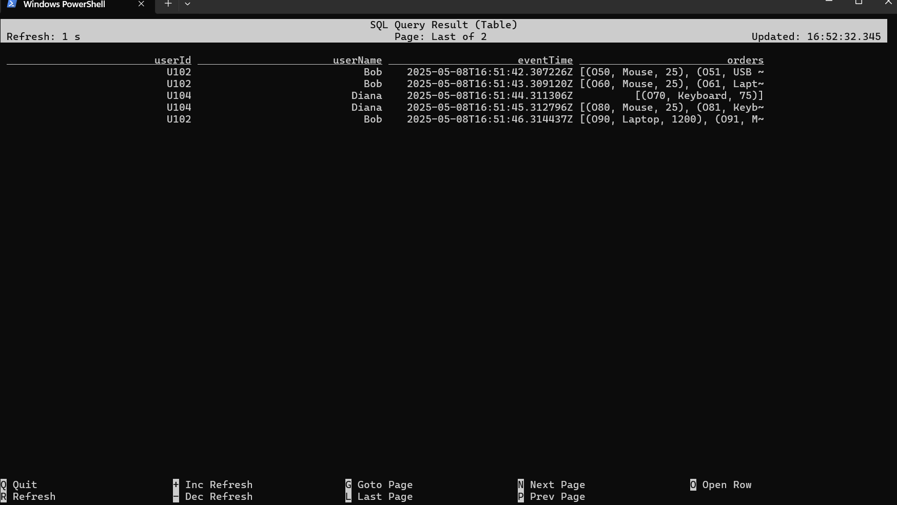
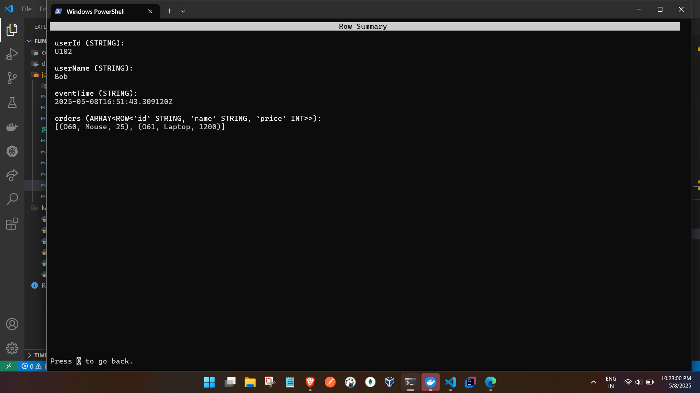
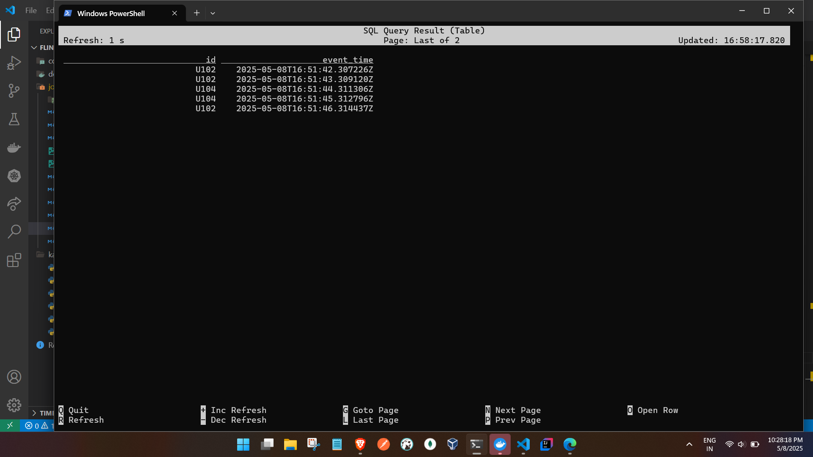

### Parse Nested JSON 
- producer script :

```
C:\tmp\flink-sql\kafka-scripts>python nestJson.py
C:\tmp\flink-sql\kafka-scripts\nestJson.py:45: DeprecationWarning: datetime.datetime.utcnow() is deprecated and scheduled for removal in a future version. Use timezone-aware objects to represent datetimes in UTC: datetime.datetime.now(datetime.UTC).
  "event_time": datetime.utcnow().isoformat() + "Z",
Sending: {
  "userData": {
    "id": "U104",
    "name": "Diana",
    "event_time": "2025-05-08T16:51:37.170722Z",
    "orders": [
      {
        "id": "O00",
        "name": "USB Cable",
        "price": 10
      },
      {
        "id": "O01",
        "name": "USB Cable",
        "price": 10
      }
    ]
  }
}
Sending: {
  "userData": {
    "id": "U103",
    "name": "Charlie",
    "event_time": "2025-05-08T16:51:38.298968Z",
    "orders": [
      {
        "id": "O10",
        "name": "Laptop",
        "price": 1200
      },
      {
        "id": "O11",
        "name": "Monitor",
        "price": 300
      }
    ]
  }
}
Sending: {
  "userData": {
    "id": "U102",
    "name": "Bob",
    "event_time": "2025-05-08T16:51:41.304704Z",
    "orders": [
      {
        "id": "O40",
        "name": "Mouse",
        "price": 25
      },
      {
        "id": "O41",
        "name": "USB Cable",
        "price": 10
      }
    ]
  }
}
Sending: {
  "userData": {
    "id": "U102",
    "name": "Bob",
    "event_time": "2025-05-08T16:51:42.307226Z",
    "orders": [
      {
        "id": "O50",
        "name": "Mouse",
        "price": 25
      },
      {
        "id": "O51",
        "name": "USB Cable",
        "price": 10
      }
    ]
  }
}
Sending: {
  "userData": {
    "id": "U102",
    "name": "Bob",
    "event_time": "2025-05-08T16:51:43.309120Z",
    "orders": [
      {
        "id": "O60",
        "name": "Mouse",
        "price": 25
      },
      {
        "id": "O61",
        "name": "Laptop",
        "price": 1200
      }
    ]
  }
}
```


- Flink SQL 

```
Flink SQL> CREATE TABLE kafka_orders (
>   userData ROW<
>     id STRING,
>     name STRING,
>     event_time STRING,
>     orders ARRAY<ROW<id STRING, name STRING, price INT>>
>   >
> ) WITH (
>   'connector' = 'kafka',
>   'topic' = 'my-topic',
>   'properties.bootstrap.servers' = 'kafka:9093',
>   'format' = 'json',
>   'scan.startup.mode' = 'earliest-offset'
> );
>
[INFO] Execute statement succeed.

Flink SQL> SELECT
>   userData.id AS userId,
>   userData.name AS userName,
>   userData.event_time AS eventTime,
>   userData.orders
> FROM kafka_orders;
>
[INFO] Result retrieval cancelled.

Flink SQL> SELECT
>   userData.id AS userId,
>   userData.name AS userName,
>   userData.event_time AS eventTime,
>   userData.orders
> FROM kafka_orders;
[INFO] Result retrieval cancelled.

Flink SQL>

SELECT 
  userData.id AS userId,
  userData.name AS userName,
  userData.event_time AS eventTime,
  o.id AS orderId,
  o.name AS orderName,
  o.price AS orderPrice
FROM kafka_orders,
LATERAL TABLE(UNNEST(userData.orders)) AS T(o);


```

OP




### Ignoring few fields from JSON

from the JSON we will ignore name and order child object 


- Flink SQL

```
Flink SQL> CREATE TABLE kafka_orders_ignore (
>   userData ROW<
>     id STRING,
>     event_time STRING
>   >
> ) WITH (
>   'connector' = 'kafka',
>   'topic' = 'my-topic',
>   'properties.bootstrap.servers' = 'kafka:9093',
>   'format' = 'json',
>   'scan.startup.mode' = 'earliest-offset'
> );
[INFO] Execute statement succeed.

Flink SQL> SELECT
>   userData.id,
>   userData.event_time
> FROM kafka_orders_ignore;
>
[INFO] Result retrieval cancelled.

Flink SQL>
 this can be pointed to db or other sink 
```

- OP



### NOTE: Ignoring few fields from JSON - Flink SQL

| JSON Field Present | Flink Schema Field Defined | Result    |
| ------------------ | -------------------------- | --------- |
| ✅ Yes              | ✅ Yes                      | Extracted |
| ✅ Yes              | ❌ No                       | Ignored   |
| ❌ No               | ✅ Yes                      | NULL      |
| ❌ No               | ❌ No                       | Ignored   |
