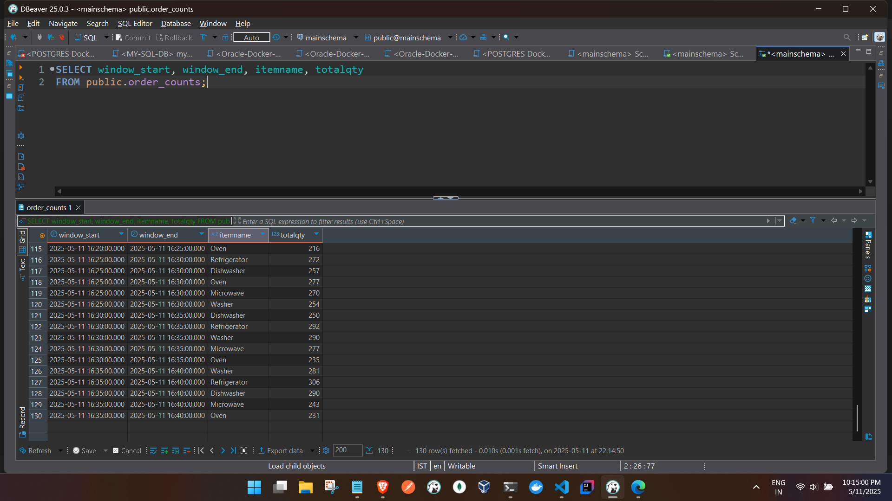
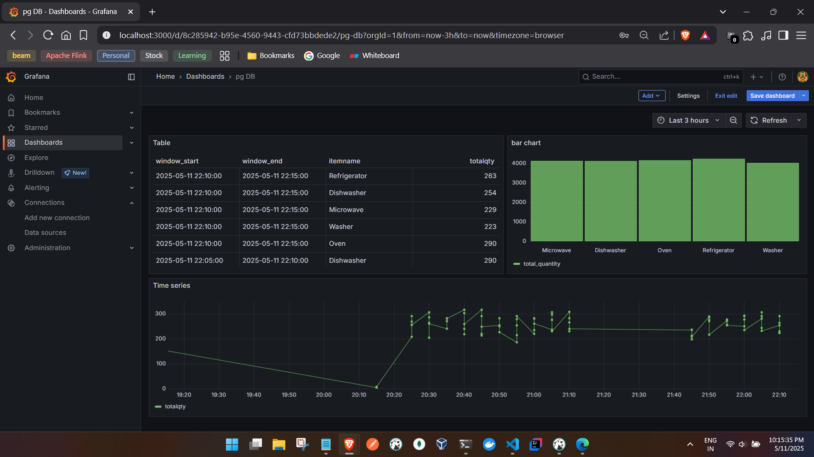

flink sql


 * k -> k 

- logs in kafka logs
```

Flink SQL> CREATE TABLE user_orders_1 (
>   cEmail       STRING,
>   CTimeStamp   STRING,
>   orders       ARRAY<ROW<
>                   itemId    STRING,
>                   Itemname  STRING,
>                   ItemQty   INT,
>                   cJSON     ROW<cVar STRING>
>                 >>,
>   pt AS PROCTIME()   -- define a processing-time column for windowing :contentReference[oaicite:2]{index=2}
> ) WITH (
>   'connector'                   = 'kafka',
>   'topic'                       = 'topic-1',
>   'properties.bootstrap.servers'= 'kafka:9093',
>   'format'                      = 'json',
>   'scan.startup.mode'           = 'earliest-offset'
> );
[INFO] Execute statement succeed.

Flink SQL> CREATE TABLE order_counts_1 (
>   window_start   STRING,
>   window_end     STRING,
>   Itemname       STRING,
>   totalQty       BIGINT
> ) WITH (
>   'connector'                   = 'kafka',
>   'topic'                       = 'topic-2',
>   'properties.bootstrap.servers'= 'kafka:9093',
>   'format'                      = 'json',
>   'sink.delivery-guarantee'     = 'at-least-once'  -- simple guarantee
> );
>
[INFO] Execute statement succeed.

Flink SQL> INSERT INTO order_counts_1
> SELECT
>   DATE_FORMAT(window_start, 'yyyy-MM-dd HH:mm:ss') AS window_start,
>   DATE_FORMAT(window_end,   'yyyy-MM-dd HH:mm:ss') AS window_end,
>   T.Itemname,
>   SUM(T.ItemQty) AS totalQty
> FROM user_orders_1
>
>   CROSS JOIN UNNEST(orders) AS T(itemId, Itemname, ItemQty, cJSON)
>
> GROUP BY
>   T.Itemname,
>   TUMBLE(pt, INTERVAL '5' MINUTE);
[ERROR] Could not execute SQL statement. Reason:
org.apache.calcite.sql.validate.SqlValidatorException: Column 'window_start' not found in any table

Flink SQL> INSERT INTO order_counts_1
> SELECT
>   DATE_FORMAT( TUMBLE_START(pt, INTERVAL '5' MINUTE),
>                'yyyy-MM-dd HH:mm:ss') AS window_start,
>   DATE_FORMAT( TUMBLE_END(pt,   INTERVAL '5' MINUTE),
>                'yyyy-MM-dd HH:mm:ss') AS window_end,
>   T.Itemname,
>   SUM(T.ItemQty) AS totalQty
> FROM user_orders_1
>   CROSS JOIN UNNEST(orders)
>     AS T(itemId, Itemname, ItemQty, cJSON)
> GROUP BY
>   T.Itemname,
>   TUMBLE(pt, INTERVAL '5' MINUTE);
[INFO] Submitting SQL update statement to the cluster...
[INFO] SQL update statement has been successfully submitted to the cluster:
Job ID: e1960f2443560ef36770f3f1fdf124a6


```


k -> DB

- Flink SQL
```
docker exec -it docker-jobmanager-1 ./bin/sql-client.sh

ADD JAR '/opt/flink/custom-lib/flink-sql-connector-kafka-3.3.0-1.19.jar';

Flink SQL>  ADD JAR '/opt/flink/custom-lib/flink-connector-jdbc-3.3.0-1.19.jar';
[INFO] Execute statement succeed.

Flink SQL> ADD JAR '/opt/flink/custom-lib/postgresql-42.6.0.jar';
[INFO] Execute statement succeed.


Flink SQL> CREATE TABLE user_orders (
>   cEmail       STRING,
>    CTimeStamp   STRING,
> orders       ARRAY<ROW<
>                  itemId    STRING,
>                  Itemname  STRING,
>                    ItemQty   INT,
>                    cJSON     ROW<cVar STRING>
>                  >>,
>    pt AS PROCTIME()   -- define a processing-time column for windowing
>  ) WITH (
>    'connector'                   = 'kafka',
>    'topic'                       = 'source-a',
>    'properties.bootstrap.servers'= 'kafka:9093',
>    'format'                      = 'json',
>    'scan.startup.mode'           = 'earliest-offset'
>  );
[INFO] Execute statement succeed.

IN DB

docker exec -it docker-postgres-1 psql -U postgres -d mainschema


mainschema=# CREATE TABLE order_counts (
    window_start TIMESTAMP,
    window_end   TIMESTAMP,
    itemname     TEXT,
    totalqty     BIGINT
);


Flink SQL> CREATE TABLE order_counts (
>     window_start TIMESTAMP,
>     window_end   TIMESTAMP,
>     itemname     STRING,
>     totalqty     BIGINT
> ) WITH (
>     'connector' = 'jdbc',
>     'url' = 'jdbc:postgresql://postgres:5432/mainschema',
>     'table-name' = 'order_counts',
>     'username' = 'postgres',
>     'password' = 'admin',
>  'driver' = 'org.postgresql.Driver'
> );
[INFO] Execute statement succeed.


Flink SQL> CREATE VIEW order_windowed AS
> SELECT
>   TUMBLE_START(pt, INTERVAL '5' MINUTE) AS window_start,
>   TUMBLE_END(pt,   INTERVAL '5' MINUTE) AS window_end,
>   orders_item.Itemname        AS Itemname,
>   SUM(orders_item.ItemQty)    AS totalqty
> FROM user_orders
> CROSS JOIN UNNEST(orders) AS orders_item(
>      itemId,
>      Itemname,
>      ItemQty,
>      cJSON
> )
> GROUP BY
>   TUMBLE(pt, INTERVAL '5' MINUTE),
>   orders_item.Itemname;
[INFO] Execute statement succeed.

Flink SQL> INSERT INTO order_counts
> SELECT
>   window_start,
>   window_end,
>   Itemname,
>   totalqty
> FROM order_windowed;
[INFO] Submitting SQL update statement to the cluster...
[INFO] SQL update statement has been successfully submitted to the cluster:
Job ID: 37476dbfede5ceeb5c8117e416e7f3cb


Flink SQL> SELECT
>   window_start,
>   window_end,
>   Itemname,
>   totalqty
> FROM order_windowed;
[INFO] Result retrieval cancelled.


```

### UI
- DB



- Dashboard:




### Prometheus 

Track quantity trends over time
Time-Series Graph

SELECT window_start AS time, itemname, totalqty FROM public.order_counts ORDER BY window_start

Note
Group by 
itemname
 for multiple lines

Bar Chart

Compare quantities by item

SELECT itemname, SUM(totalqty) AS total_quantity FROM public.order_counts WHERE window_start >= $__timeFrom() AND window_end <= $__timeTo() GROUP BY itemname

Table

Display raw data

SELECT window_start, window_end, itemname, totalqty FROM public.order_counts ORDER BY window_end DESC LIMIT 10


others

Top N Items by Total Quantity (Pie Chart or Donut Chart)


SELECT itemname, SUM(totalqty) AS total_quantity
FROM public.order_counts
WHERE window_start >= $__timeFrom() AND window_end <= $__timeTo()
GROUP BY itemname
ORDER BY total_quantity DESC
LIMIT 5;


Daily Order Trends (Time-Series Graph with Aggregation


SELECT 
    DATE_TRUNC('day', window_start) AS time,
    SUM(totalqty) AS total_quantity
FROM public.order_counts
WHERE window_start >= $__timeFrom() AND window_end <= $__timeTo()
GROUP BY DATE_TRUNC('day', window_start)
ORDER BY time;


Item Comparison Over Specific Time Windows (Stacked Bar Chart)

SELECT 
    itemname,
    DATE_TRUNC('hour', window_start) AS time_bucket,
    SUM(totalqty) AS total_quantity
FROM public.order_counts
WHERE window_start >= $__timeFrom() AND window_end <= $__timeTo()
GROUP BY itemname, DATE_TRUNC('hour', window_start)
ORDER BY time_bucket;


Latest Orders Snapshot (Table with Filters)

SELECT window_start, window_end, itemname, totalqty
FROM public.order_counts
WHERE window_start >= $__timeFrom() AND window_end <= $__timeTo()
ORDER BY window_end DESC
LIMIT 20;

