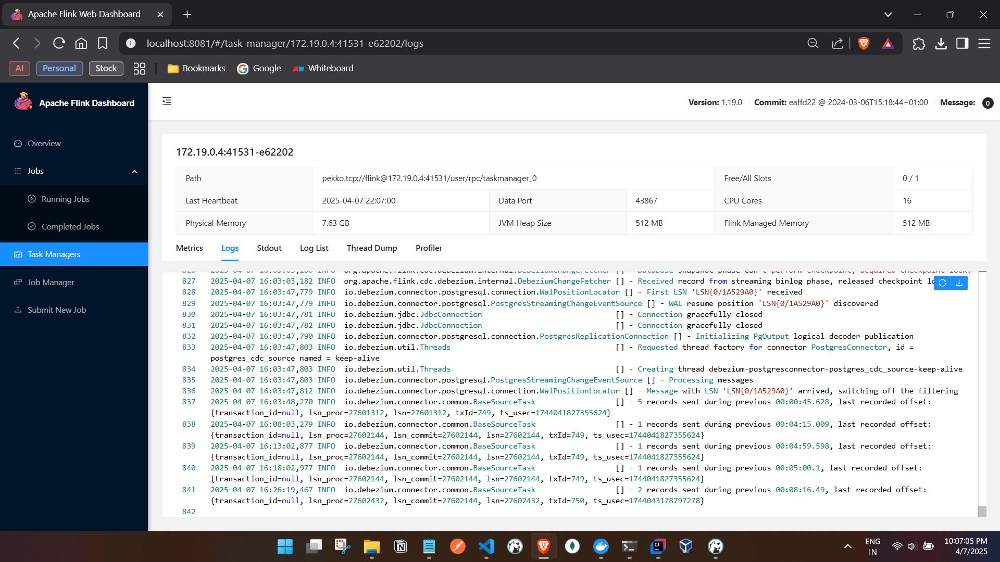

  C:\tmp\pg-cdc>docker-compose up -d
  time="2025-04-07T21:16:16+05:30" level=warning msg="C:\\tmp\\pg-cdc\\docker-compose.yml: the attribute `version` is obsolete, it will be ignored, please remove it to avoid potential confusion"
  [+] Running 4/4
  ✔ Network pg-cdc_default          Created                                                                                                                               0.0s 
  ✔ Container pg-cdc-postgres-1     Started                                                                                                                               0.5s 
  ✔ Container pg-cdc-jobmanager-1   Started                                                                                                                               0.4s 
  ✔ Container pg-cdc-taskmanager-1  Started                                                                                                                               0.6s 

  - Verify the init sql tables in pg db

  C:\tmp\pg-cdc>docker exec -it pg-cdc-postgres-1 psql -U postgres -d streamdb
  psql (15.8 (Debian 15.8-1.pgdg110+1))

  - upload the jar in lib folder and restart the pods

  C:\tmp\pg-cdc\flink-plugins\postgres-cdc>docker cp flink-sql-connector-postgres-cdc-3.3.0.jar pg-cdc-jobmanager-1:/opt/flink/lib/
  Successfully copied 19.5MB to pg-cdc-jobmanager-1:/opt/flink/lib/

  C:\tmp\pg-cdc\flink-plugins\postgres-cdc>docker cp flink-sql-connector-postgres-cdc-3.3.0.jar pg-cdc-taskmanager-1:/opt/flink/lib/
  Successfully copied 19.5MB to pg-cdc-taskmanager-1:/opt/flink/lib/

  C:\tmp\pg-cdc\flink-plugins\postgres-cdc>docker restart pg-cdc-jobmanager-1
  pg-cdc-jobmanager-1

  C:\tmp\pg-cdc\flink-plugins\postgres-cdc>docker restart pg-cdc-taskmanager-1
  pg-cdc-taskmanager-1

  C:\tmp\pg-cdc\flink-plugins\postgres-cdc>docker exec -it pg-cdc-jobmanager-1 bash
  root@ff20aaaba768:/opt/flink# cd /opt/flink/bin
  root@ff20aaaba768:/opt/flink/bin# ./sql-client.sh
  WARNING: Unknown module: jdk.compiler specified to --add-exports
  WARNING: Unknown module: jdk.compiler specified to --add-exports
  WARNING: Unknown module: jdk.compiler specified to --add-exports
  WARNING: Unknown module: jdk.compiler specified to --add-exports
  WARNING: Unknown module: jdk.compiler specified to --add-exports

                                    ▒▓██▓██▒
                                ▓████▒▒█▓▒▓███▓▒
                              ▓███▓░░        ▒▒▒▓██▒  ▒
                            ░██▒   ▒▒▓▓█▓▓▒░      ▒████
                            ██▒         ░▒▓███▒    ▒█▒█▒
                              ░▓█            ███   ▓░▒██
                                ▓█       ▒▒▒▒▒▓██▓░▒░▓▓█
                              █░ █   ▒▒░       ███▓▓█ ▒█▒▒▒
                              ████░   ▒▓█▓      ██▒▒▒ ▓███▒
                          ░▒█▓▓██       ▓█▒    ▓█▒▓██▓ ░█░
                    ▓░▒▓████▒ ██         ▒█    █▓░▒█▒░▒█▒
                    ███▓░██▓  ▓█           █   █▓ ▒▓█▓▓█▒
                  ░██▓  ░█░            █  █▒ ▒█████▓▒ ██▓░▒
                ███░ ░ █░          ▓ ░█ █████▒░░    ░█░▓  ▓░
                ██▓█ ▒▒▓▒          ▓███████▓░       ▒█▒ ▒▓ ▓██▓
            ▒██▓ ▓█ █▓█       ░▒█████▓▓▒░         ██▒▒  █ ▒  ▓█▒
            ▓█▓  ▓█ ██▓ ░▓▓▓▓▓▓▓▒              ▒██▓           ░█▒
            ▓█    █ ▓███▓▒░              ░▓▓▓███▓          ░▒░ ▓█
            ██▓    ██▒    ░▒▓▓███▓▓▓▓▓██████▓▒            ▓███  █
            ▓███▒ ███   ░▓▓▒░░   ░▓████▓░                  ░▒▓▒  █▓
            █▓▒▒▓▓██  ░▒▒░░░▒▒▒▒▓██▓░                            █▓
            ██ ▓░▒█   ▓▓▓▓▒░░  ▒█▓       ▒▓▓██▓    ▓▒          ▒▒▓
            ▓█▓ ▓▒█  █▓░  ░▒▓▓██▒            ░▓█▒   ▒▒▒░▒▒▓█████▒
            ██░ ▓█▒█▒  ▒▓▓▒  ▓█                █░      ░░░░   ░█▒
            ▓█   ▒█▓   ░     █░                ▒█              █▓
              █▓   ██         █░                 ▓▓        ▒█▓▓▓▒█░
              █▓ ░▓██░       ▓▒                  ▓█▓▒░░░▒▓█░    ▒█
                ██   ▓█▓░      ▒                    ░▒█▒██▒      ▓▓
                ▓█▒   ▒█▓▒░                         ▒▒ █▒█▓▒▒░░▒██
                  ░██▒    ▒▓▓▒                     ▓██▓▒█▒ ░▓▓▓▓▒█▓
                    ░▓██▒                          ▓░  ▒█▓█  ░░▒▒▒
                        ▒▓▓▓▓▓▒▒▒▒▒▒▒▒▒▒▒▒▒▒▒▒▒▒▒▒▒▒▒░░▓▓  ▓░▒█░

      ______ _ _       _       _____  ____  _         _____ _ _            _  BETA
    |  ____| (_)     | |     / ____|/ __ \| |       / ____| (_)          | |
    | |__  | |_ _ __ | | __ | (___ | |  | | |      | |    | |_  ___ _ __ | |_
    |  __| | | | '_ \| |/ /  \___ \| |  | | |      | |    | | |/ _ \ '_ \| __|
    | |    | | | | | |   <   ____) | |__| | |____  | |____| | |  __/ | | | |_
    |_|    |_|_|_| |_|_|\_\ |_____/ \___\_\______|  \_____|_|_|\___|_| |_|\__|

          Welcome! Enter 'HELP;' to list all available commands. 'QUIT;' to exit.

  Command history file path: /root/.flink-sql-history

  Flink SQL> CREATE TABLE stream_note_cdc (
  >   id INT,
  >   added_date TIMESTAMP(3),
  >   content STRING,
  >   is_live BOOLEAN,
  >   title STRING,
  >   PRIMARY KEY (id) NOT ENFORCED
  > ) WITH (
  >   'connector' = 'postgres-cdc',
  >   'hostname' = 'postgres',
  >   'port' = '5432',
  >   'username' = 'postgres',
  >   'password' = 'postgres',
  >   'database-name' = 'streamdb',
  >   'schema-name' = 'labschema',
  >   'table-name' = 'stream_note',
  >   'decoding.plugin.name' = 'pgoutput',
  >   'slot.name' = 'stream_slot_1'  -- we  can choose any slot name slot name required or select fails 
  > );
  >
  [INFO] Execute statement succeed.

  - Trigger a live running job from cli:

  Flink SQL> SELECT * FROM stream_note_cdc;  -- live job is triggerd logs the insert data and Q to quit
  >
  [INFO] Result retrieval cancelled.
  [INFO] Execute statement succeed.

  Flink SQL> SELECT * FROM stream_note_cdc;

  - Create a sink and connect to insert stmt
  - job can be seen in flink ui and logs as well

  Flink SQL> CREATE TABLE print_sink (
  >   id INT,
  >   added_date TIMESTAMP(3),
  >   content STRING,
  >   is_live BOOLEAN,
  >   title STRING
  > ) WITH (
  >   'connector' = 'print'
  > );

  [INFO] Execute statement succeed.

  Flink SQL> INSERT INTO print_sink SELECT * FROM stream_note_cdc;

  [INFO] Submitting SQL update statement to the cluster...
  [INFO] SQL update statement has been successfully submitted to the cluster:
  Job ID: e49a73e7c70cf7200d1f3d0f14a0b513

  Flink UI

  

  

  - Live Cli job:
  i.e calling the SELECT * FROM stream_note_cdc from flink sql and Q to quit.
  

  - post creating a JOB: insert data to see the insert logs in job i.e taskmanager logs 

  streamdb=# INSERT INTO labschema.stream_note (id, added_date, content, is_live, title)
  VALUES (102, NOW(), 'CDC Test Note', true, 'Testing Flink CDC');
  INSERT 0 1
  streamdb=# INSERT INTO labschema.stream_note (id, added_date, content, is_live, title)
  VALUES (103, NOW(), 'CDC Test Note', true, 'Testing Flink CDC');
  INSERT 0 1
  streamdb=# select * from labschema.stream_note;
  id  |         added_date         |    content     | is_live |       title
  -----+----------------------------+----------------+---------+-------------------
    1 | 2025-04-07 15:46:18.540855 | Initial note 1 | f       | Note A
    2 | 2025-04-07 15:46:18.540855 | Initial note 2 | f       | Note B
  101 | 2025-04-07 15:59:56.369119 | CDC Test Note  | t       | Testing Flink CDC
  102 | 2025-04-07 16:03:47.355055 | CDC Test Note  | t       | Testing Flink CDC
  103 | 2025-04-07 16:26:18.796702 | CDC Test Note  | t       | Testing Flink CDC
  (5 rows)

  streamdb=# INSERT INTO labschema.stream_note (id, added_date, content, is_live, title)
  VALUES (104, NOW(), 'CDC Test Note', true, 'Testing Flink CDC');
  INSERT 0 1
  streamdb=#
