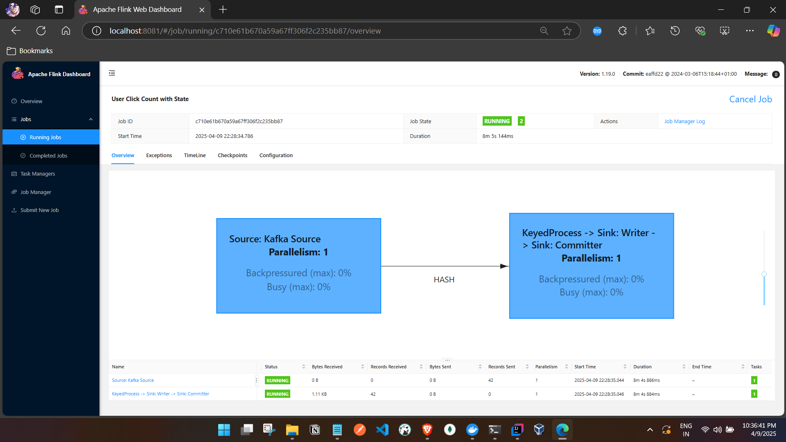

# 📘 Flink Stateful Job Documentation: User Click Counter

## 🎯 Objective
Build a Kafka-to-Kafka Flink job that demonstrates stateful processing by counting the number of user actions (e.g., clicks) using `KeyedProcessFunction`.

---

## 🏗️ Project Setup
- **Flink Version:** 1.19
- **Kafka Topic (Input):** `input-topic`
- **Kafka Topic (Output):** `output-topic`
- **Java Class:** `UserClickCountJob`
- **State Used:** `ValueState<Long>` to track clicks per user

---

## 📦 DTO Used
```java
public class UserEvent {
    private String userId;
    private String action; // e.g., CLICK, VIEW, etc.
    // Getters, setters, constructors
}
```

---

## ✅ Stateful Logic
```java
public static class StatefulClickCounter extends KeyedProcessFunction<String, UserEvent, String> {
    private ValueState<Long> clickCount;

    @Override
    public void open(Configuration parameters) {
        clickCount = getRuntimeContext().getState(
            new ValueStateDescriptor<>("clickCount", Long.class));
    }

    @Override
    public void processElement(UserEvent event, Context ctx, Collector<String> out) throws Exception {
        Long count = clickCount.value();
        if (count == null) count = 0L;
        count++;
        clickCount.update(count);
        out.collect("User " + ctx.getCurrentKey() + " clicked " + count + " times");
    }
}
```

---

## 🪝 Kafka Producer Example (Python)
```python
from kafka import KafkaProducer
import json, time, random

producer = KafkaProducer(
    bootstrap_servers='localhost:9092',
    value_serializer=lambda v: json.dumps(v).encode('utf-8')
)

user_ids = ['u1', 'u2', 'u3']
actions = ['CLICK', 'VIEW']

for i in range(10):
    event = {"userId": random.choice(user_ids), "action": random.choice(actions)}
    producer.send("input-topic", event)
    print("Sent:", event)
    time.sleep(1)

producer.flush()
producer.close()
```

---

## 🧨 Common Issue: Manifest Digest Error
**Error Message:**
```
SecurityException: Invalid signature file digest for Manifest main attributes
```

### ✅ Root Cause
Your JAR contained signed metadata files:
```
META-INF/*.SF
META-INF/*.DSA
META-INF/*.RSA
```
These conflict with Flink's class loader unless signature validation is perfect.

### ✅ Fix
Update your `maven-shade-plugin`:
```xml
<filters>
  <filter>
    <artifact>*:*</artifact>
    <excludes>
      <exclude>META-INF/*.SF</exclude>
      <exclude>META-INF/*.DSA</exclude>
      <exclude>META-INF/*.RSA</exclude>
    </excludes>
  </filter>
</filters>
```
Then rebuild:
```bash
mvn clean package
```
Use the shaded JAR from:
```
target/my-flink-project-1.0-SNAPSHOT-shaded.jar
```

---

## 🟢 Docker Submission
```bash
docker cp target/my-flink-project-1.0-SNAPSHOT-shaded.jar docker-jobmanager-1:/tmp/demo.jar

docker exec -it docker-jobmanager-1 /opt/flink/bin/flink run -c com.example.demos.UserClickCountJob /tmp/demo.jar
```

---

## 📌 Summary
This project demonstrates how Flink can maintain per-user state in memory, enabling you to build powerful, real-time analytics or behavior tracking systems in a scalable streaming environment.


Kafka python logs:
```commandline

PS C:\tmp\Flink\code\java\flink1.19\my-flink-project\src\main\java\com\example\demos> python .\producer.py
Sent: {'userId': 'u2', 'action': 'ADD_TO_CART'}
Sent: {'userId': 'u2', 'action': 'ADD_TO_CART'}
Sent: {'userId': 'u3', 'action': 'ADD_TO_CART'}
Sent: {'userId': 'u3', 'action': 'CLICK'}
Sent: {'userId': 'u2', 'action': 'CLICK'}
Sent: {'userId': 'u3', 'action': 'ADD_TO_CART'}
Sent: {'userId': 'u1', 'action': 'CLICK'}
Sent: {'userId': 'u1', 'action': 'CLICK'}
Sent: {'userId': 'u3', 'action': 'CLICK'}
Sent: {'userId': 'u1', 'action': 'ADD_TO_CART'}
Sent: {'userId': 'u1', 'action': 'VIEW'}
Sent: {'userId': 'u1', 'action': 'CLICK'}
Sent: {'userId': 'u2', 'action': 'VIEW'}
Sent: {'userId': 'u2', 'action': 'CLICK'}
Sent: {'userId': 'u1', 'action': 'ADD_TO_CART'}
Sent: {'userId': 'u3', 'action': 'VIEW'}
Sent: {'userId': 'u3', 'action': 'VIEW'}
Sent: {'userId': 'u2', 'action': 'ADD_TO_CART'}
Sent: {'userId': 'u2', 'action': 'VIEW'}
Sent: {'userId': 'u3', 'action': 'VIEW'}
PS C:\tmp\Flink\code\java\flink1.19\my-flink-project\src\main\java\com\example\demos> python .\producer.py
Sent: {'userId': 'u1', 'action': 'ADD_TO_CART'}
Sent: {'userId': 'u1', 'action': 'VIEW'}
Sent: {'userId': 'u2', 'action': 'CLICK'}
Sent: {'userId': 'u1', 'action': 'ADD_TO_CART'}
Sent: {'userId': 'u3', 'action': 'VIEW'}
Sent: {'userId': 'u3', 'action': 'VIEW'}
Sent: {'userId': 'u2', 'action': 'ADD_TO_CART'}
Sent: {'userId': 'u1', 'action': 'CLICK'}
Sent: {'userId': 'u1', 'action': 'ADD_TO_CART'}
Sent: {'userId': 'u3', 'action': 'ADD_TO_CART'}
Sent: {'userId': 'u3', 'action': 'CLICK'}
Sent: {'userId': 'u1', 'action': 'ADD_TO_CART'}
Sent: {'userId': 'u2', 'action': 'VIEW'}
Sent: {'userId': 'u2', 'action': 'ADD_TO_CART'}
Sent: {'userId': 'u2', 'action': 'CLICK'}
Sent: {'userId': 'u3', 'action': 'ADD_TO_CART'}
Sent: {'userId': 'u3', 'action': 'VIEW'}
Sent: {'userId': 'u3', 'action': 'CLICK'}
Sent: {'userId': 'u1', 'action': 'ADD_TO_CART'}
Sent: {'userId': 'u3', 'action': 'VIEW'}
PS C:\tmp\Flink\code\java\flink1.19\my-flink-project\src\main\java\com\example\demos> 

```


- Kafka consumer logs 
```commandline

C:\Users\ashfa>docker exec -it docker-kafka-1 kafka-console-consumer.sh   --bootstrap-server kafka:9093  --topic output-topic  --from-beginning
User u2 clicked 1 times
User u1 clicked 1 times
User u2 clicked 2 times
User u2 clicked 3 times
User u3 clicked 1 times
User u3 clicked 2 times
User u2 clicked 4 times
User u3 clicked 3 times
User u1 clicked 2 times
User u1 clicked 3 times
User u3 clicked 4 times
User u1 clicked 4 times
User u1 clicked 5 times
User u1 clicked 6 times
User u2 clicked 5 times
User u2 clicked 6 times
User u1 clicked 7 times
User u3 clicked 5 times
User u3 clicked 6 times
User u2 clicked 7 times
User u2 clicked 8 times
User u3 clicked 7 times
User u1 clicked 8 times
User u1 clicked 9 times
User u2 clicked 9 times
User u1 clicked 10 times
User u3 clicked 8 times
User u3 clicked 9 times
User u2 clicked 10 times
User u1 clicked 11 times
User u1 clicked 12 times
User u3 clicked 10 times
User u3 clicked 11 times
User u1 clicked 13 times
User u2 clicked 11 times
User u2 clicked 12 times
User u2 clicked 13 times
User u3 clicked 12 times
User u3 clicked 13 times
User u3 clicked 14 times
User u1 clicked 14 times
User u3 clicked 15 times

```


- Flink UI :
