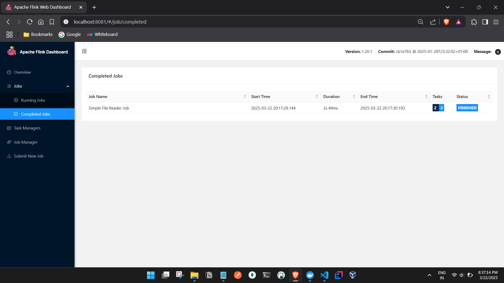

# **Apache Flink File Processing Project Documentation**

## **Project Overview**
This project is a simple **Apache Flink Streaming Job** written in **Java 11** that reads data from a **file**, processes it, and logs the content. The job is deployed in a **Dockerized Flink cluster** and submitted to **Flink JobManager** for execution.

## **Why Not Spring Boot?**
Initially, we considered **Spring Boot**, but we decided **not to use it** for the following reasons:
- **Flink does not require a web framework** (Spring Boot is overkill for stream processing).
- **Flink jobs should be lightweight** (Spring Boot adds unnecessary overhead).
- **Java 11 is stable for Flink** (Spring Boot 3+ requires Java 17, which is experimental for Flink 1.20).

---

## **Project Setup**

### **1️⃣ Creating a Maven Project**
We created a **Maven-based Java project** using:
```bash
mvn archetype:generate -DgroupId=com.example -DartifactId=flink-file-job -DarchetypeArtifactId=maven-archetype-quickstart -DinteractiveMode=false
cd flink-file-job
```

---

### **2️⃣ Adding Dependencies (`pom.xml`)**
We added **Flink dependencies** to `pom.xml`:
```xml
<dependencies>
    <!-- Flink Core -->
    <dependency>
        <groupId>org.apache.flink</groupId>
        <artifactId>flink-streaming-java</artifactId>
        <version>1.20.1</version>
    </dependency>

    <!-- Logging -->
    <dependency>
        <groupId>org.apache.logging.log4j</groupId>
        <artifactId>log4j-slf4j-impl</artifactId>
        <version>2.17.1</version>
    </dependency>
</dependencies>
```

---

### **3️⃣ Creating the Input File (`input.txt`)**
We created `input.txt` beside `pom.xml`:
```
hello
flink
simple
file
processing
```

---

### **4️⃣ Writing the Flink Java Code**
We created `src/main/java/com/example/FileReaderJob.java`:
```java
package com.example;

import org.apache.flink.api.common.functions.MapFunction;
import org.apache.flink.streaming.api.datastream.DataStream;
import org.apache.flink.streaming.api.environment.StreamExecutionEnvironment;

public class FileReaderJob {
    public static void main(String[] args) throws Exception {
        // Step 1: Create Flink execution environment
        final StreamExecutionEnvironment env = StreamExecutionEnvironment.getExecutionEnvironment();

        // Step 2: Read data from a file
        DataStream<String> fileStream = env.readTextFile("/tmp/input.txt");

        // Step 3: Process (simple logging)
        fileStream.map(new MapFunction<String, String>() {
            @Override
            public String map(String value) {
                System.out.println("Read Line: " + value);
                return value;
            }
        });

        // Step 4: Execute Flink Job
        env.execute("Simple File Reader Job");
    }
}
```

**📌 Explanation:**
- **Creates a Flink execution environment.**
- **Reads a file (`/tmp/input.txt`) inside the Flink cluster.**
- **Logs each line to the console.**
- **Runs as a Flink streaming job.**

---

## **Issues Faced & Solutions**

### **Issue: FileNotFoundException (`/tmp/input.txt` not found)**
Even though we copied `input.txt` to **JobManager**, Flink **still couldn’t find the file**. This happened because **TaskManagers** also needed the file.

### **Solution**
1️⃣ Copy the file **to all TaskManagers**:
```bash
docker cp input.txt docker-taskmanager-1:/tmp/
docker cp input.txt docker-taskmanager-2:/tmp/
```
2️⃣ Run the Flink job again:
```bash
docker exec -it docker-jobmanager-1 /opt/flink/bin/flink run -c com.example.FileReaderJob /tmp/flink-file-job-1.0-SNAPSHOT.jar
```

---

## **Creating the JAR (Artifact) and Running the Job**

### **1️⃣ Build the Project and Create a JAR**
```bash
mvn clean package
```
This generates **`flink-file-job-1.0-SNAPSHOT.jar`** inside `target/`.

### **2️⃣ Copy the JAR and File to Flink JobManager & TaskManagers**
```bash
docker cp target/flink-file-job-1.0-SNAPSHOT.jar docker-jobmanager-1:/tmp/
docker cp input.txt docker-jobmanager-1:/tmp/
docker cp input.txt docker-taskmanager-1:/tmp/
docker cp input.txt docker-taskmanager-2:/tmp/
```

### **3️⃣ Submit the Job to Flink**
```bash
docker exec -it docker-jobmanager-1 /opt/flink/bin/flink run -c com.example.FileReaderJob /tmp/flink-file-job-1.0-SNAPSHOT.jar
```

---

## **Final Output**
```
WARNING: Unknown module: jdk.compiler specified to --add-exports
Job has been submitted with JobID e4b571ae113a817e9456297acef90b33
Program execution finished
Job with JobID e4b571ae113a817e9456297acef90b33 has finished.
Job Runtime: 2049 ms
```

---

## **Did We Run This Locally?**
❌ **No, we did NOT run this locally.**
✅ **We only ran it inside the Flink Docker Cluster.**
✅ If we wanted to run locally, we could use:
```bash
flink run -c com.example.FileReaderJob target/flink-file-job-1.0-SNAPSHOT.jar

not the java program but the jar provided to flink(flink must be installed)

```

---

## **Summary**
✅ **We built a simple Flink job using Java 11.**  
✅ **We read a file and logged its contents.**  
✅ **We faced a `FileNotFoundException` because the file was missing in TaskManagers.**  
✅ **We solved it by copying the file to all TaskManagers.**  
✅ **We created a JAR, copied it to JobManager, and ran the job.**  
✅ **The job executed successfully in Flink Docker Cluster.**  

---


