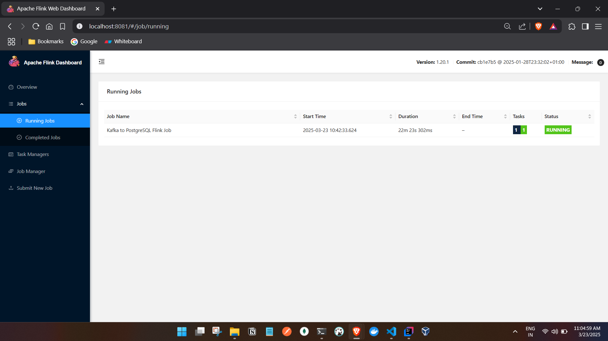
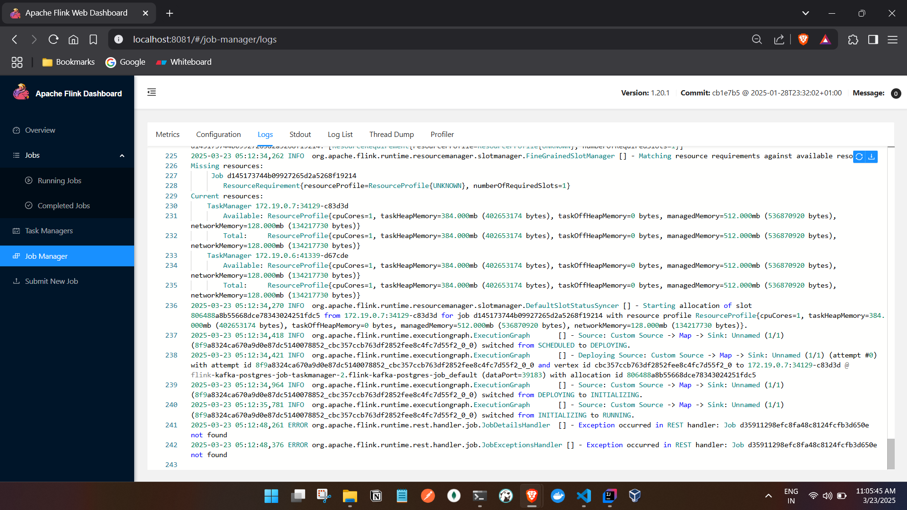
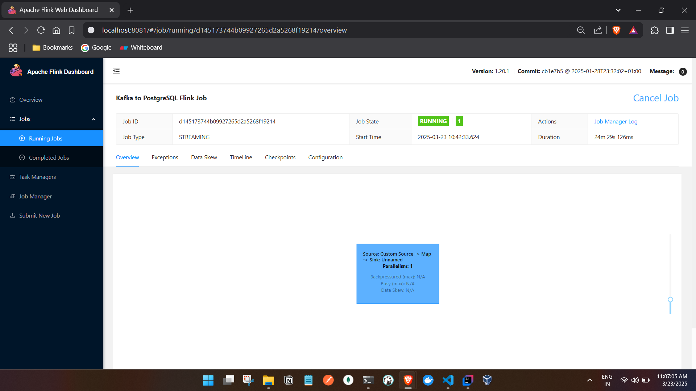
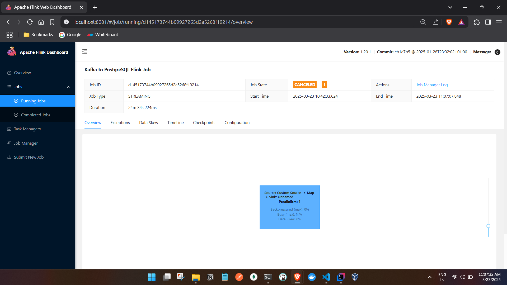

# Flink Kafka PostgreSQL Integration

## Project Overview
This project demonstrates an end-to-end data pipeline using **Apache Flink, Kafka, and PostgreSQL**. The pipeline:
- Uses a **Python Kafka producer** to send messages to a Kafka topic.
- A **Flink Java consumer** reads data from Kafka, transforms it, and inserts it into **PostgreSQL**.
- All services run inside **Docker Compose** for seamless networking and execution.

## Technologies Used
- **Python** (Kafka producer)
- **Java (Maven project)** (Flink consumer)
- **Apache Flink** (Stream processing)
- **Apache Kafka** (Messaging system)
- **PostgreSQL** (Database for persistence)
- **Docker & Docker Compose** (Containerization & service orchestration)

---

## Project Flow
1. **Kafka Producer (Python)**
   - Generates JSON data and sends it to Kafka topic `my-topic`.
2. **Kafka (Docker)**
   - Manages the messaging pipeline.
3. **Flink Consumer (Java)**
   - Reads Kafka messages, transforms them (uppercase names), and inserts them into PostgreSQL.
4. **PostgreSQL (Docker)**
   - Stores the processed records.

---

## Setup & Execution

### 1. Start Docker Compose
Ensure all services (Kafka, Flink, PostgreSQL) are running:
```sh
docker-compose up -d
```

### 2. Verify Kafka Connectivity
Check Kafka topics:
```sh
docker exec -it flink-kafka-postgres-job-kafka-1 kafka-topics.sh --bootstrap-server kafka:9093 --list
```
Consume messages to verify data:
```sh
docker exec -it flink-kafka-postgres-job-kafka-1 kafka-console-consumer.sh --bootstrap-server kafka:9093 --topic my-topic --from-beginning
```

### 3. Run Python Kafka Producer
```sh
python producer.py
```
Expected output:
```
Sent: {'id': 100, 'name': 'Johnny Moreno'}
Sent: {'id': 101, 'name': 'Shelby Terrell'}
...
```


### 4. Flink Consumer (Java) - Code Explanation  

#### **Maven Project Setup**  
We created a simple **Maven project** with **Java 11** to build the Flink consumer. The project was initialized using:  
```sh
mvn archetype:generate -DgroupId=com.example -DartifactId=flink-kafka-postgres-job -DarchetypeArtifactId=maven-archetype-quickstart -DinteractiveMode=false
```

#### **Dependencies (pom.xml)**  
The required dependencies for Flink, Kafka, and PostgreSQL were added:  
```xml
<dependencies>
    <!-- Flink Dependencies -->
    <dependency>
        <groupId>org.apache.flink</groupId>
        <artifactId>flink-streaming-java_2.12</artifactId>
        <version>1.20.1</version>
    </dependency>
    <dependency>
        <groupId>org.apache.flink</groupId>
        <artifactId>flink-clients_2.12</artifactId>
        <version>1.20.1</version>
    </dependency>

    <!-- Kafka Dependency -->
    <dependency>
        <groupId>org.apache.flink</groupId>
        <artifactId>flink-connector-kafka_2.12</artifactId>
        <version>1.20.1</version>
    </dependency>

    <!-- PostgreSQL JDBC Driver -->
    <dependency>
        <groupId>org.postgresql</groupId>
        <artifactId>postgresql</artifactId>
        <version>42.5.0</version>
    </dependency>
</dependencies>
```

#### **Flink Consumer Code (`KafkaToPostgresJob.java`)**  
This Flink job:  
1. Reads data from Kafka.  
2. Parses JSON messages.  
3. Transforms names to **uppercase**.  
4. Inserts processed records into PostgreSQL.

```java
package com.example;

import org.apache.flink.api.common.functions.MapFunction;
import org.apache.flink.api.common.serialization.SimpleStringSchema;
import org.apache.flink.streaming.api.datastream.DataStream;
import org.apache.flink.streaming.api.environment.StreamExecutionEnvironment;
import org.apache.flink.streaming.connectors.kafka.FlinkKafkaConsumer;

import java.sql.Connection;
import java.sql.DriverManager;
import java.sql.PreparedStatement;
import java.util.Properties;

public class KafkaToPostgresJob {
    public static void main(String[] args) throws Exception {
        // Set up Flink streaming environment
        final StreamExecutionEnvironment env = StreamExecutionEnvironment.getExecutionEnvironment();

        // Kafka properties
        Properties properties = new Properties();
        properties.setProperty("bootstrap.servers", "kafka:9092"); // Docker network host
        properties.setProperty("group.id", "flink-consumer");

        // Kafka Consumer
        FlinkKafkaConsumer<String> kafkaConsumer = new FlinkKafkaConsumer<>(
                "my-topic", new SimpleStringSchema(), properties);

        // Add Kafka source
        DataStream<String> stream = env.addSource(kafkaConsumer);

        // Transform JSON -> Uppercase Name
        DataStream<User> transformedStream = stream.map(new MapFunction<String, User>() {
            @Override
            public User map(String value) throws Exception {
                String json = value.replaceAll("[{}\"]", ""); // Simple JSON parsing
                String[] parts = json.split(",");
                int id = Integer.parseInt(parts[0].split(":")[1].trim());
                String name = parts[1].split(":")[1].trim().toUpperCase();

                return new User(id, name);
            }
        });

        // Insert into PostgreSQL
        transformedStream.addSink(user -> {
            try (Connection conn = DriverManager.getConnection(
                    "jdbc:postgresql://postgres:5432/mainschema", "postgres", "admin");
                 PreparedStatement stmt = conn.prepareStatement("INSERT INTO flusers (id, name) VALUES (?, ?)")) {

                stmt.setInt(1, user.getId());
                stmt.setString(2, user.getName());
                stmt.executeUpdate();
            } catch (Exception e) {
                e.printStackTrace();
            }
        });

        // Execute Flink Job
        env.execute("Kafka to PostgreSQL Flink Job");
    }

    // User POJO
    public static class User {
        private int id;
        private String name;

        public User(int id, String name) {
            this.id = id;
            this.name = name;
        }

        public int getId() { return id; }
        public String getName() { return name; }
    }
}
```

#### **Why We Didn't Run the Code Locally?**  
- Flink jobs are designed to run in a **distributed environment**.  
- The job reads from **Kafka (Docker service)**, so running locally may cause **network issues**.  
- The database **PostgreSQL** is also inside Docker, so **direct access issues** could arise.  
- Running **inside Flink JobManager** ensures seamless integration.


### 5. Build & Deploy Flink Job
```sh
mvn clean package -DskipTests
```

**JAR Size Issue & Fix:**
- Initially, the JAR file was too small (~6KB) and missing dependencies.
- **Fix:** We used the **Maven Shade Plugin** to package all dependencies into a fat JAR.
- Ensured the JAR size was large enough (~76MB) before deploying.

Copy the JAR to Flink JobManager:
```sh
docker cp target/flink-kafka-postgres-job-1.0-SNAPSHOT.jar flink-kafka-postgres-job-jobmanager-1:/tmp/
```
Run the Flink job:
```sh
docker exec -it flink-kafka-postgres-job-jobmanager-1 /opt/flink/bin/flink run -c com.example.KafkaToPostgresJob /tmp/flink-kafka-postgres-job-1.0-SNAPSHOT.jar

```

### 6. Verify Data in PostgreSQL
Connect to PostgreSQL and check the table:

note: we are using init.sql to create the table 
```sh
docker exec -it flink-kafka-postgres-job-postgres-1 psql -U postgres -d mainschema
```
Query the inserted data:
```sql
SELECT * FROM public.flusers;
```

---

## Issues Faced & Fixes

### 1. **Kafka Port Mismatch**
**Issue:** Flink inside Docker couldn't connect to Kafka running locally.
- **Fix:** Changed `bootstrap.servers` to `kafka:9093` (Docker network internal name).

### 2. **JAR Not Found in Flink JobManager**
**Issue:** After copying the JAR, it wasn't found in `/tmp/`.
- **Fix:** Verified using `ls /tmp/`, re-copied and ensured the JAR was visible.

### 3. **Job Running Indefinitely**
**Why is Flink Job still running?**
- **Flink streaming jobs don’t terminate** unless explicitly stopped.
- Runs indefinitely, processing real-time Kafka events.

### 4. **How to Re-run the Job?**
If the Flink job fails or needs restart:
```sh
docker restart flink-kafka-postgres-job-jobmanager-1
```
To kill the job:
```sh
docker exec -it flink-kafka-postgres-job-jobmanager-1 /opt/flink/bin/flink cancel <JobID>
```

---

## Conclusion
This setup provides a scalable way to process streaming data using **Kafka, Flink, and PostgreSQL**. The job runs continuously, consuming and processing data in real time. Future improvements include:
- Adding **schema validation** in Flink.
- Using **Flink's Checkpointing** for fault tolerance.
- Enhancing the producer to send **dynamic data streams**.


### Why Did We Run the Code Only in Flink and Not Locally?  

1. **Flink's Distributed Processing**  
   - Flink is designed to run in a distributed environment. Running locally would not fully utilize its parallel processing capabilities.  
   - When running inside Flink, tasks are distributed among multiple TaskManagers, ensuring better scalability.  

2. **Kafka & PostgreSQL Connectivity in Docker**  
   - Our Kafka broker and PostgreSQL database were running inside Docker.  
   - If we ran the job locally, it might not be able to connect properly due to network isolation between the host system and containers.  
   - Running inside the Flink cluster (which is also in Docker) ensured that all services could communicate within the same Docker network.  

3. **Job Submission Workflow**  
   - Flink jobs are meant to be submitted to a running Flink cluster, which manages execution, scaling, and fault tolerance.  
   - Running directly in Flink allows proper state management, failure handling, and integration with checkpoints and savepoints.  

4. **Dependency & Environment Compatibility**  
   - Running locally would require setting up all dependencies manually, such as Kafka consumers, Flink libraries, and PostgreSQL connectors.  
   - Inside Flink, all dependencies are included in the job JAR, making it self-contained.  

5. **Real-World Production Workflow**  
   - In real-world scenarios, Flink jobs are deployed in clusters, not as standalone local applications.  
   - Running in Flink aligns with the best practices of deploying streaming jobs in a production environment.  

---


### UI






- Cancelling the job:





#### DB output:
````
C:\Users\ashfa>docker exec -it ecd psql -U postgres -d mainschema
psql (17.0 (Debian 17.0-1.pgdg120+1))
Type "help" for help.

mainschema=# SELECT * FROM public.flusers;
 id  |        name
-----+---------------------
   1 | ALICE
   2 | BOB
   3 | CHARLIE
   4 | ALICE
   5 | BOB
   6 | CHARLIE
 100 | JOHNNY MORENO
 101 | SHELBY TERRELL
 102 | VERONICA SCHMIDT
 103 | DEBORAH HAMILTON
 104 | JEFFREY SERRANO
 105 | JULIE RODRIGUEZ
 106 | KIMBERLY CRAWFORD
 107 | THOMAS POOLE
 108 | SAMUEL SMITH
 109 | CURTIS WEBER
 110 | ALEXANDER NGUYEN MD
 111 | LAURA WRIGHT
 112 | TARA MARTIN
 113 | LAURA WILSON DVM
 114 | JARED MARTINEZ
 115 | JOEL BRADSHAW
 116 | TODD DIAZ
 117 | ANDREW MCCLURE
 118 | SHELBY MCCOY
 119 | KAYLA DUNCAN
 120 | JAMES ORR
(27 rows)

````
