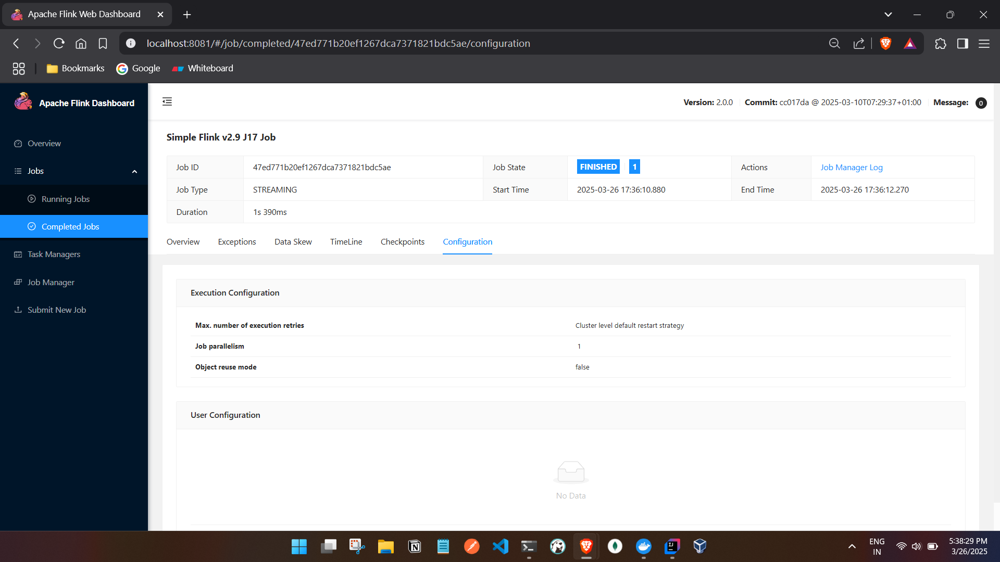

 Directory: C:\tmp\Flink\code\java\flink2\my-flink-project\jars

Mode                 LastWriteTime         Length Name
----                 -------------         ------ ----
-a----         3/26/2025   5:32 PM           3941 my-flink-project.jar

PS C:\tmp\Flink\code\java\flink2\my-flink-project\jars> docker cp C:\tmp\Flink\code\java\flink2\my-flink-project\jars\my-flink-project.jar my-flink-project-jobmanager-1:/tmp/my-flink-project.jar
Successfully copied 5.63kB to my-flink-project-jobmanager-1:/tmp/my-flink-project.jar
PS C:\tmp\Flink\code\java\flink2\my-flink-project\jars> docker exec -it my-flink-project-jobmanager-1 bash
root@32365c117a5d:/opt/flink# flink run -c com.example.FlinkSimpleJob /tmp/my-flink-project.jar
WARNING: Unknown module: jdk.compiler specified to --add-exports
WARNING: Unknown module: jdk.compiler specified to --add-exports
WARNING: Unknown module: jdk.compiler specified to --add-exports
WARNING: Unknown module: jdk.compiler specified to --add-exports
WARNING: Unknown module: jdk.compiler specified to --add-exports
Job has been submitted with JobID 47ed771b20ef1267dca7371821bdc5ae
Program execution finished
Job with JobID 47ed771b20ef1267dca7371821bdc5ae has finished.
Job Runtime: 1390 ms

root@32365c117a5d:/opt/flink#

C:\Users\ashfa>docker ps
CONTAINER ID   IMAGE                           COMMAND                  CREATED          STATUS          PORTS                              NAMES
de90b29e304b   flink:2.0.0-scala_2.12-java17   "/docker-entrypoint.…"   10 minutes ago   Up 10 minutes   6123/tcp, 8081/tcp                 my-flink-project-taskmanager-1
b2b1e5213e28   flink:2.0.0-scala_2.12-java17   "/docker-entrypoint.…"   10 minutes ago   Up 10 minutes   6123/tcp, 8081/tcp                 my-flink-project-taskmanager-2
32365c117a5d   flink:2.0.0-scala_2.12-java17   "/docker-entrypoint.…"   10 minutes ago   Up 10 minutes   6123/tcp, 0.0.0.0:8081->8081/tcp   my-flink-project-jobmanager-1

Task Manager logs:

C:\Users\ashfa>docker logs -f de
Starting Task Manager
Starting taskexecutor as a console application on host de90b29e304b.
WARNING: Unknown module: jdk.compiler specified to --add-exports
WARNING: Unknown module: jdk.compiler specified to --add-exports
WARNING: Unknown module: jdk.compiler specified to --add-exports
WARNING: Unknown module: jdk.compiler specified to --add-exports
WARNING: Unknown module: jdk.compiler specified to --add-exports
2025-03-26 11:50:40,529 INFO  org.apache.flink.runtime.taskexecutor.TaskManagerRunner      [] - --------------------------------------------------------------------------------
2025-03-26 11:50:40,532 INFO  org.apache.flink.runtime.taskexecutor.TaskManagerRunner      [] -  Preconfiguration:
2025-03-26 11:50:40,533 INFO  org.apache.flink.runtime.taskexecutor.TaskManagerRunner      [] -

RESOURCE_PARAMS extraction logs:
jvm_params: -Xmx536870902 -Xms536870902 -XX:MaxDirectMemorySize=268435458 -XX:MaxMetaspaceSize=268435456
dynamic_configs: -D taskmanager.memory.network.min=134217730b -D taskmanager.cpu.cores=1.0 -D taskmanager.memory.task.off-heap.size=0b -D taskmanager.memory.jvm-metaspace.size=268435456b -D external-resources=none -D taskmanager.memory.jvm-overhead.min=201326592b -D taskmanager.memory.framework.off-heap.size=134217728b -D taskmanager.memory.network.max=134217730b -D taskmanager.memory.framework.heap.size=134217728b -D taskmanager.memory.managed.size=536870920b -D taskmanager.memory.task.heap.size=402653174b -D taskmanager.numberOfTaskSlots=1 -D taskmanager.memory.jvm-overhead.max=201326592b
logs: INFO  [] - Using standard YAML parser to load flink configuration file from /opt/flink/conf/config.yaml.
INFO  [] - Loading configuration property: blob.server.port, 6124
INFO  [] - Loading configuration property: taskmanager.memory.process.size, 1728m
INFO  [] - Loading configuration property: taskmanager.bind-host, 0.0.0.0
INFO  [] - Loading configuration property: jobmanager.execution.failover-strategy, region
INFO  [] - Loading configuration property: jobmanager.rpc.address, jobmanager
INFO  [] - Loading configuration property: jobmanager.memory.process.size, 1600m
INFO  [] - Loading configuration property: jobmanager.rpc.port, 6123
INFO  [] - Loading configuration property: query.server.port, 6125
INFO  [] - Loading configuration property: jobmanager.bind-host, 0.0.0.0
INFO  [] - Loading configuration property: parallelism.default, 1
INFO  [] - Loading configuration property: taskmanager.numberOfTaskSlots, 1
INFO  [] - Loading configuration property: rest.address, 0.0.0.0
INFO  [] - Loading configuration property: env.java.opts.all, --add-exports=java.base/sun.net.util=ALL-UNNAMED --add-exports=java.rmi/sun.rmi.registry=ALL-UNNAMED --add-exports=jdk.compiler/com.sun.tools.javac.api=ALL-UNNAMED --add-exports=jdk.compiler/com.sun.tools.javac.file=ALL-UNNAMED --add-exports=jdk.compiler/com.sun.tools.javac.parser=ALL-UNNAMED --add-exports=jdk.compiler/com.sun.tools.javac.tree=ALL-UNNAMED --add-exports=jdk.compiler/com.sun.tools.javac.util=ALL-UNNAMED --add-exports=java.security.jgss/sun.security.krb5=ALL-UNNAMED --add-opens=java.base/java.lang=ALL-UNNAMED --add-opens=java.base/java.net=ALL-UNNAMED --add-opens=java.base/java.io=ALL-UNNAMED --add-opens=java.base/java.nio=ALL-UNNAMED --add-opens=java.base/sun.nio.ch=ALL-UNNAMED --add-opens=java.base/java.lang.reflect=ALL-UNNAMED --add-opens=java.base/java.text=ALL-UNNAMED --add-opens=java.base/java.time=ALL-UNNAMED --add-opens=java.base/java.util=ALL-UNNAMED --add-opens=java.base/java.util.concurrent=ALL-UNNAMED --add-opens=java.base/java.util.concurrent.atomic=ALL-UNNAMED --add-opens=java.base/java.util.concurrent.locks=ALL-UNNAMED
INFO  [] - The derived from fraction jvm overhead memory (172.800mb (181193935 bytes)) is less than its min value 192.000mb (201326592 bytes), min value will be used instead
INFO  [] - Final TaskExecutor Memory configuration:
INFO  [] -   Total Process Memory:          1.688gb (1811939328 bytes)
INFO  [] -     Total Flink Memory:          1.250gb (1342177280 bytes)
INFO  [] -       Total JVM Heap Memory:     512.000mb (536870902 bytes)
INFO  [] -         Framework:               128.000mb (134217728 bytes)
INFO  [] -         Task:                    384.000mb (402653174 bytes)
INFO  [] -       Total Off-heap Memory:     768.000mb (805306378 bytes)
INFO  [] -         Managed:                 512.000mb (536870920 bytes)
INFO  [] -         Total JVM Direct Memory: 256.000mb (268435458 bytes)
INFO  [] -           Framework:             128.000mb (134217728 bytes)
INFO  [] -           Task:                  0 bytes
INFO  [] -           Network:               128.000mb (134217730 bytes)
INFO  [] -     JVM Metaspace:               256.000mb (268435456 bytes)
INFO  [] -     JVM Overhead:                192.000mb (201326592 bytes)

2025-03-26 11:50:40,534 INFO  org.apache.flink.runtime.taskexecutor.TaskManagerRunner      [] - --------------------------------------------------------------------------------
2025-03-26 11:50:40,548 INFO  org.apache.flink.runtime.taskexecutor.TaskManagerRunner      [] -  Starting TaskManager (Version: 2.0.0, Scala: 2.12, Rev:cc017da, Date:2025-03-10T07:29:37+01:00)
2025-03-26 11:50:40,549 INFO  org.apache.flink.runtime.taskexecutor.TaskManagerRunner      [] -  OS current user: flink
2025-03-26 11:50:40,550 INFO  org.apache.flink.runtime.taskexecutor.TaskManagerRunner      [] -  Current Hadoop/Kerberos user: <no hadoop dependency found>
2025-03-26 11:50:40,551 INFO  org.apache.flink.runtime.taskexecutor.TaskManagerRunner      [] -  JVM: OpenJDK 64-Bit Server VM - Eclipse Adoptium - 17/17.0.14+7
2025-03-26 11:50:40,551 INFO  org.apache.flink.runtime.taskexecutor.TaskManagerRunner      [] -  Arch: amd64
2025-03-26 11:50:40,555 INFO  org.apache.flink.runtime.taskexecutor.TaskManagerRunner      [] -  Maximum heap size: 512 MiBytes
2025-03-26 11:50:40,556 INFO  org.apache.flink.runtime.taskexecutor.TaskManagerRunner      [] -  JAVA_HOME: /opt/java/openjdk
2025-03-26 11:50:40,557 INFO  org.apache.flink.runtime.taskexecutor.TaskManagerRunner      [] -  No Hadoop Dependency available
2025-03-26 11:50:40,557 INFO  org.apache.flink.runtime.taskexecutor.TaskManagerRunner      [] -  JVM Options:
2025-03-26 11:50:40,558 INFO  org.apache.flink.runtime.taskexecutor.TaskManagerRunner      [] -     -Xmx536870902
2025-03-26 11:50:40,558 INFO  org.apache.flink.runtime.taskexecutor.TaskManagerRunner      [] -     -Xms536870902
2025-03-26 11:50:40,558 INFO  org.apache.flink.runtime.taskexecutor.TaskManagerRunner      [] -     -XX:MaxDirectMemorySize=268435458
2025-03-26 11:50:40,558 INFO  org.apache.flink.runtime.taskexecutor.TaskManagerRunner      [] -     -XX:MaxMetaspaceSize=268435456
2025-03-26 11:50:40,559 INFO  org.apache.flink.runtime.taskexecutor.TaskManagerRunner      [] -     -XX:+IgnoreUnrecognizedVMOptions
2025-03-26 11:50:40,559 INFO  org.apache.flink.runtime.taskexecutor.TaskManagerRunner      [] -     --add-exports=java.base/sun.net.util=ALL-UNNAMED
2025-03-26 11:50:40,559 INFO  org.apache.flink.runtime.taskexecutor.TaskManagerRunner      [] -     --add-exports=java.rmi/sun.rmi.registry=ALL-UNNAMED
2025-03-26 11:50:40,560 INFO  org.apache.flink.runtime.taskexecutor.TaskManagerRunner      [] -     --add-exports=jdk.compiler/com.sun.tools.javac.api=ALL-UNNAMED
2025-03-26 11:50:40,560 INFO  org.apache.flink.runtime.taskexecutor.TaskManagerRunner      [] -     --add-exports=jdk.compiler/com.sun.tools.javac.file=ALL-UNNAMED
2025-03-26 11:50:40,560 INFO  org.apache.flink.runtime.taskexecutor.TaskManagerRunner      [] -     --add-exports=jdk.compiler/com.sun.tools.javac.parser=ALL-UNNAMED
2025-03-26 11:50:40,561 INFO  org.apache.flink.runtime.taskexecutor.TaskManagerRunner      [] -     --add-exports=jdk.compiler/com.sun.tools.javac.tree=ALL-UNNAMED
2025-03-26 11:50:40,561 INFO  org.apache.flink.runtime.taskexecutor.TaskManagerRunner      [] -     --add-exports=jdk.compiler/com.sun.tools.javac.util=ALL-UNNAMED
2025-03-26 11:50:40,562 INFO  org.apache.flink.runtime.taskexecutor.TaskManagerRunner      [] -     --add-exports=java.security.jgss/sun.security.krb5=ALL-UNNAMED
2025-03-26 11:50:40,563 INFO  org.apache.flink.runtime.taskexecutor.TaskManagerRunner      [] -     --add-opens=java.base/java.lang=ALL-UNNAMED
2025-03-26 11:50:40,563 INFO  org.apache.flink.runtime.taskexecutor.TaskManagerRunner      [] -     --add-opens=java.base/java.net=ALL-UNNAMED
2025-03-26 11:50:40,564 INFO  org.apache.flink.runtime.taskexecutor.TaskManagerRunner      [] -     --add-opens=java.base/java.io=ALL-UNNAMED
2025-03-26 11:50:40,564 INFO  org.apache.flink.runtime.taskexecutor.TaskManagerRunner      [] -     --add-opens=java.base/java.nio=ALL-UNNAMED
2025-03-26 11:50:40,564 INFO  org.apache.flink.runtime.taskexecutor.TaskManagerRunner      [] -     --add-opens=java.base/sun.nio.ch=ALL-UNNAMED
2025-03-26 11:50:40,564 INFO  org.apache.flink.runtime.taskexecutor.TaskManagerRunner      [] -     --add-opens=java.base/java.lang.reflect=ALL-UNNAMED
2025-03-26 11:50:40,565 INFO  org.apache.flink.runtime.taskexecutor.TaskManagerRunner      [] -     --add-opens=java.base/java.text=ALL-UNNAMED
2025-03-26 11:50:40,565 INFO  org.apache.flink.runtime.taskexecutor.TaskManagerRunner      [] -     --add-opens=java.base/java.time=ALL-UNNAMED
2025-03-26 11:50:40,566 INFO  org.apache.flink.runtime.taskexecutor.TaskManagerRunner      [] -     --add-opens=java.base/java.util=ALL-UNNAMED
2025-03-26 11:50:40,566 INFO  org.apache.flink.runtime.taskexecutor.TaskManagerRunner      [] -     --add-opens=java.base/java.util.concurrent=ALL-UNNAMED
2025-03-26 11:50:40,566 INFO  org.apache.flink.runtime.taskexecutor.TaskManagerRunner      [] -     --add-opens=java.base/java.util.concurrent.atomic=ALL-UNNAMED
2025-03-26 11:50:40,566 INFO  org.apache.flink.runtime.taskexecutor.TaskManagerRunner      [] -     --add-opens=java.base/java.util.concurrent.locks=ALL-UNNAMED
2025-03-26 11:50:40,567 INFO  org.apache.flink.runtime.taskexecutor.TaskManagerRunner      [] -     -Dlog.file=/opt/flink/log/flink--taskexecutor-0-de90b29e304b.log
2025-03-26 11:50:40,567 INFO  org.apache.flink.runtime.taskexecutor.TaskManagerRunner      [] -     -Dlog4j.configuration=file:/opt/flink/conf/log4j-console.properties
2025-03-26 11:50:40,567 INFO  org.apache.flink.runtime.taskexecutor.TaskManagerRunner      [] -     -Dlog4j.configurationFile=file:/opt/flink/conf/log4j-console.properties
2025-03-26 11:50:40,568 INFO  org.apache.flink.runtime.taskexecutor.TaskManagerRunner      [] -     -Dlogback.configurationFile=file:/opt/flink/conf/logback-console.xml
2025-03-26 11:50:40,568 INFO  org.apache.flink.runtime.taskexecutor.TaskManagerRunner      [] -  Program Arguments:
2025-03-26 11:50:40,573 INFO  org.apache.flink.runtime.taskexecutor.TaskManagerRunner      [] -     --configDir
2025-03-26 11:50:40,573 INFO  org.apache.flink.runtime.taskexecutor.TaskManagerRunner      [] -     /opt/flink/conf
2025-03-26 11:50:40,574 INFO  org.apache.flink.runtime.taskexecutor.TaskManagerRunner      [] -     -D
2025-03-26 11:50:40,574 INFO  org.apache.flink.runtime.taskexecutor.TaskManagerRunner      [] -     taskmanager.memory.network.min=134217730b
2025-03-26 11:50:40,575 INFO  org.apache.flink.runtime.taskexecutor.TaskManagerRunner      [] -     -D
2025-03-26 11:50:40,575 INFO  org.apache.flink.runtime.taskexecutor.TaskManagerRunner      [] -     taskmanager.cpu.cores=1.0
2025-03-26 11:50:40,575 INFO  org.apache.flink.runtime.taskexecutor.TaskManagerRunner      [] -     -D
2025-03-26 11:50:40,575 INFO  org.apache.flink.runtime.taskexecutor.TaskManagerRunner      [] -     taskmanager.memory.task.off-heap.size=0b
2025-03-26 11:50:40,576 INFO  org.apache.flink.runtime.taskexecutor.TaskManagerRunner      [] -     -D
2025-03-26 11:50:40,577 INFO  org.apache.flink.runtime.taskexecutor.TaskManagerRunner      [] -     taskmanager.memory.jvm-metaspace.size=268435456b
2025-03-26 11:50:40,578 INFO  org.apache.flink.runtime.taskexecutor.TaskManagerRunner      [] -     -D
2025-03-26 11:50:40,578 INFO  org.apache.flink.runtime.taskexecutor.TaskManagerRunner      [] -     external-resources=none
2025-03-26 11:50:40,578 INFO  org.apache.flink.runtime.taskexecutor.TaskManagerRunner      [] -     -D
2025-03-26 11:50:40,579 INFO  org.apache.flink.runtime.taskexecutor.TaskManagerRunner      [] -     taskmanager.memory.jvm-overhead.min=201326592b
2025-03-26 11:50:40,580 INFO  org.apache.flink.runtime.taskexecutor.TaskManagerRunner      [] -     -D
2025-03-26 11:50:40,580 INFO  org.apache.flink.runtime.taskexecutor.TaskManagerRunner      [] -     taskmanager.memory.framework.off-heap.size=134217728b
2025-03-26 11:50:40,580 INFO  org.apache.flink.runtime.taskexecutor.TaskManagerRunner      [] -     -D
2025-03-26 11:50:40,581 INFO  org.apache.flink.runtime.taskexecutor.TaskManagerRunner      [] -     taskmanager.memory.network.max=134217730b
2025-03-26 11:50:40,581 INFO  org.apache.flink.runtime.taskexecutor.TaskManagerRunner      [] -     -D
2025-03-26 11:50:40,582 INFO  org.apache.flink.runtime.taskexecutor.TaskManagerRunner      [] -     taskmanager.memory.framework.heap.size=134217728b
2025-03-26 11:50:40,582 INFO  org.apache.flink.runtime.taskexecutor.TaskManagerRunner      [] -     -D
2025-03-26 11:50:40,583 INFO  org.apache.flink.runtime.taskexecutor.TaskManagerRunner      [] -     taskmanager.memory.managed.size=536870920b
2025-03-26 11:50:40,584 INFO  org.apache.flink.runtime.taskexecutor.TaskManagerRunner      [] -     -D
2025-03-26 11:50:40,584 INFO  org.apache.flink.runtime.taskexecutor.TaskManagerRunner      [] -     taskmanager.memory.task.heap.size=402653174b
2025-03-26 11:50:40,584 INFO  org.apache.flink.runtime.taskexecutor.TaskManagerRunner      [] -     -D
2025-03-26 11:50:40,585 INFO  org.apache.flink.runtime.taskexecutor.TaskManagerRunner      [] -     taskmanager.numberOfTaskSlots=1
2025-03-26 11:50:40,585 INFO  org.apache.flink.runtime.taskexecutor.TaskManagerRunner      [] -     -D
2025-03-26 11:50:40,585 INFO  org.apache.flink.runtime.taskexecutor.TaskManagerRunner      [] -     taskmanager.memory.jvm-overhead.max=201326592b
2025-03-26 11:50:40,585 INFO  org.apache.flink.runtime.taskexecutor.TaskManagerRunner      [] -  Classpath: /opt/flink/lib/flink-cep-2.0.0.jar:/opt/flink/lib/flink-connector-files-2.0.0.jar:/opt/flink/lib/flink-csv-2.0.0.jar:/opt/flink/lib/flink-json-2.0.0.jar:/opt/flink/lib/flink-scala_2.12-2.0.0.jar:/opt/flink/lib/flink-table-api-java-uber-2.0.0.jar:/opt/flink/lib/flink-table-planner-loader-2.0.0.jar:/opt/flink/lib/flink-table-runtime-2.0.0.jar:/opt/flink/lib/log4j-1.2-api-2.24.1.jar:/opt/flink/lib/log4j-api-2.24.1.jar:/opt/flink/lib/log4j-core-2.24.1.jar:/opt/flink/lib/log4j-slf4j-impl-2.24.1.jar:/opt/flink/lib/flink-dist-2.0.0.jar::::
2025-03-26 11:50:40,586 INFO  org.apache.flink.runtime.taskexecutor.TaskManagerRunner      [] - --------------------------------------------------------------------------------
2025-03-26 11:50:40,589 INFO  org.apache.flink.runtime.taskexecutor.TaskManagerRunner      [] - Registered UNIX signal handlers for [TERM, HUP, INT]
2025-03-26 11:50:40,612 INFO  org.apache.flink.runtime.taskexecutor.TaskManagerRunner      [] - Maximum number of open file descriptors is 1048576.
2025-03-26 11:50:40,623 INFO  org.apache.flink.configuration.GlobalConfiguration           [] - Using standard YAML parser to load flink configuration file from /opt/flink/conf/config.yaml.
2025-03-26 11:50:40,706 INFO  org.apache.flink.configuration.GlobalConfiguration           [] - Loading configuration property: blob.server.port, 6124
2025-03-26 11:50:40,706 INFO  org.apache.flink.configuration.GlobalConfiguration           [] - Loading configuration property: taskmanager.memory.process.size, 1728m
2025-03-26 11:50:40,707 INFO  org.apache.flink.configuration.GlobalConfiguration           [] - Loading configuration property: taskmanager.bind-host, 0.0.0.0
2025-03-26 11:50:40,707 INFO  org.apache.flink.configuration.GlobalConfiguration           [] - Loading configuration property: jobmanager.execution.failover-strategy, region
2025-03-26 11:50:40,708 INFO  org.apache.flink.configuration.GlobalConfiguration           [] - Loading configuration property: jobmanager.rpc.address, jobmanager
2025-03-26 11:50:40,708 INFO  org.apache.flink.configuration.GlobalConfiguration           [] - Loading configuration property: jobmanager.memory.process.size, 1600m
2025-03-26 11:50:40,709 INFO  org.apache.flink.configuration.GlobalConfiguration           [] - Loading configuration property: jobmanager.rpc.port, 6123
2025-03-26 11:50:40,709 INFO  org.apache.flink.configuration.GlobalConfiguration           [] - Loading configuration property: query.server.port, 6125
2025-03-26 11:50:40,709 INFO  org.apache.flink.configuration.GlobalConfiguration           [] - Loading configuration property: jobmanager.bind-host, 0.0.0.0
2025-03-26 11:50:40,710 INFO  org.apache.flink.configuration.GlobalConfiguration           [] - Loading configuration property: parallelism.default, 1
2025-03-26 11:50:40,710 INFO  org.apache.flink.configuration.GlobalConfiguration           [] - Loading configuration property: taskmanager.numberOfTaskSlots, 1
2025-03-26 11:50:40,710 INFO  org.apache.flink.configuration.GlobalConfiguration           [] - Loading configuration property: rest.address, 0.0.0.0
2025-03-26 11:50:40,711 INFO  org.apache.flink.configuration.GlobalConfiguration           [] - Loading configuration property: env.java.opts.all, --add-exports=java.base/sun.net.util=ALL-UNNAMED --add-exports=java.rmi/sun.rmi.registry=ALL-UNNAMED --add-exports=jdk.compiler/com.sun.tools.javac.api=ALL-UNNAMED --add-exports=jdk.compiler/com.sun.tools.javac.file=ALL-UNNAMED --add-exports=jdk.compiler/com.sun.tools.javac.parser=ALL-UNNAMED --add-exports=jdk.compiler/com.sun.tools.javac.tree=ALL-UNNAMED --add-exports=jdk.compiler/com.sun.tools.javac.util=ALL-UNNAMED --add-exports=java.security.jgss/sun.security.krb5=ALL-UNNAMED --add-opens=java.base/java.lang=ALL-UNNAMED --add-opens=java.base/java.net=ALL-UNNAMED --add-opens=java.base/java.io=ALL-UNNAMED --add-opens=java.base/java.nio=ALL-UNNAMED --add-opens=java.base/sun.nio.ch=ALL-UNNAMED --add-opens=java.base/java.lang.reflect=ALL-UNNAMED --add-opens=java.base/java.text=ALL-UNNAMED --add-opens=java.base/java.time=ALL-UNNAMED --add-opens=java.base/java.util=ALL-UNNAMED --add-opens=java.base/java.util.concurrent=ALL-UNNAMED --add-opens=java.base/java.util.concurrent.atomic=ALL-UNNAMED --add-opens=java.base/java.util.concurrent.locks=ALL-UNNAMED
2025-03-26 11:50:40,711 INFO  org.apache.flink.configuration.GlobalConfiguration           [] - Loading dynamic configuration property: taskmanager.memory.network.min, 134217730b
2025-03-26 11:50:40,712 INFO  org.apache.flink.configuration.GlobalConfiguration           [] - Loading dynamic configuration property: taskmanager.memory.jvm-metaspace.size, 268435456b
2025-03-26 11:50:40,712 INFO  org.apache.flink.configuration.GlobalConfiguration           [] - Loading dynamic configuration property: taskmanager.memory.task.off-heap.size, 0b
2025-03-26 11:50:40,712 INFO  org.apache.flink.configuration.GlobalConfiguration           [] - Loading dynamic configuration property: taskmanager.cpu.cores, 1.0
2025-03-26 11:50:40,712 INFO  org.apache.flink.configuration.GlobalConfiguration           [] - Loading dynamic configuration property: external-resources, none
2025-03-26 11:50:40,713 INFO  org.apache.flink.configuration.GlobalConfiguration           [] - Loading dynamic configuration property: taskmanager.memory.jvm-overhead.min, 201326592b
2025-03-26 11:50:40,713 INFO  org.apache.flink.configuration.GlobalConfiguration           [] - Loading dynamic configuration property: taskmanager.memory.framework.off-heap.size, 134217728b
2025-03-26 11:50:40,713 INFO  org.apache.flink.configuration.GlobalConfiguration           [] - Loading dynamic configuration property: taskmanager.memory.network.max, 134217730b
2025-03-26 11:50:40,714 INFO  org.apache.flink.configuration.GlobalConfiguration           [] - Loading dynamic configuration property: taskmanager.memory.framework.heap.size, 134217728b
2025-03-26 11:50:40,714 INFO  org.apache.flink.configuration.GlobalConfiguration           [] - Loading dynamic configuration property: taskmanager.memory.managed.size, 536870920b
2025-03-26 11:50:40,714 INFO  org.apache.flink.configuration.GlobalConfiguration           [] - Loading dynamic configuration property: taskmanager.memory.task.heap.size, 402653174b
2025-03-26 11:50:40,715 INFO  org.apache.flink.configuration.GlobalConfiguration           [] - Loading dynamic configuration property: taskmanager.numberOfTaskSlots, 1
2025-03-26 11:50:40,715 INFO  org.apache.flink.configuration.GlobalConfiguration           [] - Loading dynamic configuration property: taskmanager.memory.jvm-overhead.max, 201326592b
2025-03-26 11:50:40,785 INFO  org.apache.flink.core.fs.FileSystem                          [] - Hadoop is not in the classpath/dependencies. The extended set of supported File Systems via Hadoop is not available.
2025-03-26 11:50:40,810 INFO  org.apache.flink.core.plugin.DefaultPluginManager            [] - Plugin loader with ID not found, creating it: metrics-otel
2025-03-26 11:50:40,817 INFO  org.apache.flink.core.plugin.DefaultPluginManager            [] - Plugin loader with ID not found, creating it: external-resource-gpu
2025-03-26 11:50:40,818 INFO  org.apache.flink.core.plugin.DefaultPluginManager            [] - Plugin loader with ID not found, creating it: metrics-prometheus
2025-03-26 11:50:40,819 INFO  org.apache.flink.core.plugin.DefaultPluginManager            [] - Plugin loader with ID not found, creating it: metrics-datadog
2025-03-26 11:50:40,819 INFO  org.apache.flink.core.plugin.DefaultPluginManager            [] - Plugin loader with ID not found, creating it: metrics-graphite
2025-03-26 11:50:40,819 INFO  org.apache.flink.core.plugin.DefaultPluginManager            [] - Plugin loader with ID not found, creating it: metrics-jmx
2025-03-26 11:50:40,820 INFO  org.apache.flink.core.plugin.DefaultPluginManager            [] - Plugin loader with ID not found, creating it: metrics-influx
2025-03-26 11:50:40,820 INFO  org.apache.flink.core.plugin.DefaultPluginManager            [] - Plugin loader with ID not found, creating it: metrics-slf4j
2025-03-26 11:50:40,821 INFO  org.apache.flink.core.plugin.DefaultPluginManager            [] - Plugin loader with ID not found, creating it: metrics-statsd
2025-03-26 11:50:40,847 INFO  org.apache.flink.runtime.state.changelog.StateChangelogStorageLoader [] - StateChangelogStorageLoader initialized with shortcut names {memory,filesystem}.
2025-03-26 11:50:40,848 INFO  org.apache.flink.core.plugin.DefaultPluginManager            [] - Plugin loader with ID found, reusing it: metrics-otel
2025-03-26 11:50:40,849 INFO  org.apache.flink.core.plugin.DefaultPluginManager            [] - Plugin loader with ID found, reusing it: external-resource-gpu
2025-03-26 11:50:40,849 INFO  org.apache.flink.core.plugin.DefaultPluginManager            [] - Plugin loader with ID found, reusing it: metrics-prometheus
2025-03-26 11:50:40,849 INFO  org.apache.flink.core.plugin.DefaultPluginManager            [] - Plugin loader with ID found, reusing it: metrics-datadog
2025-03-26 11:50:40,850 INFO  org.apache.flink.core.plugin.DefaultPluginManager            [] - Plugin loader with ID found, reusing it: metrics-graphite
2025-03-26 11:50:40,851 INFO  org.apache.flink.core.plugin.DefaultPluginManager            [] - Plugin loader with ID found, reusing it: metrics-jmx
2025-03-26 11:50:40,851 INFO  org.apache.flink.core.plugin.DefaultPluginManager            [] - Plugin loader with ID found, reusing it: metrics-influx
2025-03-26 11:50:40,852 INFO  org.apache.flink.core.plugin.DefaultPluginManager            [] - Plugin loader with ID found, reusing it: metrics-slf4j
2025-03-26 11:50:40,852 INFO  org.apache.flink.core.plugin.DefaultPluginManager            [] - Plugin loader with ID found, reusing it: metrics-statsd
2025-03-26 11:50:40,856 INFO  org.apache.flink.runtime.state.changelog.StateChangelogStorageLoader [] - StateChangelogStorageLoader initialized with shortcut names {memory,filesystem}.
2025-03-26 11:50:40,877 INFO  org.apache.flink.runtime.security.modules.HadoopModuleFactory [] - Cannot create Hadoop Security Module because Hadoop cannot be found in the Classpath.
2025-03-26 11:50:40,907 INFO  org.apache.flink.runtime.security.modules.JaasModule         [] - Jaas file will be created as /tmp/jaas-5283945353592098998.conf.
2025-03-26 11:50:40,919 INFO  org.apache.flink.runtime.security.contexts.HadoopSecurityContextFactory [] - Cannot install HadoopSecurityContext because Hadoop cannot be found in the Classpath.
2025-03-26 11:50:41,404 INFO  org.apache.flink.runtime.util.LeaderRetrievalUtils           [] - Trying to select the network interface and address to use by connecting to the leading JobManager.
2025-03-26 11:50:41,406 INFO  org.apache.flink.runtime.util.LeaderRetrievalUtils           [] - TaskManager will try to connect for PT10S before falling back to heuristics
2025-03-26 11:50:41,869 INFO  org.apache.flink.runtime.net.ConnectionUtils                 [] - Trying to connect to address jobmanager/172.19.0.2:6123
2025-03-26 11:50:41,870 INFO  org.apache.flink.runtime.net.ConnectionUtils                 [] - Failed to connect to [jobmanager/172.19.0.2:6123] from local address [de90b29e304b/172.19.0.3] with timeout [200] due to: Connection refused
2025-03-26 11:50:41,871 INFO  org.apache.flink.runtime.net.ConnectionUtils                 [] - Failed to connect to [jobmanager/172.19.0.2:6123] from local address [/172.19.0.3] with timeout [50] due to: Connection refused
2025-03-26 11:50:41,872 INFO  org.apache.flink.runtime.net.ConnectionUtils                 [] - Failed to connect to [jobmanager/172.19.0.2:6123] from local address [/172.19.0.3] with timeout [50] due to: Connection refused
2025-03-26 11:50:41,873 INFO  org.apache.flink.runtime.net.ConnectionUtils                 [] - Failed to connect to [jobmanager/172.19.0.2:6123] from local address [/0:0:0:0:0:0:0:1%lo] with timeout [50] due to: Network is unreachable
2025-03-26 11:50:41,874 INFO  org.apache.flink.runtime.net.ConnectionUtils                 [] - Failed to connect to [jobmanager/172.19.0.2:6123] from local address [/127.0.0.1] with timeout [50] due to: Invalid argument
2025-03-26 11:50:41,875 INFO  org.apache.flink.runtime.net.ConnectionUtils                 [] - Failed to connect to [jobmanager/172.19.0.2:6123] from local address [/172.19.0.3] with timeout [1000] due to: Connection refused
2025-03-26 11:50:41,876 INFO  org.apache.flink.runtime.net.ConnectionUtils                 [] - Failed to connect to [jobmanager/172.19.0.2:6123] from local address [/0:0:0:0:0:0:0:1%lo] with timeout [1000] due to: Network is unreachable
2025-03-26 11:50:41,877 INFO  org.apache.flink.runtime.net.ConnectionUtils                 [] - Failed to connect to [jobmanager/172.19.0.2:6123] from local address [/127.0.0.1] with timeout [1000] due to: Invalid argument
2025-03-26 11:50:42,078 INFO  org.apache.flink.runtime.net.ConnectionUtils                 [] - Trying to connect to address jobmanager/172.19.0.2:6123
2025-03-26 11:50:42,079 INFO  org.apache.flink.runtime.net.ConnectionUtils                 [] - Failed to connect to [jobmanager/172.19.0.2:6123] from local address [de90b29e304b/172.19.0.3] with timeout [200] due to: Connection refused
2025-03-26 11:50:42,080 INFO  org.apache.flink.runtime.net.ConnectionUtils                 [] - Failed to connect to [jobmanager/172.19.0.2:6123] from local address [/172.19.0.3] with timeout [50] due to: Connection refused
2025-03-26 11:50:42,081 INFO  org.apache.flink.runtime.net.ConnectionUtils                 [] - Failed to connect to [jobmanager/172.19.0.2:6123] from local address [/172.19.0.3] with timeout [50] due to: Connection refused
2025-03-26 11:50:42,082 INFO  org.apache.flink.runtime.net.ConnectionUtils                 [] - Failed to connect to [jobmanager/172.19.0.2:6123] from local address [/0:0:0:0:0:0:0:1%lo] with timeout [50] due to: Network is unreachable
2025-03-26 11:50:42,083 INFO  org.apache.flink.runtime.net.ConnectionUtils                 [] - Failed to connect to [jobmanager/172.19.0.2:6123] from local address [/127.0.0.1] with timeout [50] due to: Invalid argument
2025-03-26 11:50:42,084 INFO  org.apache.flink.runtime.net.ConnectionUtils                 [] - Failed to connect to [jobmanager/172.19.0.2:6123] from local address [/172.19.0.3] with timeout [1000] due to: Connection refused
2025-03-26 11:50:42,086 INFO  org.apache.flink.runtime.net.ConnectionUtils                 [] - Failed to connect to [jobmanager/172.19.0.2:6123] from local address [/0:0:0:0:0:0:0:1%lo] with timeout [1000] due to: Network is unreachable
2025-03-26 11:50:42,086 INFO  org.apache.flink.runtime.net.ConnectionUtils                 [] - Failed to connect to [jobmanager/172.19.0.2:6123] from local address [/127.0.0.1] with timeout [1000] due to: Invalid argument
2025-03-26 11:50:42,487 INFO  org.apache.flink.runtime.net.ConnectionUtils                 [] - Trying to connect to address jobmanager/172.19.0.2:6123
2025-03-26 11:50:42,488 INFO  org.apache.flink.runtime.net.ConnectionUtils                 [] - Failed to connect to [jobmanager/172.19.0.2:6123] from local address [de90b29e304b/172.19.0.3] with timeout [200] due to: Connection refused
2025-03-26 11:50:42,489 INFO  org.apache.flink.runtime.net.ConnectionUtils                 [] - Failed to connect to [jobmanager/172.19.0.2:6123] from local address [/172.19.0.3] with timeout [50] due to: Connection refused
2025-03-26 11:50:42,490 INFO  org.apache.flink.runtime.net.ConnectionUtils                 [] - Failed to connect to [jobmanager/172.19.0.2:6123] from local address [/172.19.0.3] with timeout [50] due to: Connection refused
2025-03-26 11:50:42,490 INFO  org.apache.flink.runtime.net.ConnectionUtils                 [] - Failed to connect to [jobmanager/172.19.0.2:6123] from local address [/0:0:0:0:0:0:0:1%lo] with timeout [50] due to: Network is unreachable
2025-03-26 11:50:42,491 INFO  org.apache.flink.runtime.net.ConnectionUtils                 [] - Failed to connect to [jobmanager/172.19.0.2:6123] from local address [/127.0.0.1] with timeout [50] due to: Invalid argument
2025-03-26 11:50:42,492 INFO  org.apache.flink.runtime.net.ConnectionUtils                 [] - Failed to connect to [jobmanager/172.19.0.2:6123] from local address [/172.19.0.3] with timeout [1000] due to: Connection refused
2025-03-26 11:50:42,492 INFO  org.apache.flink.runtime.net.ConnectionUtils                 [] - Failed to connect to [jobmanager/172.19.0.2:6123] from local address [/0:0:0:0:0:0:0:1%lo] with timeout [1000] due to: Network is unreachable
2025-03-26 11:50:42,493 INFO  org.apache.flink.runtime.net.ConnectionUtils                 [] - Failed to connect to [jobmanager/172.19.0.2:6123] from local address [/127.0.0.1] with timeout [1000] due to: Invalid argument
2025-03-26 11:50:43,293 INFO  org.apache.flink.runtime.net.ConnectionUtils                 [] - Trying to connect to address jobmanager/172.19.0.2:6123
2025-03-26 11:50:43,295 INFO  org.apache.flink.runtime.taskexecutor.TaskManagerRunner      [] - TaskManager will use hostname/address 'de90b29e304b' (172.19.0.3) for communication.
2025-03-26 11:50:43,366 INFO  org.apache.flink.runtime.rpc.pekko.PekkoRpcServiceUtils      [] - Trying to start actor system, external address 172.19.0.3:0, bind address 0.0.0.0:0.
2025-03-26 11:50:44,213 INFO  org.apache.pekko.event.slf4j.Slf4jLogger                     [] - Slf4jLogger started
2025-03-26 11:50:44,263 INFO  org.apache.pekko.remote.RemoteActorRefProvider               [] - Pekko Cluster not in use - enabling unsafe features anyway because `pekko.remote.use-unsafe-remote-features-outside-cluster` has been enabled.
2025-03-26 11:50:44,266 INFO  org.apache.pekko.remote.Remoting                             [] - Starting remoting
2025-03-26 11:50:44,586 INFO  org.apache.pekko.remote.Remoting                             [] - Remoting started; listening on addresses :[pekko.tcp://flink@172.19.0.3:35889]
2025-03-26 11:50:44,758 INFO  org.apache.flink.runtime.rpc.pekko.PekkoRpcServiceUtils      [] - Actor system started at pekko.tcp://flink@172.19.0.3:35889
2025-03-26 11:50:44,785 INFO  org.apache.flink.runtime.taskexecutor.TaskManagerRunner      [] - Using working directory: WorkingDirectory(/tmp/tm_172.19.0.3:35889-20872d)
2025-03-26 11:50:44,805 INFO  org.apache.flink.runtime.metrics.MetricRegistryImpl          [] - No metrics reporter configured, no metrics will be exposed/reported.
2025-03-26 11:50:44,805 INFO  org.apache.flink.runtime.metrics.MetricRegistryImpl          [] - No trace reporter configured, no metrics will be exposed/reported.
2025-03-26 11:50:44,815 INFO  org.apache.flink.runtime.rpc.pekko.PekkoRpcServiceUtils      [] - Trying to start actor system, external address 172.19.0.3:0, bind address 0.0.0.0:0.
2025-03-26 11:50:44,871 INFO  org.apache.pekko.event.slf4j.Slf4jLogger                     [] - Slf4jLogger started
2025-03-26 11:50:44,881 INFO  org.apache.pekko.remote.RemoteActorRefProvider               [] - Pekko Cluster not in use - enabling unsafe features anyway because `pekko.remote.use-unsafe-remote-features-outside-cluster` has been enabled.
2025-03-26 11:50:44,882 INFO  org.apache.pekko.remote.Remoting                             [] - Starting remoting
2025-03-26 11:50:44,919 INFO  org.apache.pekko.remote.Remoting                             [] - Remoting started; listening on addresses :[pekko.tcp://flink-metrics@172.19.0.3:40831]
2025-03-26 11:50:44,938 INFO  org.apache.flink.runtime.rpc.pekko.PekkoRpcServiceUtils      [] - Actor system started at pekko.tcp://flink-metrics@172.19.0.3:40831
2025-03-26 11:50:44,962 INFO  org.apache.flink.runtime.rpc.pekko.PekkoRpcService           [] - Starting RPC endpoint for org.apache.flink.runtime.metrics.dump.MetricQueryService at pekko://flink-metrics/user/rpc/MetricQueryService_172.19.0.3:35889-20872d .
2025-03-26 11:50:44,985 INFO  org.apache.flink.runtime.blob.PermanentBlobCache             [] - Created BLOB cache storage directory /tmp/tm_172.19.0.3:35889-20872d/blobStorage
2025-03-26 11:50:44,997 INFO  org.apache.flink.runtime.blob.TransientBlobCache             [] - Created BLOB cache storage directory /tmp/tm_172.19.0.3:35889-20872d/blobStorage
2025-03-26 11:50:45,007 INFO  org.apache.flink.runtime.externalresource.ExternalResourceUtils [] - Enabled external resources: []
2025-03-26 11:50:45,009 INFO  org.apache.flink.runtime.security.token.DelegationTokenReceiverRepository [] - Loading delegation token receivers
2025-03-26 11:50:45,018 INFO  org.apache.flink.runtime.security.token.DelegationTokenReceiverRepository [] - Delegation token receiver hadoopfs loaded and initialized
2025-03-26 11:50:45,019 INFO  org.apache.flink.runtime.security.token.DelegationTokenReceiverRepository [] - Delegation token receiver hbase loaded and initialized
2025-03-26 11:50:45,020 INFO  org.apache.flink.core.plugin.DefaultPluginManager            [] - Plugin loader with ID found, reusing it: metrics-otel
2025-03-26 11:50:45,021 INFO  org.apache.flink.core.plugin.DefaultPluginManager            [] - Plugin loader with ID found, reusing it: external-resource-gpu
2025-03-26 11:50:45,021 INFO  org.apache.flink.core.plugin.DefaultPluginManager            [] - Plugin loader with ID found, reusing it: metrics-prometheus
2025-03-26 11:50:45,022 INFO  org.apache.flink.core.plugin.DefaultPluginManager            [] - Plugin loader with ID found, reusing it: metrics-datadog
2025-03-26 11:50:45,023 INFO  org.apache.flink.core.plugin.DefaultPluginManager            [] - Plugin loader with ID found, reusing it: metrics-graphite
2025-03-26 11:50:45,024 INFO  org.apache.flink.core.plugin.DefaultPluginManager            [] - Plugin loader with ID found, reusing it: metrics-jmx
2025-03-26 11:50:45,024 INFO  org.apache.flink.core.plugin.DefaultPluginManager            [] - Plugin loader with ID found, reusing it: metrics-influx
2025-03-26 11:50:45,024 INFO  org.apache.flink.core.plugin.DefaultPluginManager            [] - Plugin loader with ID found, reusing it: metrics-slf4j
2025-03-26 11:50:45,024 INFO  org.apache.flink.core.plugin.DefaultPluginManager            [] - Plugin loader with ID found, reusing it: metrics-statsd
2025-03-26 11:50:45,026 INFO  org.apache.flink.runtime.security.token.DelegationTokenReceiverRepository [] - Delegation token receivers loaded successfully
2025-03-26 11:50:45,026 INFO  org.apache.flink.runtime.taskexecutor.TaskManagerRunner      [] - Starting TaskManager with ResourceID: 172.19.0.3:35889-20872d
2025-03-26 11:50:45,161 INFO  org.apache.flink.runtime.taskexecutor.TaskManagerServices    [] - Temporary file directory '/tmp': total 1006 GB, usable 926 GB (92.05% usable)
2025-03-26 11:50:45,166 INFO  org.apache.flink.runtime.io.disk.iomanager.IOManager         [] - Created a new FileChannelManager for spilling of task related data to disk (joins, sorting, ...). Used directories:
/tmp/flink-io-3fce91d6-f4d5-456f-a327-cb54a87ba11e
2025-03-26 11:50:45,181 INFO  org.apache.flink.runtime.io.network.netty.NettyConfig        [] - NettyConfig [server address: /0.0.0.0, server port range: 0, ssl enabled: false, memory segment size (bytes): 32768, number of server threads: 1 (manual), number of client threads: 1 (manual), server connect backlog: 0 (use Netty's default), client connect timeout (sec): 120, send/receive buffer size (bytes): 0 (use Netty's default)]
2025-03-26 11:50:45,196 INFO  org.apache.flink.runtime.io.network.NettyShuffleServiceFactory [] - Created a new FileChannelManager for storing result partitions of BLOCKING shuffles. Used directories:
/tmp/flink-netty-shuffle-7fe797fa-f902-43af-b361-ef8377b60345
2025-03-26 11:50:45,370 INFO  org.apache.flink.runtime.io.network.buffer.NetworkBufferPool [] - Allocated 128 MB for network buffer pool (number of memory segments: 4096, bytes per segment: 32768).
2025-03-26 11:50:45,386 INFO  org.apache.flink.runtime.io.network.NettyShuffleEnvironment  [] - Starting the network environment and its components.
2025-03-26 11:50:45,424 INFO  org.apache.flink.runtime.io.network.netty.NettyClient        [] - Transport type 'auto': using EPOLL.
2025-03-26 11:50:45,425 INFO  org.apache.flink.runtime.io.network.netty.NettyClient        [] - Successful initialization (took 38 ms).
2025-03-26 11:50:45,428 INFO  org.apache.flink.runtime.io.network.netty.NettyServer        [] - Transport type 'auto': using EPOLL.
2025-03-26 11:50:45,436 INFO  org.apache.flink.runtime.io.network.netty.NettyServer        [] - Successful initialization (took 10 ms). Listening on SocketAddress /[0:0:0:0:0:0:0:0%0]:41027.
2025-03-26 11:50:45,436 INFO  org.apache.flink.runtime.taskexecutor.TaskManagerServices    [] - TaskManager data connection initialized successfully; listening internally on port: 41027
2025-03-26 11:50:45,439 INFO  org.apache.flink.runtime.taskexecutor.KvStateService         [] - Starting the kvState service and its components.
2025-03-26 11:50:45,500 INFO  org.apache.flink.runtime.rpc.pekko.PekkoRpcService           [] - Starting RPC endpoint for org.apache.flink.runtime.taskexecutor.TaskExecutor at pekko://flink/user/rpc/taskmanager_0 .
2025-03-26 11:50:45,535 INFO  org.apache.flink.runtime.taskexecutor.DefaultJobLeaderService [] - Start job leader service.
2025-03-26 11:50:45,557 INFO  org.apache.flink.runtime.filecache.FileCache                 [] - User file cache uses directory /tmp/flink-dist-cache-237a0ebb-a01d-4f2b-8b6d-ff5d9814741e
2025-03-26 11:50:45,561 INFO  org.apache.flink.runtime.taskexecutor.TaskExecutor           [] - Connecting to ResourceManager pekko.tcp://flink@jobmanager:6123/user/rpc/resourcemanager_*(00000000000000000000000000000000).
2025-03-26 11:50:45,886 INFO  org.apache.flink.runtime.taskexecutor.TaskExecutor           [] - Resolved ResourceManager address, beginning registration
2025-03-26 11:50:45,976 INFO  org.apache.flink.runtime.taskexecutor.TaskExecutor           [] - Successful registration at resource manager pekko.tcp://flink@jobmanager:6123/user/rpc/resourcemanager_* under registration id 7b6adb21eb3c7c80977c170a8f6ca229.
2025-03-26 12:06:11,576 INFO  org.apache.flink.runtime.taskexecutor.TaskExecutor           [] - Receive slot request a097ca45245dfd18c170852d4b17b86a for job 47ed771b20ef1267dca7371821bdc5ae from resource manager with leader id 00000000000000000000000000000000.
2025-03-26 12:06:11,625 INFO  org.apache.flink.runtime.taskexecutor.slot.TaskSlotTableImpl [] - Allocated slot for a097ca45245dfd18c170852d4b17b86a with resources ResourceProfile{cpuCores=1, taskHeapMemory=384.000mb (402653174 bytes), taskOffHeapMemory=0 bytes, managedMemory=512.000mb (536870920 bytes), networkMemory=128.000mb (134217730 bytes)}.
2025-03-26 12:06:11,651 INFO  org.apache.flink.runtime.taskexecutor.DefaultJobLeaderService [] - Add job 47ed771b20ef1267dca7371821bdc5ae for job leader monitoring.
2025-03-26 12:06:11,657 INFO  org.apache.flink.runtime.taskexecutor.DefaultJobLeaderService [] - Try to register at job manager pekko.tcp://flink@jobmanager:6123/user/rpc/jobmanager_2 with leader id 00000000-0000-0000-0000-000000000000.
2025-03-26 12:06:11,714 INFO  org.apache.flink.runtime.taskexecutor.DefaultJobLeaderService [] - Resolved JobManager address, beginning registration
2025-03-26 12:06:11,763 INFO  org.apache.flink.runtime.taskexecutor.DefaultJobLeaderService [] - Successful registration at job manager pekko.tcp://flink@jobmanager:6123/user/rpc/jobmanager_2 for job 47ed771b20ef1267dca7371821bdc5ae.
2025-03-26 12:06:11,765 INFO  org.apache.flink.runtime.taskexecutor.TaskExecutor           [] - Establish JobManager connection for job 47ed771b20ef1267dca7371821bdc5ae.
2025-03-26 12:06:11,770 INFO  org.apache.flink.runtime.taskexecutor.TaskExecutor           [] - Offer reserved slots to the leader of job 47ed771b20ef1267dca7371821bdc5ae.
2025-03-26 12:06:11,824 INFO  org.apache.flink.runtime.taskexecutor.slot.TaskSlotTableImpl [] - Activate slot a097ca45245dfd18c170852d4b17b86a.
2025-03-26 12:06:11,866 INFO  org.apache.flink.runtime.state.changelog.StateChangelogStorageLoader [] - Creating a changelog storage with name 'memory'.
2025-03-26 12:06:11,882 INFO  org.apache.flink.runtime.state.TaskExecutorChannelStateExecutorFactoryManager [] - Creating the channel state executor factory for job id 47ed771b20ef1267dca7371821bdc5ae
2025-03-26 12:06:11,904 INFO  org.apache.flink.runtime.taskexecutor.TaskExecutor           [] - Received task Source: Sequence Source (Deprecated) -> Map -> Sink: Print to Std. Out (1/1)#0 (b5227b0c569f6fdc68a5e8389318442f_cbc357ccb763df2852fee8c4fc7d55f2_0_0), deploy into slot with allocation id a097ca45245dfd18c170852d4b17b86a.
2025-03-26 12:06:11,906 INFO  org.apache.flink.runtime.taskmanager.Task                    [] - Source: Sequence Source (Deprecated) -> Map -> Sink: Print to Std. Out (1/1)#0 (b5227b0c569f6fdc68a5e8389318442f_cbc357ccb763df2852fee8c4fc7d55f2_0_0) switched from CREATED to DEPLOYING.
2025-03-26 12:06:11,911 INFO  org.apache.flink.runtime.taskexecutor.slot.TaskSlotTableImpl [] - Activate slot a097ca45245dfd18c170852d4b17b86a.
2025-03-26 12:06:11,915 INFO  org.apache.flink.runtime.taskmanager.Task                    [] - Loading JAR files for task Source: Sequence Source (Deprecated) -> Map -> Sink: Print to Std. Out (1/1)#0 (b5227b0c569f6fdc68a5e8389318442f_cbc357ccb763df2852fee8c4fc7d55f2_0_0) [DEPLOYING].
2025-03-26 12:06:11,923 INFO  org.apache.flink.runtime.blob.BlobClient                     [] - Downloading 47ed771b20ef1267dca7371821bdc5ae/p-47633946bcb2e862bbab9d9ca0f6509927812d5c-f8020c7ba85074b659f9de5ed7249ec3 from jobmanager/172.19.0.2:6124
2025-03-26 12:06:11,994 INFO  org.apache.flink.streaming.runtime.tasks.StreamTask          [] - State backend is set to heap memory org.apache.flink.runtime.state.hashmap.HashMapStateBackend@2e501590
2025-03-26 12:06:11,995 INFO  org.apache.flink.runtime.state.StateBackendLoader            [] - State backend loader loads the state backend as HashMapStateBackend
2025-03-26 12:06:11,996 INFO  org.apache.flink.streaming.runtime.tasks.StreamTask          [] - Checkpoint storage is set to 'jobmanager'
2025-03-26 12:06:12,021 INFO  org.apache.flink.runtime.taskmanager.Task                    [] - Source: Sequence Source (Deprecated) -> Map -> Sink: Print to Std. Out (1/1)#0 (b5227b0c569f6fdc68a5e8389318442f_cbc357ccb763df2852fee8c4fc7d55f2_0_0) switched from DEPLOYING to INITIALIZING.
2025-03-26 12:06:12,151 INFO  org.apache.flink.runtime.state.StateBackendLoader            [] - State backend is set to heap memory org.apache.flink.runtime.state.hashmap.HashMapStateBackend@35466232
2025-03-26 12:06:12,202 INFO  org.apache.flink.runtime.state.StateBackendLoader            [] - State backend is set to heap memory org.apache.flink.runtime.state.hashmap.HashMapStateBackend@68e8533f
2025-03-26 12:06:12,203 INFO  org.apache.flink.runtime.state.StateBackendLoader            [] - State backend is set to heap memory org.apache.flink.runtime.state.hashmap.HashMapStateBackend@352b12e3
2025-03-26 12:06:12,221 INFO  org.apache.flink.runtime.taskmanager.Task                    [] - Source: Sequence Source (Deprecated) -> Map -> Sink: Print to Std. Out (1/1)#0 (b5227b0c569f6fdc68a5e8389318442f_cbc357ccb763df2852fee8c4fc7d55f2_0_0) switched from INITIALIZING to RUNNING.
Generated number: 1
Generated number: 2
Generated number: 3
Generated number: 4
Generated number: 5
Generated number: 6
Generated number: 7
Generated number: 8
Generated number: 9
Generated number: 10
Generated number: 11
Generated number: 12
Generated number: 13
Generated number: 14
Generated number: 15
Generated number: 16
Generated number: 17
Generated number: 18
Generated number: 19
Generated number: 20
Generated number: 21
Generated number: 22
Generated number: 23
Generated number: 24
Generated number: 25
Generated number: 26
Generated number: 27
Generated number: 28
Generated number: 29
Generated number: 30
Generated number: 31
Generated number: 32
Generated number: 33
Generated number: 34
Generated number: 35
Generated number: 36
Generated number: 37
Generated number: 38
Generated number: 39
Generated number: 40
Generated number: 41
Generated number: 42
Generated number: 43
Generated number: 44
Generated number: 45
Generated number: 46
Generated number: 47
Generated number: 48
Generated number: 49
Generated number: 50
Generated number: 51
Generated number: 52
Generated number: 53
Generated number: 54
Generated number: 55
Generated number: 56
Generated number: 57
Generated number: 58
Generated number: 59
Generated number: 60
Generated number: 61
Generated number: 62
Generated number: 63
Generated number: 64
Generated number: 65
Generated number: 66
Generated number: 67
Generated number: 68
Generated number: 69
Generated number: 70
Generated number: 71
Generated number: 72
Generated number: 73
Generated number: 74
Generated number: 75
Generated number: 76
Generated number: 77
Generated number: 78
Generated number: 79
Generated number: 80
Generated number: 81
Generated number: 82
Generated number: 83
Generated number: 84
Generated number: 85
Generated number: 86
Generated number: 87
Generated number: 88
Generated number: 89
Generated number: 90
Generated number: 91
Generated number: 92
Generated number: 93
Generated number: 94
Generated number: 95
Generated number: 96
Generated number: 97
Generated number: 98
Generated number: 99
Generated number: 100
Generated number: 101
Generated number: 102
Generated number: 103
Generated number: 104
Generated number: 105
Generated number: 106
Generated number: 107
Generated number: 108
Generated number: 109
Generated number: 110
Generated number: 111
Generated number: 112
Generated number: 113
Generated number: 114
Generated number: 115
Generated number: 116
Generated number: 117
Generated number: 118
Generated number: 119
Generated number: 120
Generated number: 121
Generated number: 122
Generated number: 123
Generated number: 124
Generated number: 125
Generated number: 126
Generated number: 127
Generated number: 128
Generated number: 129
Generated number: 130
Generated number: 131
Generated number: 132
Generated number: 133
Generated number: 134
Generated number: 135
Generated number: 136
Generated number: 137
Generated number: 138
Generated number: 139
Generated number: 140
Generated number: 141
Generated number: 142
Generated number: 143
Generated number: 144
Generated number: 145
Generated number: 146
Generated number: 147
Generated number: 148
Generated number: 149
Generated number: 150
Generated number: 151
Generated number: 152
Generated number: 153
Generated number: 154
Generated number: 155
Generated number: 156
Generated number: 157
Generated number: 158
Generated number: 159
Generated number: 160
Generated number: 161
Generated number: 162
Generated number: 163
Generated number: 164
Generated number: 165
Generated number: 166
Generated number: 167
Generated number: 168
Generated number: 169
Generated number: 170
Generated number: 171
Generated number: 172
Generated number: 173
Generated number: 174
Generated number: 175
Generated number: 176
Generated number: 177
Generated number: 178
Generated number: 179
Generated number: 180
Generated number: 181
Generated number: 182
Generated number: 183
Generated number: 184
Generated number: 185
Generated number: 186
Generated number: 187
Generated number: 188
Generated number: 189
Generated number: 190
Generated number: 191
Generated number: 192
Generated number: 193
Generated number: 194
Generated number: 195
Generated number: 196
Generated number: 197
Generated number: 198
Generated number: 199
Generated number: 200
2025-03-26 12:06:12,253 INFO  org.apache.flink.runtime.taskmanager.Task                    [] - Source: Sequence Source (Deprecated) -> Map -> Sink: Print to Std. Out (1/1)#0 (b5227b0c569f6fdc68a5e8389318442f_cbc357ccb763df2852fee8c4fc7d55f2_0_0) switched from RUNNING to FINISHED.
2025-03-26 12:06:12,253 INFO  org.apache.flink.runtime.taskmanager.Task                    [] - Freeing task resources for Source: Sequence Source (Deprecated) -> Map -> Sink: Print to Std. Out (1/1)#0 (b5227b0c569f6fdc68a5e8389318442f_cbc357ccb763df2852fee8c4fc7d55f2_0_0).
2025-03-26 12:06:12,254 INFO  org.apache.flink.runtime.taskexecutor.TaskExecutor           [] - Un-registering task and sending final execution state FINISHED to JobManager for task Source: Sequence Source (Deprecated) -> Map -> Sink: Print to Std. Out (1/1)#0 b5227b0c569f6fdc68a5e8389318442f_cbc357ccb763df2852fee8c4fc7d55f2_0_0.
2025-03-26 12:06:12,353 INFO  org.apache.flink.runtime.taskexecutor.slot.TaskSlotTableImpl [] - Free slot TaskSlot(index:1, state:ACTIVE, resource profile: ResourceProfile{cpuCores=1, taskHeapMemory=384.000mb (402653174 bytes), taskOffHeapMemory=0 bytes, managedMemory=512.000mb (536870920 bytes), networkMemory=128.000mb (134217730 bytes)}, allocationId: a097ca45245dfd18c170852d4b17b86a, jobId: 47ed771b20ef1267dca7371821bdc5ae).
2025-03-26 12:06:12,356 INFO  org.apache.flink.runtime.taskexecutor.DefaultJobLeaderService [] - Remove job 47ed771b20ef1267dca7371821bdc5ae from job leader monitoring.
2025-03-26 12:06:12,360 INFO  org.apache.flink.runtime.taskexecutor.TaskExecutor           [] - Close JobManager connection for job 47ed771b20ef1267dca7371821bdc5ae.

C:\Users\ashfa>docker logs -f 32365c117a5d
Starting Job Manager
Starting standalonesession as a console application on host 32365c117a5d.
WARNING: Unknown module: jdk.compiler specified to --add-exports
WARNING: Unknown module: jdk.compiler specified to --add-exports
WARNING: Unknown module: jdk.compiler specified to --add-exports
WARNING: Unknown module: jdk.compiler specified to --add-exports
WARNING: Unknown module: jdk.compiler specified to --add-exports
2025-03-26 11:50:40,229 INFO  org.apache.flink.runtime.entrypoint.ClusterEntrypoint        [] - --------------------------------------------------------------------------------
2025-03-26 11:50:40,233 INFO  org.apache.flink.runtime.entrypoint.ClusterEntrypoint        [] -  Preconfiguration:
2025-03-26 11:50:40,234 INFO  org.apache.flink.runtime.entrypoint.ClusterEntrypoint        [] -

RESOURCE_PARAMS extraction logs:
jvm_params: -Xmx1073741824 -Xms1073741824 -XX:MaxMetaspaceSize=268435456
dynamic_configs: -D jobmanager.memory.off-heap.size=134217728b -D jobmanager.memory.jvm-overhead.min=201326592b -D jobmanager.memory.jvm-metaspace.size=268435456b -D jobmanager.memory.heap.size=1073741824b -D jobmanager.memory.jvm-overhead.max=201326592b
logs: INFO  [] - Using standard YAML parser to load flink configuration file from /opt/flink/conf/config.yaml.
INFO  [] - Loading configuration property: blob.server.port, 6124
INFO  [] - Loading configuration property: taskmanager.memory.process.size, 1728m
INFO  [] - Loading configuration property: taskmanager.bind-host, 0.0.0.0
INFO  [] - Loading configuration property: jobmanager.execution.failover-strategy, region
INFO  [] - Loading configuration property: jobmanager.rpc.address, jobmanager
INFO  [] - Loading configuration property: jobmanager.memory.process.size, 1600m
INFO  [] - Loading configuration property: jobmanager.rpc.port, 6123
INFO  [] - Loading configuration property: query.server.port, 6125
INFO  [] - Loading configuration property: jobmanager.bind-host, 0.0.0.0
INFO  [] - Loading configuration property: parallelism.default, 1
INFO  [] - Loading configuration property: taskmanager.numberOfTaskSlots, 1
INFO  [] - Loading configuration property: rest.address, 0.0.0.0
INFO  [] - Loading configuration property: env.java.opts.all, --add-exports=java.base/sun.net.util=ALL-UNNAMED --add-exports=java.rmi/sun.rmi.registry=ALL-UNNAMED --add-exports=jdk.compiler/com.sun.tools.javac.api=ALL-UNNAMED --add-exports=jdk.compiler/com.sun.tools.javac.file=ALL-UNNAMED --add-exports=jdk.compiler/com.sun.tools.javac.parser=ALL-UNNAMED --add-exports=jdk.compiler/com.sun.tools.javac.tree=ALL-UNNAMED --add-exports=jdk.compiler/com.sun.tools.javac.util=ALL-UNNAMED --add-exports=java.security.jgss/sun.security.krb5=ALL-UNNAMED --add-opens=java.base/java.lang=ALL-UNNAMED --add-opens=java.base/java.net=ALL-UNNAMED --add-opens=java.base/java.io=ALL-UNNAMED --add-opens=java.base/java.nio=ALL-UNNAMED --add-opens=java.base/sun.nio.ch=ALL-UNNAMED --add-opens=java.base/java.lang.reflect=ALL-UNNAMED --add-opens=java.base/java.text=ALL-UNNAMED --add-opens=java.base/java.time=ALL-UNNAMED --add-opens=java.base/java.util=ALL-UNNAMED --add-opens=java.base/java.util.concurrent=ALL-UNNAMED --add-opens=java.base/java.util.concurrent.atomic=ALL-UNNAMED --add-opens=java.base/java.util.concurrent.locks=ALL-UNNAMED
INFO  [] - The derived from fraction jvm overhead memory (160.000mb (167772162 bytes)) is less than its min value 192.000mb (201326592 bytes), min value will be used instead
INFO  [] - Final Master Memory configuration:
INFO  [] -   Total Process Memory: 1.563gb (1677721600 bytes)
INFO  [] -     Total Flink Memory: 1.125gb (1207959552 bytes)
INFO  [] -       JVM Heap:         1024.000mb (1073741824 bytes)
INFO  [] -       Off-heap:         128.000mb (134217728 bytes)
INFO  [] -     JVM Metaspace:      256.000mb (268435456 bytes)
INFO  [] -     JVM Overhead:       192.000mb (201326592 bytes)

2025-03-26 11:50:40,235 INFO  org.apache.flink.runtime.entrypoint.ClusterEntrypoint        [] - --------------------------------------------------------------------------------
2025-03-26 11:50:40,250 INFO  org.apache.flink.runtime.entrypoint.ClusterEntrypoint        [] -  Starting StandaloneSessionClusterEntrypoint (Version: 2.0.0, Scala: 2.12, Rev:cc017da, Date:2025-03-10T07:29:37+01:00)
2025-03-26 11:50:40,251 INFO  org.apache.flink.runtime.entrypoint.ClusterEntrypoint        [] -  OS current user: flink
2025-03-26 11:50:40,252 INFO  org.apache.flink.runtime.entrypoint.ClusterEntrypoint        [] -  Current Hadoop/Kerberos user: <no hadoop dependency found>
2025-03-26 11:50:40,253 INFO  org.apache.flink.runtime.entrypoint.ClusterEntrypoint        [] -  JVM: OpenJDK 64-Bit Server VM - Eclipse Adoptium - 17/17.0.14+7
2025-03-26 11:50:40,254 INFO  org.apache.flink.runtime.entrypoint.ClusterEntrypoint        [] -  Arch: amd64
2025-03-26 11:50:40,258 INFO  org.apache.flink.runtime.entrypoint.ClusterEntrypoint        [] -  Maximum heap size: 1024 MiBytes
2025-03-26 11:50:40,258 INFO  org.apache.flink.runtime.entrypoint.ClusterEntrypoint        [] -  JAVA_HOME: /opt/java/openjdk
2025-03-26 11:50:40,259 INFO  org.apache.flink.runtime.entrypoint.ClusterEntrypoint        [] -  No Hadoop Dependency available
2025-03-26 11:50:40,260 INFO  org.apache.flink.runtime.entrypoint.ClusterEntrypoint        [] -  JVM Options:
2025-03-26 11:50:40,260 INFO  org.apache.flink.runtime.entrypoint.ClusterEntrypoint        [] -     -Xmx1073741824
2025-03-26 11:50:40,261 INFO  org.apache.flink.runtime.entrypoint.ClusterEntrypoint        [] -     -Xms1073741824
2025-03-26 11:50:40,261 INFO  org.apache.flink.runtime.entrypoint.ClusterEntrypoint        [] -     -XX:MaxMetaspaceSize=268435456
2025-03-26 11:50:40,261 INFO  org.apache.flink.runtime.entrypoint.ClusterEntrypoint        [] -     -XX:+IgnoreUnrecognizedVMOptions
2025-03-26 11:50:40,262 INFO  org.apache.flink.runtime.entrypoint.ClusterEntrypoint        [] -     --add-exports=java.base/sun.net.util=ALL-UNNAMED
2025-03-26 11:50:40,262 INFO  org.apache.flink.runtime.entrypoint.ClusterEntrypoint        [] -     --add-exports=java.rmi/sun.rmi.registry=ALL-UNNAMED
2025-03-26 11:50:40,262 INFO  org.apache.flink.runtime.entrypoint.ClusterEntrypoint        [] -     --add-exports=jdk.compiler/com.sun.tools.javac.api=ALL-UNNAMED
2025-03-26 11:50:40,263 INFO  org.apache.flink.runtime.entrypoint.ClusterEntrypoint        [] -     --add-exports=jdk.compiler/com.sun.tools.javac.file=ALL-UNNAMED
2025-03-26 11:50:40,263 INFO  org.apache.flink.runtime.entrypoint.ClusterEntrypoint        [] -     --add-exports=jdk.compiler/com.sun.tools.javac.parser=ALL-UNNAMED
2025-03-26 11:50:40,263 INFO  org.apache.flink.runtime.entrypoint.ClusterEntrypoint        [] -     --add-exports=jdk.compiler/com.sun.tools.javac.tree=ALL-UNNAMED
2025-03-26 11:50:40,264 INFO  org.apache.flink.runtime.entrypoint.ClusterEntrypoint        [] -     --add-exports=jdk.compiler/com.sun.tools.javac.util=ALL-UNNAMED
2025-03-26 11:50:40,264 INFO  org.apache.flink.runtime.entrypoint.ClusterEntrypoint        [] -     --add-exports=java.security.jgss/sun.security.krb5=ALL-UNNAMED
2025-03-26 11:50:40,265 INFO  org.apache.flink.runtime.entrypoint.ClusterEntrypoint        [] -     --add-opens=java.base/java.lang=ALL-UNNAMED
2025-03-26 11:50:40,265 INFO  org.apache.flink.runtime.entrypoint.ClusterEntrypoint        [] -     --add-opens=java.base/java.net=ALL-UNNAMED
2025-03-26 11:50:40,265 INFO  org.apache.flink.runtime.entrypoint.ClusterEntrypoint        [] -     --add-opens=java.base/java.io=ALL-UNNAMED
2025-03-26 11:50:40,266 INFO  org.apache.flink.runtime.entrypoint.ClusterEntrypoint        [] -     --add-opens=java.base/java.nio=ALL-UNNAMED
2025-03-26 11:50:40,266 INFO  org.apache.flink.runtime.entrypoint.ClusterEntrypoint        [] -     --add-opens=java.base/sun.nio.ch=ALL-UNNAMED
2025-03-26 11:50:40,266 INFO  org.apache.flink.runtime.entrypoint.ClusterEntrypoint        [] -     --add-opens=java.base/java.lang.reflect=ALL-UNNAMED
2025-03-26 11:50:40,266 INFO  org.apache.flink.runtime.entrypoint.ClusterEntrypoint        [] -     --add-opens=java.base/java.text=ALL-UNNAMED
2025-03-26 11:50:40,267 INFO  org.apache.flink.runtime.entrypoint.ClusterEntrypoint        [] -     --add-opens=java.base/java.time=ALL-UNNAMED
2025-03-26 11:50:40,268 INFO  org.apache.flink.runtime.entrypoint.ClusterEntrypoint        [] -     --add-opens=java.base/java.util=ALL-UNNAMED
2025-03-26 11:50:40,268 INFO  org.apache.flink.runtime.entrypoint.ClusterEntrypoint        [] -     --add-opens=java.base/java.util.concurrent=ALL-UNNAMED
2025-03-26 11:50:40,268 INFO  org.apache.flink.runtime.entrypoint.ClusterEntrypoint        [] -     --add-opens=java.base/java.util.concurrent.atomic=ALL-UNNAMED
2025-03-26 11:50:40,268 INFO  org.apache.flink.runtime.entrypoint.ClusterEntrypoint        [] -     --add-opens=java.base/java.util.concurrent.locks=ALL-UNNAMED
2025-03-26 11:50:40,269 INFO  org.apache.flink.runtime.entrypoint.ClusterEntrypoint        [] -     -Dlog.file=/opt/flink/log/flink--standalonesession-0-32365c117a5d.log
2025-03-26 11:50:40,269 INFO  org.apache.flink.runtime.entrypoint.ClusterEntrypoint        [] -     -Dlog4j.configuration=file:/opt/flink/conf/log4j-console.properties
2025-03-26 11:50:40,270 INFO  org.apache.flink.runtime.entrypoint.ClusterEntrypoint        [] -     -Dlog4j.configurationFile=file:/opt/flink/conf/log4j-console.properties
2025-03-26 11:50:40,270 INFO  org.apache.flink.runtime.entrypoint.ClusterEntrypoint        [] -     -Dlogback.configurationFile=file:/opt/flink/conf/logback-console.xml
2025-03-26 11:50:40,270 INFO  org.apache.flink.runtime.entrypoint.ClusterEntrypoint        [] -  Program Arguments:
2025-03-26 11:50:40,272 INFO  org.apache.flink.runtime.entrypoint.ClusterEntrypoint        [] -     -D
2025-03-26 11:50:40,273 INFO  org.apache.flink.runtime.entrypoint.ClusterEntrypoint        [] -     jobmanager.memory.off-heap.size=134217728b
2025-03-26 11:50:40,273 INFO  org.apache.flink.runtime.entrypoint.ClusterEntrypoint        [] -     -D
2025-03-26 11:50:40,273 INFO  org.apache.flink.runtime.entrypoint.ClusterEntrypoint        [] -     jobmanager.memory.jvm-overhead.min=201326592b
2025-03-26 11:50:40,274 INFO  org.apache.flink.runtime.entrypoint.ClusterEntrypoint        [] -     -D
2025-03-26 11:50:40,274 INFO  org.apache.flink.runtime.entrypoint.ClusterEntrypoint        [] -     jobmanager.memory.jvm-metaspace.size=268435456b
2025-03-26 11:50:40,274 INFO  org.apache.flink.runtime.entrypoint.ClusterEntrypoint        [] -     -D
2025-03-26 11:50:40,274 INFO  org.apache.flink.runtime.entrypoint.ClusterEntrypoint        [] -     jobmanager.memory.heap.size=1073741824b
2025-03-26 11:50:40,275 INFO  org.apache.flink.runtime.entrypoint.ClusterEntrypoint        [] -     -D
2025-03-26 11:50:40,275 INFO  org.apache.flink.runtime.entrypoint.ClusterEntrypoint        [] -     jobmanager.memory.jvm-overhead.max=201326592b
2025-03-26 11:50:40,276 INFO  org.apache.flink.runtime.entrypoint.ClusterEntrypoint        [] -     --configDir
2025-03-26 11:50:40,276 INFO  org.apache.flink.runtime.entrypoint.ClusterEntrypoint        [] -     /opt/flink/conf
2025-03-26 11:50:40,277 INFO  org.apache.flink.runtime.entrypoint.ClusterEntrypoint        [] -  Classpath: /opt/flink/lib/flink-cep-2.0.0.jar:/opt/flink/lib/flink-connector-files-2.0.0.jar:/opt/flink/lib/flink-csv-2.0.0.jar:/opt/flink/lib/flink-json-2.0.0.jar:/opt/flink/lib/flink-scala_2.12-2.0.0.jar:/opt/flink/lib/flink-table-api-java-uber-2.0.0.jar:/opt/flink/lib/flink-table-planner-loader-2.0.0.jar:/opt/flink/lib/flink-table-runtime-2.0.0.jar:/opt/flink/lib/log4j-1.2-api-2.24.1.jar:/opt/flink/lib/log4j-api-2.24.1.jar:/opt/flink/lib/log4j-core-2.24.1.jar:/opt/flink/lib/log4j-slf4j-impl-2.24.1.jar:/opt/flink/lib/flink-dist-2.0.0.jar::::
2025-03-26 11:50:40,277 INFO  org.apache.flink.runtime.entrypoint.ClusterEntrypoint        [] - --------------------------------------------------------------------------------
2025-03-26 11:50:40,279 INFO  org.apache.flink.runtime.entrypoint.ClusterEntrypoint        [] - Registered UNIX signal handlers for [TERM, HUP, INT]
2025-03-26 11:50:40,299 INFO  org.apache.flink.configuration.GlobalConfiguration           [] - Using standard YAML parser to load flink configuration file from /opt/flink/conf/config.yaml.
2025-03-26 11:50:40,381 INFO  org.apache.flink.configuration.GlobalConfiguration           [] - Loading configuration property: blob.server.port, 6124
2025-03-26 11:50:40,382 INFO  org.apache.flink.configuration.GlobalConfiguration           [] - Loading configuration property: taskmanager.memory.process.size, 1728m
2025-03-26 11:50:40,382 INFO  org.apache.flink.configuration.GlobalConfiguration           [] - Loading configuration property: taskmanager.bind-host, 0.0.0.0
2025-03-26 11:50:40,383 INFO  org.apache.flink.configuration.GlobalConfiguration           [] - Loading configuration property: jobmanager.execution.failover-strategy, region
2025-03-26 11:50:40,384 INFO  org.apache.flink.configuration.GlobalConfiguration           [] - Loading configuration property: jobmanager.rpc.address, jobmanager
2025-03-26 11:50:40,386 INFO  org.apache.flink.configuration.GlobalConfiguration           [] - Loading configuration property: jobmanager.memory.process.size, 1600m
2025-03-26 11:50:40,387 INFO  org.apache.flink.configuration.GlobalConfiguration           [] - Loading configuration property: jobmanager.rpc.port, 6123
2025-03-26 11:50:40,388 INFO  org.apache.flink.configuration.GlobalConfiguration           [] - Loading configuration property: query.server.port, 6125
2025-03-26 11:50:40,388 INFO  org.apache.flink.configuration.GlobalConfiguration           [] - Loading configuration property: jobmanager.bind-host, 0.0.0.0
2025-03-26 11:50:40,388 INFO  org.apache.flink.configuration.GlobalConfiguration           [] - Loading configuration property: parallelism.default, 1
2025-03-26 11:50:40,389 INFO  org.apache.flink.configuration.GlobalConfiguration           [] - Loading configuration property: taskmanager.numberOfTaskSlots, 1
2025-03-26 11:50:40,389 INFO  org.apache.flink.configuration.GlobalConfiguration           [] - Loading configuration property: rest.address, 0.0.0.0
2025-03-26 11:50:40,389 INFO  org.apache.flink.configuration.GlobalConfiguration           [] - Loading configuration property: env.java.opts.all, --add-exports=java.base/sun.net.util=ALL-UNNAMED --add-exports=java.rmi/sun.rmi.registry=ALL-UNNAMED --add-exports=jdk.compiler/com.sun.tools.javac.api=ALL-UNNAMED --add-exports=jdk.compiler/com.sun.tools.javac.file=ALL-UNNAMED --add-exports=jdk.compiler/com.sun.tools.javac.parser=ALL-UNNAMED --add-exports=jdk.compiler/com.sun.tools.javac.tree=ALL-UNNAMED --add-exports=jdk.compiler/com.sun.tools.javac.util=ALL-UNNAMED --add-exports=java.security.jgss/sun.security.krb5=ALL-UNNAMED --add-opens=java.base/java.lang=ALL-UNNAMED --add-opens=java.base/java.net=ALL-UNNAMED --add-opens=java.base/java.io=ALL-UNNAMED --add-opens=java.base/java.nio=ALL-UNNAMED --add-opens=java.base/sun.nio.ch=ALL-UNNAMED --add-opens=java.base/java.lang.reflect=ALL-UNNAMED --add-opens=java.base/java.text=ALL-UNNAMED --add-opens=java.base/java.time=ALL-UNNAMED --add-opens=java.base/java.util=ALL-UNNAMED --add-opens=java.base/java.util.concurrent=ALL-UNNAMED --add-opens=java.base/java.util.concurrent.atomic=ALL-UNNAMED --add-opens=java.base/java.util.concurrent.locks=ALL-UNNAMED
2025-03-26 11:50:40,390 INFO  org.apache.flink.configuration.GlobalConfiguration           [] - Loading dynamic configuration property: jobmanager.memory.off-heap.size, 134217728b
2025-03-26 11:50:40,390 INFO  org.apache.flink.configuration.GlobalConfiguration           [] - Loading dynamic configuration property: jobmanager.memory.jvm-overhead.min, 201326592b
2025-03-26 11:50:40,391 INFO  org.apache.flink.configuration.GlobalConfiguration           [] - Loading dynamic configuration property: jobmanager.memory.jvm-metaspace.size, 268435456b
2025-03-26 11:50:40,391 INFO  org.apache.flink.configuration.GlobalConfiguration           [] - Loading dynamic configuration property: jobmanager.memory.heap.size, 1073741824b
2025-03-26 11:50:40,391 INFO  org.apache.flink.configuration.GlobalConfiguration           [] - Loading dynamic configuration property: jobmanager.memory.jvm-overhead.max, 201326592b
2025-03-26 11:50:40,457 INFO  org.apache.flink.runtime.entrypoint.ClusterEntrypoint        [] - Starting StandaloneSessionClusterEntrypoint.
2025-03-26 11:50:40,512 INFO  org.apache.flink.runtime.entrypoint.ClusterEntrypoint        [] - Install default filesystem.
2025-03-26 11:50:40,519 INFO  org.apache.flink.core.fs.FileSystem                          [] - Hadoop is not in the classpath/dependencies. The extended set of supported File Systems via Hadoop is not available.
2025-03-26 11:50:40,553 INFO  org.apache.flink.core.plugin.DefaultPluginManager            [] - Plugin loader with ID not found, creating it: metrics-otel
2025-03-26 11:50:40,565 INFO  org.apache.flink.core.plugin.DefaultPluginManager            [] - Plugin loader with ID not found, creating it: external-resource-gpu
2025-03-26 11:50:40,565 INFO  org.apache.flink.core.plugin.DefaultPluginManager            [] - Plugin loader with ID not found, creating it: metrics-prometheus
2025-03-26 11:50:40,566 INFO  org.apache.flink.core.plugin.DefaultPluginManager            [] - Plugin loader with ID not found, creating it: metrics-datadog
2025-03-26 11:50:40,567 INFO  org.apache.flink.core.plugin.DefaultPluginManager            [] - Plugin loader with ID not found, creating it: metrics-graphite
2025-03-26 11:50:40,567 INFO  org.apache.flink.core.plugin.DefaultPluginManager            [] - Plugin loader with ID not found, creating it: metrics-jmx
2025-03-26 11:50:40,567 INFO  org.apache.flink.core.plugin.DefaultPluginManager            [] - Plugin loader with ID not found, creating it: metrics-influx
2025-03-26 11:50:40,568 INFO  org.apache.flink.core.plugin.DefaultPluginManager            [] - Plugin loader with ID not found, creating it: metrics-slf4j
2025-03-26 11:50:40,569 INFO  org.apache.flink.core.plugin.DefaultPluginManager            [] - Plugin loader with ID not found, creating it: metrics-statsd
2025-03-26 11:50:40,599 INFO  org.apache.flink.runtime.entrypoint.ClusterEntrypoint        [] - Install security context.
2025-03-26 11:50:40,617 INFO  org.apache.flink.runtime.security.modules.HadoopModuleFactory [] - Cannot create Hadoop Security Module because Hadoop cannot be found in the Classpath.
2025-03-26 11:50:40,627 INFO  org.apache.flink.runtime.security.modules.JaasModule         [] - Jaas file will be created as /tmp/jaas-12263579530897342606.conf.
2025-03-26 11:50:40,636 INFO  org.apache.flink.runtime.security.contexts.HadoopSecurityContextFactory [] - Cannot install HadoopSecurityContext because Hadoop cannot be found in the Classpath.
2025-03-26 11:50:40,639 INFO  org.apache.flink.runtime.entrypoint.ClusterEntrypoint        [] - Initializing cluster services.
2025-03-26 11:50:40,654 INFO  org.apache.flink.runtime.entrypoint.ClusterEntrypoint        [] - Using working directory: WorkingDirectory(/tmp/jm_3b4972192cdf079cbcbcdcf5ce1d335e).
2025-03-26 11:50:41,149 INFO  org.apache.flink.runtime.rpc.pekko.PekkoRpcServiceUtils      [] - Trying to start actor system, external address jobmanager:6123, bind address 0.0.0.0:6123.
2025-03-26 11:50:42,200 INFO  org.apache.pekko.event.slf4j.Slf4jLogger                     [] - Slf4jLogger started
2025-03-26 11:50:42,236 INFO  org.apache.pekko.remote.RemoteActorRefProvider               [] - Pekko Cluster not in use - enabling unsafe features anyway because `pekko.remote.use-unsafe-remote-features-outside-cluster` has been enabled.
2025-03-26 11:50:42,241 INFO  org.apache.pekko.remote.Remoting                             [] - Starting remoting
2025-03-26 11:50:42,544 INFO  org.apache.pekko.remote.Remoting                             [] - Remoting started; listening on addresses :[pekko.tcp://flink@jobmanager:6123]
2025-03-26 11:50:42,699 INFO  org.apache.flink.runtime.rpc.pekko.PekkoRpcServiceUtils      [] - Actor system started at pekko.tcp://flink@jobmanager:6123
2025-03-26 11:50:42,722 INFO  org.apache.flink.runtime.security.token.DefaultDelegationTokenManager [] - Loading delegation token providers
2025-03-26 11:50:42,728 INFO  org.apache.flink.runtime.security.token.hadoop.HadoopFSDelegationTokenProvider [] - Hadoop FS is not available (not packaged with this application): NoClassDefFoundError : "org/apache/hadoop/conf/Configuration".
2025-03-26 11:50:42,728 INFO  org.apache.flink.runtime.security.token.DefaultDelegationTokenManager [] - Delegation token provider hadoopfs loaded and initialized
2025-03-26 11:50:42,731 INFO  org.apache.flink.runtime.security.token.DefaultDelegationTokenManager [] - Delegation token provider hbase loaded and initialized
2025-03-26 11:50:42,731 INFO  org.apache.flink.core.plugin.DefaultPluginManager            [] - Plugin loader with ID found, reusing it: metrics-otel
2025-03-26 11:50:42,732 INFO  org.apache.flink.core.plugin.DefaultPluginManager            [] - Plugin loader with ID found, reusing it: external-resource-gpu
2025-03-26 11:50:42,732 INFO  org.apache.flink.core.plugin.DefaultPluginManager            [] - Plugin loader with ID found, reusing it: metrics-prometheus
2025-03-26 11:50:42,733 INFO  org.apache.flink.core.plugin.DefaultPluginManager            [] - Plugin loader with ID found, reusing it: metrics-datadog
2025-03-26 11:50:42,733 INFO  org.apache.flink.core.plugin.DefaultPluginManager            [] - Plugin loader with ID found, reusing it: metrics-graphite
2025-03-26 11:50:42,733 INFO  org.apache.flink.core.plugin.DefaultPluginManager            [] - Plugin loader with ID found, reusing it: metrics-jmx
2025-03-26 11:50:42,734 INFO  org.apache.flink.core.plugin.DefaultPluginManager            [] - Plugin loader with ID found, reusing it: metrics-influx
2025-03-26 11:50:42,734 INFO  org.apache.flink.core.plugin.DefaultPluginManager            [] - Plugin loader with ID found, reusing it: metrics-slf4j
2025-03-26 11:50:42,735 INFO  org.apache.flink.core.plugin.DefaultPluginManager            [] - Plugin loader with ID found, reusing it: metrics-statsd
2025-03-26 11:50:42,736 INFO  org.apache.flink.runtime.security.token.DefaultDelegationTokenManager [] - Delegation token providers loaded successfully
2025-03-26 11:50:42,738 INFO  org.apache.flink.runtime.security.token.DelegationTokenReceiverRepository [] - Loading delegation token receivers
2025-03-26 11:50:42,740 INFO  org.apache.flink.runtime.security.token.DelegationTokenReceiverRepository [] - Delegation token receiver hadoopfs loaded and initialized
2025-03-26 11:50:42,741 INFO  org.apache.flink.runtime.security.token.DelegationTokenReceiverRepository [] - Delegation token receiver hbase loaded and initialized
2025-03-26 11:50:42,742 INFO  org.apache.flink.core.plugin.DefaultPluginManager            [] - Plugin loader with ID found, reusing it: metrics-otel
2025-03-26 11:50:42,742 INFO  org.apache.flink.core.plugin.DefaultPluginManager            [] - Plugin loader with ID found, reusing it: external-resource-gpu
2025-03-26 11:50:42,742 INFO  org.apache.flink.core.plugin.DefaultPluginManager            [] - Plugin loader with ID found, reusing it: metrics-prometheus
2025-03-26 11:50:42,742 INFO  org.apache.flink.core.plugin.DefaultPluginManager            [] - Plugin loader with ID found, reusing it: metrics-datadog
2025-03-26 11:50:42,743 INFO  org.apache.flink.core.plugin.DefaultPluginManager            [] - Plugin loader with ID found, reusing it: metrics-graphite
2025-03-26 11:50:42,743 INFO  org.apache.flink.core.plugin.DefaultPluginManager            [] - Plugin loader with ID found, reusing it: metrics-jmx
2025-03-26 11:50:42,744 INFO  org.apache.flink.core.plugin.DefaultPluginManager            [] - Plugin loader with ID found, reusing it: metrics-influx
2025-03-26 11:50:42,744 INFO  org.apache.flink.core.plugin.DefaultPluginManager            [] - Plugin loader with ID found, reusing it: metrics-slf4j
2025-03-26 11:50:42,744 INFO  org.apache.flink.core.plugin.DefaultPluginManager            [] - Plugin loader with ID found, reusing it: metrics-statsd
2025-03-26 11:50:42,745 INFO  org.apache.flink.runtime.security.token.DelegationTokenReceiverRepository [] - Delegation token receivers loaded successfully
2025-03-26 11:50:42,746 INFO  org.apache.flink.runtime.security.token.DefaultDelegationTokenManager [] - Checking provider and receiver instances consistency
2025-03-26 11:50:42,747 INFO  org.apache.flink.runtime.security.token.DefaultDelegationTokenManager [] - Provider and receiver instances are consistent
2025-03-26 11:50:42,748 INFO  org.apache.flink.runtime.security.token.DefaultDelegationTokenManager [] - Obtaining delegation tokens
2025-03-26 11:50:42,752 INFO  org.apache.flink.runtime.security.token.DefaultDelegationTokenManager [] - Delegation tokens obtained successfully
2025-03-26 11:50:42,752 WARN  org.apache.flink.runtime.security.token.DefaultDelegationTokenManager [] - No tokens obtained so skipping notifications
2025-03-26 11:50:42,778 INFO  org.apache.flink.runtime.blob.BlobServer                     [] - Created BLOB server storage directory /tmp/jm_3b4972192cdf079cbcbcdcf5ce1d335e/blobStorage
2025-03-26 11:50:42,786 INFO  org.apache.flink.runtime.blob.BlobServer                     [] - Started BLOB server at 0.0.0.0:6124 - max concurrent requests: 50 - max backlog: 1000
2025-03-26 11:50:42,813 INFO  org.apache.flink.runtime.metrics.MetricRegistryImpl          [] - No metrics reporter configured, no metrics will be exposed/reported.
2025-03-26 11:50:42,813 INFO  org.apache.flink.runtime.metrics.MetricRegistryImpl          [] - No trace reporter configured, no metrics will be exposed/reported.
2025-03-26 11:50:42,819 INFO  org.apache.flink.runtime.rpc.pekko.PekkoRpcServiceUtils      [] - Trying to start actor system, external address jobmanager:0, bind address 0.0.0.0:0.
2025-03-26 11:50:42,858 INFO  org.apache.pekko.event.slf4j.Slf4jLogger                     [] - Slf4jLogger started
2025-03-26 11:50:42,868 INFO  org.apache.pekko.remote.RemoteActorRefProvider               [] - Pekko Cluster not in use - enabling unsafe features anyway because `pekko.remote.use-unsafe-remote-features-outside-cluster` has been enabled.
2025-03-26 11:50:42,869 INFO  org.apache.pekko.remote.Remoting                             [] - Starting remoting
2025-03-26 11:50:42,904 INFO  org.apache.pekko.remote.Remoting                             [] - Remoting started; listening on addresses :[pekko.tcp://flink-metrics@jobmanager:42447]
2025-03-26 11:50:42,924 INFO  org.apache.flink.runtime.rpc.pekko.PekkoRpcServiceUtils      [] - Actor system started at pekko.tcp://flink-metrics@jobmanager:42447
2025-03-26 11:50:42,953 INFO  org.apache.flink.runtime.rpc.pekko.PekkoRpcService           [] - Starting RPC endpoint for org.apache.flink.runtime.metrics.dump.MetricQueryService at pekko://flink-metrics/user/rpc/MetricQueryService .
2025-03-26 11:50:43,091 INFO  org.apache.flink.runtime.dispatcher.FileExecutionGraphInfoStore [] - Initializing FileExecutionGraphInfoStore: Storage directory /tmp/executionGraphStore-4e6bf33a-758a-463c-8ba8-9554b1bfcc0e, expiration time 3600000, maximum cache size 52428800 bytes.
2025-03-26 11:50:43,167 INFO  org.apache.flink.runtime.dispatcher.DispatcherRestEndpoint   [] - Upload directory /tmp/flink-web-7a3507ec-d36e-4a99-af93-7cae7be08e84/flink-web-upload does not exist.
2025-03-26 11:50:43,169 INFO  org.apache.flink.runtime.dispatcher.DispatcherRestEndpoint   [] - Created directory /tmp/flink-web-7a3507ec-d36e-4a99-af93-7cae7be08e84/flink-web-upload for file uploads.
2025-03-26 11:50:43,173 INFO  org.apache.flink.runtime.dispatcher.DispatcherRestEndpoint   [] - Starting rest endpoint.
2025-03-26 11:50:43,600 INFO  org.apache.flink.runtime.webmonitor.WebMonitorUtils          [] - Determined location of main cluster component log file: /opt/flink/log/flink--standalonesession-0-32365c117a5d.log
2025-03-26 11:50:43,600 INFO  org.apache.flink.runtime.webmonitor.WebMonitorUtils          [] - Determined location of main cluster component stdout file: /opt/flink/log/flink--standalonesession-0-32365c117a5d.out
2025-03-26 11:50:43,664 INFO  org.apache.flink.runtime.dispatcher.DispatcherRestEndpoint   [] - Rest endpoint listening at 0.0.0.0:8081
2025-03-26 11:50:43,667 INFO  org.apache.flink.runtime.dispatcher.DispatcherRestEndpoint   [] - http://0.0.0.0:8081 was granted leadership with leaderSessionID=00000000-0000-0000-0000-000000000000
2025-03-26 11:50:43,668 INFO  org.apache.flink.runtime.dispatcher.DispatcherRestEndpoint   [] - Web frontend listening at http://0.0.0.0:8081.
2025-03-26 11:50:43,710 INFO  org.apache.flink.runtime.dispatcher.runner.DefaultDispatcherRunner [] - DefaultDispatcherRunner was granted leadership with leader id 00000000-0000-0000-0000-000000000000. Creating new DispatcherLeaderProcess.
2025-03-26 11:50:43,719 INFO  org.apache.flink.runtime.dispatcher.runner.SessionDispatcherLeaderProcess [] - Start SessionDispatcherLeaderProcess.
2025-03-26 11:50:43,722 INFO  org.apache.flink.runtime.resourcemanager.ResourceManagerServiceImpl [] - Starting resource manager service.
2025-03-26 11:50:43,724 INFO  org.apache.flink.runtime.resourcemanager.ResourceManagerServiceImpl [] - Resource manager service is granted leadership with session id 00000000-0000-0000-0000-000000000000.
2025-03-26 11:50:43,730 INFO  org.apache.flink.runtime.dispatcher.runner.SessionDispatcherLeaderProcess [] - Recover all persisted job graphs that are not finished, yet.
2025-03-26 11:50:43,732 INFO  org.apache.flink.runtime.dispatcher.runner.SessionDispatcherLeaderProcess [] - Successfully recovered 0 persisted job graphs.
2025-03-26 11:50:43,761 INFO  org.apache.flink.runtime.rpc.pekko.PekkoRpcService           [] - Starting RPC endpoint for org.apache.flink.runtime.dispatcher.StandaloneDispatcher at pekko://flink/user/rpc/dispatcher_0 .
2025-03-26 11:50:43,769 INFO  org.apache.flink.runtime.rpc.pekko.PekkoRpcService           [] - Starting RPC endpoint for org.apache.flink.runtime.resourcemanager.StandaloneResourceManager at pekko://flink/user/rpc/resourcemanager_1 .
2025-03-26 11:50:43,796 INFO  org.apache.flink.runtime.resourcemanager.StandaloneResourceManager [] - Starting the resource manager.
2025-03-26 11:50:43,804 INFO  org.apache.flink.runtime.resourcemanager.slotmanager.FineGrainedSlotManager [] - Starting the slot manager.
2025-03-26 11:50:43,806 INFO  org.apache.flink.runtime.security.token.DefaultDelegationTokenManager [] - Starting tokens update task
2025-03-26 11:50:43,806 WARN  org.apache.flink.runtime.security.token.DefaultDelegationTokenManager [] - No tokens obtained so skipping notifications
2025-03-26 11:50:43,807 WARN  org.apache.flink.runtime.security.token.DefaultDelegationTokenManager [] - Tokens update task not started because either no tokens obtained or none of the tokens specified its renewal date
2025-03-26 11:50:45,621 INFO  org.apache.flink.runtime.resourcemanager.StandaloneResourceManager [] - Registering TaskManager with ResourceID 172.19.0.4:36829-2e4119 (pekko.tcp://flink@172.19.0.4:36829/user/rpc/taskmanager_0) at ResourceManager
2025-03-26 11:50:45,658 INFO  org.apache.flink.runtime.resourcemanager.slotmanager.FineGrainedSlotManager [] - Unregistering task executor 85d1ff85d777a87616ef577d16a40605 from the slot manager.
2025-03-26 11:50:45,659 INFO  org.apache.flink.runtime.resourcemanager.StandaloneResourceManager [] - Registering TaskManager with ResourceID 172.19.0.4:36829-2e4119 (pekko.tcp://flink@172.19.0.4:36829/user/rpc/taskmanager_0) at ResourceManager
2025-03-26 11:50:45,693 INFO  org.apache.flink.runtime.resourcemanager.slotmanager.FineGrainedSlotManager [] - Registering task executor 172.19.0.4:36829-2e4119 under 75f7935249bbfc255b76ec073a035d24 at the slot manager.
2025-03-26 11:50:45,959 INFO  org.apache.flink.runtime.resourcemanager.StandaloneResourceManager [] - Registering TaskManager with ResourceID 172.19.0.3:35889-20872d (pekko.tcp://flink@172.19.0.3:35889/user/rpc/taskmanager_0) at ResourceManager
2025-03-26 11:50:45,992 INFO  org.apache.flink.runtime.resourcemanager.slotmanager.FineGrainedSlotManager [] - Registering task executor 172.19.0.3:35889-20872d under 7b6adb21eb3c7c80977c170a8f6ca229 at the slot manager.
2025-03-26 12:06:10,870 INFO  org.apache.flink.runtime.dispatcher.StandaloneDispatcher     [] - Received job submission 'Simple Flink v2.9 J17 Job' (47ed771b20ef1267dca7371821bdc5ae).
2025-03-26 12:06:10,877 INFO  org.apache.flink.runtime.dispatcher.StandaloneDispatcher     [] - Submitting job 'Simple Flink v2.9 J17 Job' (47ed771b20ef1267dca7371821bdc5ae).
2025-03-26 12:06:10,998 INFO  org.apache.flink.runtime.jobmaster.JobMasterServiceLeadershipRunner [] - JobMasterServiceLeadershipRunner for job 47ed771b20ef1267dca7371821bdc5ae was granted leadership with leader id 00000000-0000-0000-0000-000000000000. Creating new JobMasterServiceProcess.
2025-03-26 12:06:11,032 INFO  org.apache.flink.runtime.rpc.pekko.PekkoRpcService           [] - Starting RPC endpoint for org.apache.flink.runtime.jobmaster.JobMaster at pekko://flink/user/rpc/jobmanager_2 .
2025-03-26 12:06:11,050 INFO  org.apache.flink.runtime.jobmaster.JobMaster                 [] - Initializing job 'Simple Flink v2.9 J17 Job' (47ed771b20ef1267dca7371821bdc5ae).
2025-03-26 12:06:11,161 INFO  org.apache.flink.runtime.jobmaster.JobMaster                 [] - Using restart back off time strategy NoRestartBackoffTimeStrategy for Simple Flink v2.9 J17 Job (47ed771b20ef1267dca7371821bdc5ae).
2025-03-26 12:06:11,268 INFO  org.apache.flink.runtime.executiongraph.ExecutionGraph       [] - Created execution graph b5227b0c569f6fdc68a5e8389318442f for job 47ed771b20ef1267dca7371821bdc5ae.
2025-03-26 12:06:11,300 INFO  org.apache.flink.runtime.jobmaster.JobMaster                 [] - Running initialization on master for job Simple Flink v2.9 J17 Job (47ed771b20ef1267dca7371821bdc5ae).
2025-03-26 12:06:11,301 INFO  org.apache.flink.runtime.jobmaster.JobMaster                 [] - Successfully ran initialization on master in 0 ms.
2025-03-26 12:06:11,332 INFO  org.apache.flink.runtime.scheduler.adapter.DefaultExecutionTopology [] - Built 1 new pipelined regions in 4 ms, total 1 pipelined regions currently.
2025-03-26 12:06:11,345 INFO  org.apache.flink.runtime.jobmaster.JobMaster                 [] - State backend is set to heap memory org.apache.flink.runtime.state.hashmap.HashMapStateBackend@72418cc0
2025-03-26 12:06:11,345 INFO  org.apache.flink.runtime.state.StateBackendLoader            [] - State backend loader loads the state backend as HashMapStateBackend
2025-03-26 12:06:11,347 INFO  org.apache.flink.runtime.jobmaster.JobMaster                 [] - Checkpoint storage is set to 'jobmanager'
2025-03-26 12:06:11,365 INFO  org.apache.flink.runtime.checkpoint.CheckpointCoordinator    [] - No checkpoint found during restore.
2025-03-26 12:06:11,377 INFO  org.apache.flink.runtime.jobmaster.JobMaster                 [] - Using failover strategy org.apache.flink.runtime.executiongraph.failover.RestartPipelinedRegionFailoverStrategy@4c6fe08c for Simple Flink v2.9 J17 Job (47ed771b20ef1267dca7371821bdc5ae).
2025-03-26 12:06:11,395 INFO  org.apache.flink.runtime.jobmaster.JobMaster                 [] - Starting execution of job 'Simple Flink v2.9 J17 Job' (47ed771b20ef1267dca7371821bdc5ae) under job master id 00000000000000000000000000000000.
2025-03-26 12:06:11,400 INFO  org.apache.flink.runtime.jobmaster.JobMaster                 [] - Starting scheduling with scheduling strategy [org.apache.flink.runtime.scheduler.strategy.PipelinedRegionSchedulingStrategy]
2025-03-26 12:06:11,401 INFO  org.apache.flink.runtime.executiongraph.ExecutionGraph       [] - Job Simple Flink v2.9 J17 Job (47ed771b20ef1267dca7371821bdc5ae) switched from state CREATED to RUNNING.
2025-03-26 12:06:11,406 INFO  org.apache.flink.runtime.executiongraph.ExecutionGraph       [] - Source: Sequence Source (Deprecated) -> Map -> Sink: Print to Std. Out (1/1) (b5227b0c569f6fdc68a5e8389318442f_cbc357ccb763df2852fee8c4fc7d55f2_0_0) switched from CREATED to SCHEDULED.
2025-03-26 12:06:11,432 INFO  org.apache.flink.runtime.jobmaster.JobMaster                 [] - Connecting to ResourceManager pekko.tcp://flink@jobmanager:6123/user/rpc/resourcemanager_*(00000000000000000000000000000000)
2025-03-26 12:06:11,440 INFO  org.apache.flink.runtime.jobmaster.JobMaster                 [] - Resolved ResourceManager address, beginning registration
2025-03-26 12:06:11,444 INFO  org.apache.flink.runtime.resourcemanager.StandaloneResourceManager [] - Registering job manager 00000000000000000000000000000000@pekko.tcp://flink@jobmanager:6123/user/rpc/jobmanager_2 for job 47ed771b20ef1267dca7371821bdc5ae.
2025-03-26 12:06:11,454 INFO  org.apache.flink.runtime.resourcemanager.StandaloneResourceManager [] - Registered job manager 00000000000000000000000000000000@pekko.tcp://flink@jobmanager:6123/user/rpc/jobmanager_2 for job 47ed771b20ef1267dca7371821bdc5ae.
2025-03-26 12:06:11,457 INFO  org.apache.flink.runtime.jobmaster.JobMaster                 [] - JobManager successfully registered at ResourceManager, leader id: 00000000000000000000000000000000.
2025-03-26 12:06:11,463 INFO  org.apache.flink.runtime.resourcemanager.slotmanager.FineGrainedSlotManager [] - Received resource requirements from job 47ed771b20ef1267dca7371821bdc5ae: [ResourceRequirement{resourceProfile=ResourceProfile{UNKNOWN}, numberOfRequiredSlots=1}]
2025-03-26 12:06:11,539 INFO  org.apache.flink.runtime.resourcemanager.slotmanager.FineGrainedSlotManager [] - Matching resource requirements against available resources.
Missing resources:
         Job 47ed771b20ef1267dca7371821bdc5ae
                ResourceRequirement{resourceProfile=ResourceProfile{UNKNOWN}, numberOfRequiredSlots=1}
Current resources:
        TaskManager 172.19.0.3:35889-20872d
                Available: ResourceProfile{cpuCores=1, taskHeapMemory=384.000mb (402653174 bytes), taskOffHeapMemory=0 bytes, managedMemory=512.000mb (536870920 bytes), networkMemory=128.000mb (134217730 bytes)}
                Total:     ResourceProfile{cpuCores=1, taskHeapMemory=384.000mb (402653174 bytes), taskOffHeapMemory=0 bytes, managedMemory=512.000mb (536870920 bytes), networkMemory=128.000mb (134217730 bytes)}
        TaskManager 172.19.0.4:36829-2e4119
                Available: ResourceProfile{cpuCores=1, taskHeapMemory=384.000mb (402653174 bytes), taskOffHeapMemory=0 bytes, managedMemory=512.000mb (536870920 bytes), networkMemory=128.000mb (134217730 bytes)}
                Total:     ResourceProfile{cpuCores=1, taskHeapMemory=384.000mb (402653174 bytes), taskOffHeapMemory=0 bytes, managedMemory=512.000mb (536870920 bytes), networkMemory=128.000mb (134217730 bytes)}
2025-03-26 12:06:11,547 INFO  org.apache.flink.runtime.resourcemanager.slotmanager.DefaultSlotStatusSyncer [] - Starting allocation of slot a097ca45245dfd18c170852d4b17b86a from 172.19.0.3:35889-20872d for job 47ed771b20ef1267dca7371821bdc5ae with resource profile ResourceProfile{cpuCores=1, taskHeapMemory=384.000mb (402653174 bytes), taskOffHeapMemory=0 bytes, managedMemory=512.000mb (536870920 bytes), networkMemory=128.000mb (134217730 bytes)}.
2025-03-26 12:06:11,785 INFO  org.apache.flink.runtime.executiongraph.ExecutionGraph       [] - Source: Sequence Source (Deprecated) -> Map -> Sink: Print to Std. Out (1/1) (b5227b0c569f6fdc68a5e8389318442f_cbc357ccb763df2852fee8c4fc7d55f2_0_0) switched from SCHEDULED to DEPLOYING.
2025-03-26 12:06:11,791 INFO  org.apache.flink.runtime.executiongraph.ExecutionGraph       [] - Deploying Source: Sequence Source (Deprecated) -> Map -> Sink: Print to Std. Out (1/1) (attempt #0) with attempt id b5227b0c569f6fdc68a5e8389318442f_cbc357ccb763df2852fee8c4fc7d55f2_0_0 and vertex id cbc357ccb763df2852fee8c4fc7d55f2_0 to 172.19.0.3:35889-20872d @ my-flink-project-taskmanager-1.my-flink-project_default (dataPort=41027) with allocation id a097ca45245dfd18c170852d4b17b86a
2025-03-26 12:06:12,034 INFO  org.apache.flink.runtime.executiongraph.ExecutionGraph       [] - Source: Sequence Source (Deprecated) -> Map -> Sink: Print to Std. Out (1/1) (b5227b0c569f6fdc68a5e8389318442f_cbc357ccb763df2852fee8c4fc7d55f2_0_0) switched from DEPLOYING to INITIALIZING.
2025-03-26 12:06:12,244 INFO  org.apache.flink.runtime.executiongraph.ExecutionGraph       [] - Source: Sequence Source (Deprecated) -> Map -> Sink: Print to Std. Out (1/1) (b5227b0c569f6fdc68a5e8389318442f_cbc357ccb763df2852fee8c4fc7d55f2_0_0) switched from INITIALIZING to RUNNING.
2025-03-26 12:06:12,264 INFO  org.apache.flink.runtime.executiongraph.ExecutionGraph       [] - Source: Sequence Source (Deprecated) -> Map -> Sink: Print to Std. Out (1/1) (b5227b0c569f6fdc68a5e8389318442f_cbc357ccb763df2852fee8c4fc7d55f2_0_0) switched from RUNNING to FINISHED.
2025-03-26 12:06:12,270 INFO  org.apache.flink.runtime.executiongraph.ExecutionGraph       [] - Job Simple Flink v2.9 J17 Job (47ed771b20ef1267dca7371821bdc5ae) switched from state RUNNING to FINISHED.
2025-03-26 12:06:12,270 INFO  org.apache.flink.runtime.checkpoint.CheckpointCoordinator    [] - Stopping checkpoint coordinator for job 47ed771b20ef1267dca7371821bdc5ae.
2025-03-26 12:06:12,282 INFO  org.apache.flink.runtime.dispatcher.StandaloneDispatcher     [] - Job 47ed771b20ef1267dca7371821bdc5ae reached terminal state FINISHED.
2025-03-26 12:06:12,289 INFO  org.apache.flink.runtime.resourcemanager.slotmanager.FineGrainedSlotManager [] - Clearing resource requirements of job 47ed771b20ef1267dca7371821bdc5ae
2025-03-26 12:06:12,320 INFO  org.apache.flink.runtime.jobmaster.JobMaster                 [] - Stopping the JobMaster for job 'Simple Flink v2.9 J17 Job' (47ed771b20ef1267dca7371821bdc5ae).
2025-03-26 12:06:12,324 INFO  org.apache.flink.runtime.checkpoint.StandaloneCompletedCheckpointStore [] - Shutting down
2025-03-26 12:06:12,326 INFO  org.apache.flink.runtime.jobmaster.slotpool.DefaultDeclarativeSlotPool [] - Releasing slot [a097ca45245dfd18c170852d4b17b86a].
2025-03-26 12:06:12,327 INFO  org.apache.flink.runtime.jobmaster.JobMaster                 [] - Disconnect TaskExecutor 172.19.0.3:35889-20872d because: Stopping JobMaster for job 'Simple Flink v2.9 J17 Job' (47ed771b20ef1267dca7371821bdc5ae).
2025-03-26 12:06:12,328 INFO  org.apache.flink.runtime.jobmaster.JobMaster                 [] - Close ResourceManager connection 3b4972192cdf079cbcbcdcf5ce1d335e: Stopping JobMaster for job 'Simple Flink v2.9 J17 Job' (47ed771b20ef1267dca7371821bdc5ae).
2025-03-26 12:06:12,329 INFO  org.apache.flink.runtime.resourcemanager.StandaloneResourceManager [] - Disconnect job manager 00000000000000000000000000000000@pekko.tcp://flink@jobmanager:6123/user/rpc/jobmanager_2 for job 47ed771b20ef1267dca7371821bdc5ae from the resource manager.
2025-03-26 12:06:12,359 INFO  org.apache.flink.runtime.resourcemanager.slotmanager.DefaultSlotStatusSyncer [] - Freeing slot a097ca45245dfd18c170852d4b17b86a.

