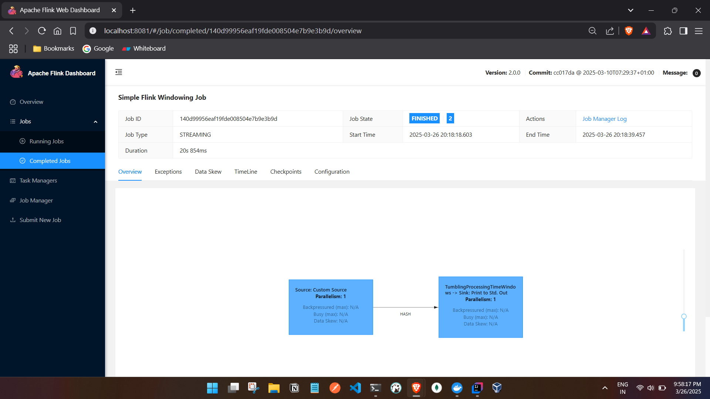

 
- windowing example:

build the jar, copy the jar in jobmanager tmp file and trigger from it and logs or code output can be seen in taskmanager.

PS C:\tmp\Flink\code\java\flink2\my-flink-project> docker cp target/my-flink-project-1.0-SNAPSHOT.jar my-flink-project-jobmanager-1:/tmp/my-flink-project.jar
Successfully copied 8.7kB to my-flink-project-jobmanager-1:/tmp/my-flink-project.jar


PS C:\tmp\Flink\code\java\flink2\my-flink-project> docker exec -it my-flink-project-jobmanager-1 flink run -c com.example.SimpleWindowingJob /tmp/my-flink-project.jar
WARNING: Unknown module: jdk.compiler specified to --add-exports
WARNING: Unknown module: jdk.compiler specified to --add-exports
WARNING: Unknown module: jdk.compiler specified to --add-exports
WARNING: Unknown module: jdk.compiler specified to --add-exports
WARNING: Unknown module: jdk.compiler specified to --add-exports
Job has been submitted with JobID 140d99956eaf19fde008504e7b9e3b9d
Program execution finished
Job with JobID 140d99956eaf19fde008504e7b9e3b9d has finished.
Job Runtime: 20854 ms


What's next:
Try Docker Debug for seamless, persistent debugging tools in any container or image → docker debug my-flink-project-jobmanager-1
Learn more at https://docs.docker.com/go/debug-cli/
PS C:\tmp\Flink\code\java\flink2\my-flink-project> docker exec -it my-flink-project-jobmanager-1 flink run -c com.example.SimpleWindowingJob /tmp/my-flink-project.jar
WARNING: Unknown module: jdk.compiler specified to --add-exports
WARNING: Unknown module: jdk.compiler specified to --add-exports
WARNING: Unknown module: jdk.compiler specified to --add-exports
WARNING: Unknown module: jdk.compiler specified to --add-exports
WARNING: Unknown module: jdk.compiler specified to --add-exports
Job has been submitted with JobID 5c66744aa9bee68006a8166c896ebb99
Program execution finished
Job with JobID 5c66744aa9bee68006a8166c896ebb99 has finished.
Job Runtime: 20503 ms


Task Manager logs:


C:\Users\ashfa>docker ps
CONTAINER ID   IMAGE                           COMMAND                  CREATED       STATUS       PORTS                              NAMES
de90b29e304b   flink:2.0.0-scala_2.12-java17   "/docker-entrypoint.…"   4 hours ago   Up 4 hours   6123/tcp, 8081/tcp                 my-flink-project-taskmanager-1
b2b1e5213e28   flink:2.0.0-scala_2.12-java17   "/docker-entrypoint.…"   4 hours ago   Up 4 hours   6123/tcp, 8081/tcp                 my-flink-project-taskmanager-2
32365c117a5d   flink:2.0.0-scala_2.12-java17   "/docker-entrypoint.…"   4 hours ago   Up 4 hours   6123/tcp, 0.0.0.0:8081->8081/tcp   my-flink-project-jobmanager-1

C:\Users\ashfa>docker logs -f de
Starting Task Manager
Starting taskexecutor as a console application on host de90b29e304b.
WARNING: Unknown module: jdk.compiler specified to --add-exports
WARNING: Unknown module: jdk.compiler specified to --add-exports
WARNING: Unknown module: jdk.compiler specified to --add-exports
WARNING: Unknown module: jdk.compiler specified to --add-exports
WARNING: Unknown module: jdk.compiler specified to --add-exports
2025-03-26 11:50:40,529 INFO  org.apache.flink.runtime.taskexecutor.TaskManagerRunner      [] - --------------------------------------------------------------------------------
2025-03-26 11:50:40,532 INFO  org.apache.flink.runtime.taskexecutor.TaskManagerRunner      [] -  Preconfiguration:
2025-03-26 11:50:40,533 INFO  org.apache.flink.runtime.taskexecutor.TaskManagerRunner      [] -


RESOURCE_PARAMS extraction logs:
jvm_params: -Xmx536870902 -Xms536870902 -XX:MaxDirectMemorySize=268435458 -XX:MaxMetaspaceSize=268435456
dynamic_configs: -D taskmanager.memory.network.min=134217730b -D taskmanager.cpu.cores=1.0 -D taskmanager.memory.task.off-heap.size=0b -D taskmanager.memory.jvm-metaspace.size=268435456b -D external-resources=none -D taskmanager.memory.jvm-overhead.min=201326592b -D taskmanager.memory.framework.off-heap.size=134217728b -D taskmanager.memory.network.max=134217730b -D taskmanager.memory.framework.heap.size=134217728b -D taskmanager.memory.managed.size=536870920b -D taskmanager.memory.task.heap.size=402653174b -D taskmanager.numberOfTaskSlots=1 -D taskmanager.memory.jvm-overhead.max=201326592b
logs: INFO  [] - Using standard YAML parser to load flink configuration file from /opt/flink/conf/config.yaml.
INFO  [] - Loading configuration property: blob.server.port, 6124
INFO  [] - Loading configuration property: taskmanager.memory.process.size, 1728m
INFO  [] - Loading configuration property: taskmanager.bind-host, 0.0.0.0
INFO  [] - Loading configuration property: jobmanager.execution.failover-strategy, region
INFO  [] - Loading configuration property: jobmanager.rpc.address, jobmanager
INFO  [] - Loading configuration property: jobmanager.memory.process.size, 1600m
INFO  [] - Loading configuration property: jobmanager.rpc.port, 6123
INFO  [] - Loading configuration property: query.server.port, 6125
INFO  [] - Loading configuration property: jobmanager.bind-host, 0.0.0.0
INFO  [] - Loading configuration property: parallelism.default, 1
INFO  [] - Loading configuration property: taskmanager.numberOfTaskSlots, 1
INFO  [] - Loading configuration property: rest.address, 0.0.0.0
INFO  [] - Loading configuration property: env.java.opts.all, --add-exports=java.base/sun.net.util=ALL-UNNAMED --add-exports=java.rmi/sun.rmi.registry=ALL-UNNAMED --add-exports=jdk.compiler/com.sun.tools.javac.api=ALL-UNNAMED --add-exports=jdk.compiler/com.sun.tools.javac.file=ALL-UNNAMED --add-exports=jdk.compiler/com.sun.tools.javac.parser=ALL-UNNAMED --add-exports=jdk.compiler/com.sun.tools.javac.tree=ALL-UNNAMED --add-exports=jdk.compiler/com.sun.tools.javac.util=ALL-UNNAMED --add-exports=java.security.jgss/sun.security.krb5=ALL-UNNAMED --add-opens=java.base/java.lang=ALL-UNNAMED --add-opens=java.base/java.net=ALL-UNNAMED --add-opens=java.base/java.io=ALL-UNNAMED --add-opens=java.base/java.nio=ALL-UNNAMED --add-opens=java.base/sun.nio.ch=ALL-UNNAMED --add-opens=java.base/java.lang.reflect=ALL-UNNAMED --add-opens=java.base/java.text=ALL-UNNAMED --add-opens=java.base/java.time=ALL-UNNAMED --add-opens=java.base/java.util=ALL-UNNAMED --add-opens=java.base/java.util.concurrent=ALL-UNNAMED --add-opens=java.base/java.util.concurrent.atomic=ALL-UNNAMED --add-opens=java.base/java.util.concurrent.locks=ALL-UNNAMED
INFO  [] - The derived from fraction jvm overhead memory (172.800mb (181193935 bytes)) is less than its min value 192.000mb (201326592 bytes), min value will be used instead
INFO  [] - Final TaskExecutor Memory configuration:
INFO  [] -   Total Process Memory:          1.688gb (1811939328 bytes)
INFO  [] -     Total Flink Memory:          1.250gb (1342177280 bytes)
INFO  [] -       Total JVM Heap Memory:     512.000mb (536870902 bytes)
INFO  [] -         Framework:               128.000mb (134217728 bytes)
INFO  [] -         Task:                    384.000mb (402653174 bytes)
INFO  [] -       Total Off-heap Memory:     768.000mb (805306378 bytes)
INFO  [] -         Managed:                 512.000mb (536870920 bytes)
INFO  [] -         Total JVM Direct Memory: 256.000mb (268435458 bytes)
INFO  [] -           Framework:             128.000mb (134217728 bytes)
INFO  [] -           Task:                  0 bytes
INFO  [] -           Network:               128.000mb (134217730 bytes)
INFO  [] -     JVM Metaspace:               256.000mb (268435456 bytes)
INFO  [] -     JVM Overhead:                192.000mb (201326592 bytes)

2025-03-26 11:50:40,534 INFO  org.apache.flink.runtime.taskexecutor.TaskManagerRunner      [] - --------------------------------------------------------------------------------
2025-03-26 11:50:40,548 INFO  org.apache.flink.runtime.taskexecutor.TaskManagerRunner      [] -  Starting TaskManager (Version: 2.0.0, Scala: 2.12, Rev:cc017da, Date:2025-03-10T07:29:37+01:00)
2025-03-26 11:50:40,549 INFO  org.apache.flink.runtime.taskexecutor.TaskManagerRunner      [] -  OS current user: flink
2025-03-26 11:50:40,550 INFO  org.apache.flink.runtime.taskexecutor.TaskManagerRunner      [] -  Current Hadoop/Kerberos user: <no hadoop dependency found>
2025-03-26 11:50:40,551 INFO  org.apache.flink.runtime.taskexecutor.TaskManagerRunner      [] -  JVM: OpenJDK 64-Bit Server VM - Eclipse Adoptium - 17/17.0.14+7
2025-03-26 11:50:40,551 INFO  org.apache.flink.runtime.taskexecutor.TaskManagerRunner      [] -  Arch: amd64
2025-03-26 11:50:40,555 INFO  org.apache.flink.runtime.taskexecutor.TaskManagerRunner      [] -  Maximum heap size: 512 MiBytes
2025-03-26 11:50:40,556 INFO  org.apache.flink.runtime.taskexecutor.TaskManagerRunner      [] -  JAVA_HOME: /opt/java/openjdk
2025-03-26 11:50:40,557 INFO  org.apache.flink.runtime.taskexecutor.TaskManagerRunner      [] -  No Hadoop Dependency available
2025-03-26 11:50:40,557 INFO  org.apache.flink.runtime.taskexecutor.TaskManagerRunner      [] -  JVM Options:
2025-03-26 11:50:40,558 INFO  org.apache.flink.runtime.taskexecutor.TaskManagerRunner      [] -     -Xmx536870902
2025-03-26 11:50:40,558 INFO  org.apache.flink.runtime.taskexecutor.TaskManagerRunner      [] -     -Xms536870902
2025-03-26 11:50:40,558 INFO  org.apache.flink.runtime.taskexecutor.TaskManagerRunner      [] -     -XX:MaxDirectMemorySize=268435458
2025-03-26 11:50:40,558 INFO  org.apache.flink.runtime.taskexecutor.TaskManagerRunner      [] -     -XX:MaxMetaspaceSize=268435456
2025-03-26 11:50:40,559 INFO  org.apache.flink.runtime.taskexecutor.TaskManagerRunner      [] -     -XX:+IgnoreUnrecognizedVMOptions
2025-03-26 11:50:40,559 INFO  org.apache.flink.runtime.taskexecutor.TaskManagerRunner      [] -     --add-exports=java.base/sun.net.util=ALL-UNNAMED
2025-03-26 11:50:40,559 INFO  org.apache.flink.runtime.taskexecutor.TaskManagerRunner      [] -     --add-exports=java.rmi/sun.rmi.registry=ALL-UNNAMED
2025-03-26 11:50:40,560 INFO  org.apache.flink.runtime.taskexecutor.TaskManagerRunner      [] -     --add-exports=jdk.compiler/com.sun.tools.javac.api=ALL-UNNAMED
2025-03-26 11:50:40,560 INFO  org.apache.flink.runtime.taskexecutor.TaskManagerRunner      [] -     --add-exports=jdk.compiler/com.sun.tools.javac.file=ALL-UNNAMED
2025-03-26 11:50:40,560 INFO  org.apache.flink.runtime.taskexecutor.TaskManagerRunner      [] -     --add-exports=jdk.compiler/com.sun.tools.javac.parser=ALL-UNNAMED
2025-03-26 11:50:40,561 INFO  org.apache.flink.runtime.taskexecutor.TaskManagerRunner      [] -     --add-exports=jdk.compiler/com.sun.tools.javac.tree=ALL-UNNAMED
2025-03-26 11:50:40,561 INFO  org.apache.flink.runtime.taskexecutor.TaskManagerRunner      [] -     --add-exports=jdk.compiler/com.sun.tools.javac.util=ALL-UNNAMED
2025-03-26 11:50:40,562 INFO  org.apache.flink.runtime.taskexecutor.TaskManagerRunner      [] -     --add-exports=java.security.jgss/sun.security.krb5=ALL-UNNAMED
2025-03-26 11:50:40,563 INFO  org.apache.flink.runtime.taskexecutor.TaskManagerRunner      [] -     --add-opens=java.base/java.lang=ALL-UNNAMED
2025-03-26 11:50:40,563 INFO  org.apache.flink.runtime.taskexecutor.TaskManagerRunner      [] -     --add-opens=java.base/java.net=ALL-UNNAMED
2025-03-26 11:50:40,564 INFO  org.apache.flink.runtime.taskexecutor.TaskManagerRunner      [] -     --add-opens=java.base/java.io=ALL-UNNAMED
2025-03-26 11:50:40,564 INFO  org.apache.flink.runtime.taskexecutor.TaskManagerRunner      [] -     --add-opens=java.base/java.nio=ALL-UNNAMED
2025-03-26 11:50:40,564 INFO  org.apache.flink.runtime.taskexecutor.TaskManagerRunner      [] -     --add-opens=java.base/sun.nio.ch=ALL-UNNAMED
2025-03-26 11:50:40,564 INFO  org.apache.flink.runtime.taskexecutor.TaskManagerRunner      [] -     --add-opens=java.base/java.lang.reflect=ALL-UNNAMED
2025-03-26 11:50:40,565 INFO  org.apache.flink.runtime.taskexecutor.TaskManagerRunner      [] -     --add-opens=java.base/java.text=ALL-UNNAMED
2025-03-26 11:50:40,565 INFO  org.apache.flink.runtime.taskexecutor.TaskManagerRunner      [] -     --add-opens=java.base/java.time=ALL-UNNAMED
2025-03-26 11:50:40,566 INFO  org.apache.flink.runtime.taskexecutor.TaskManagerRunner      [] -     --add-opens=java.base/java.util=ALL-UNNAMED
2025-03-26 11:50:40,566 INFO  org.apache.flink.runtime.taskexecutor.TaskManagerRunner      [] -     --add-opens=java.base/java.util.concurrent=ALL-UNNAMED
2025-03-26 11:50:40,566 INFO  org.apache.flink.runtime.taskexecutor.TaskManagerRunner      [] -     --add-opens=java.base/java.util.concurrent.atomic=ALL-UNNAMED
2025-03-26 11:50:40,566 INFO  org.apache.flink.runtime.taskexecutor.TaskManagerRunner      [] -     --add-opens=java.base/java.util.concurrent.locks=ALL-UNNAMED
2025-03-26 11:50:40,567 INFO  org.apache.flink.runtime.taskexecutor.TaskManagerRunner      [] -     -Dlog.file=/opt/flink/log/flink--taskexecutor-0-de90b29e304b.log
2025-03-26 11:50:40,567 INFO  org.apache.flink.runtime.taskexecutor.TaskManagerRunner      [] -     -Dlog4j.configuration=file:/opt/flink/conf/log4j-console.properties
2025-03-26 11:50:40,567 INFO  org.apache.flink.runtime.taskexecutor.TaskManagerRunner      [] -     -Dlog4j.configurationFile=file:/opt/flink/conf/log4j-console.properties
2025-03-26 11:50:40,568 INFO  org.apache.flink.runtime.taskexecutor.TaskManagerRunner      [] -     -Dlogback.configurationFile=file:/opt/flink/conf/logback-console.xml
2025-03-26 11:50:40,568 INFO  org.apache.flink.runtime.taskexecutor.TaskManagerRunner      [] -  Program Arguments:
2025-03-26 11:50:40,573 INFO  org.apache.flink.runtime.taskexecutor.TaskManagerRunner      [] -     --configDir
2025-03-26 11:50:40,573 INFO  org.apache.flink.runtime.taskexecutor.TaskManagerRunner      [] -     /opt/flink/conf
2025-03-26 11:50:40,574 INFO  org.apache.flink.runtime.taskexecutor.TaskManagerRunner      [] -     -D
2025-03-26 11:50:40,574 INFO  org.apache.flink.runtime.taskexecutor.TaskManagerRunner      [] -     taskmanager.memory.network.min=134217730b
2025-03-26 11:50:40,575 INFO  org.apache.flink.runtime.taskexecutor.TaskManagerRunner      [] -     -D
2025-03-26 11:50:40,575 INFO  org.apache.flink.runtime.taskexecutor.TaskManagerRunner      [] -     taskmanager.cpu.cores=1.0
2025-03-26 11:50:40,575 INFO  org.apache.flink.runtime.taskexecutor.TaskManagerRunner      [] -     -D
2025-03-26 11:50:40,575 INFO  org.apache.flink.runtime.taskexecutor.TaskManagerRunner      [] -     taskmanager.memory.task.off-heap.size=0b
2025-03-26 11:50:40,576 INFO  org.apache.flink.runtime.taskexecutor.TaskManagerRunner      [] -     -D
2025-03-26 11:50:40,577 INFO  org.apache.flink.runtime.taskexecutor.TaskManagerRunner      [] -     taskmanager.memory.jvm-metaspace.size=268435456b
2025-03-26 11:50:40,578 INFO  org.apache.flink.runtime.taskexecutor.TaskManagerRunner      [] -     -D
2025-03-26 11:50:40,578 INFO  org.apache.flink.runtime.taskexecutor.TaskManagerRunner      [] -     external-resources=none
2025-03-26 11:50:40,578 INFO  org.apache.flink.runtime.taskexecutor.TaskManagerRunner      [] -     -D
2025-03-26 11:50:40,579 INFO  org.apache.flink.runtime.taskexecutor.TaskManagerRunner      [] -     taskmanager.memory.jvm-overhead.min=201326592b
2025-03-26 11:50:40,580 INFO  org.apache.flink.runtime.taskexecutor.TaskManagerRunner      [] -     -D
2025-03-26 11:50:40,580 INFO  org.apache.flink.runtime.taskexecutor.TaskManagerRunner      [] -     taskmanager.memory.framework.off-heap.size=134217728b
2025-03-26 11:50:40,580 INFO  org.apache.flink.runtime.taskexecutor.TaskManagerRunner      [] -     -D
2025-03-26 11:50:40,581 INFO  org.apache.flink.runtime.taskexecutor.TaskManagerRunner      [] -     taskmanager.memory.network.max=134217730b
2025-03-26 11:50:40,581 INFO  org.apache.flink.runtime.taskexecutor.TaskManagerRunner      [] -     -D
2025-03-26 11:50:40,582 INFO  org.apache.flink.runtime.taskexecutor.TaskManagerRunner      [] -     taskmanager.memory.framework.heap.size=134217728b
2025-03-26 11:50:40,582 INFO  org.apache.flink.runtime.taskexecutor.TaskManagerRunner      [] -     -D
2025-03-26 11:50:40,583 INFO  org.apache.flink.runtime.taskexecutor.TaskManagerRunner      [] -     taskmanager.memory.managed.size=536870920b
2025-03-26 11:50:40,584 INFO  org.apache.flink.runtime.taskexecutor.TaskManagerRunner      [] -     -D
2025-03-26 11:50:40,584 INFO  org.apache.flink.runtime.taskexecutor.TaskManagerRunner      [] -     taskmanager.memory.task.heap.size=402653174b
2025-03-26 11:50:40,584 INFO  org.apache.flink.runtime.taskexecutor.TaskManagerRunner      [] -     -D
2025-03-26 11:50:40,585 INFO  org.apache.flink.runtime.taskexecutor.TaskManagerRunner      [] -     taskmanager.numberOfTaskSlots=1
2025-03-26 11:50:40,585 INFO  org.apache.flink.runtime.taskexecutor.TaskManagerRunner      [] -     -D
2025-03-26 11:50:40,585 INFO  org.apache.flink.runtime.taskexecutor.TaskManagerRunner      [] -     taskmanager.memory.jvm-overhead.max=201326592b
2025-03-26 11:50:40,585 INFO  org.apache.flink.runtime.taskexecutor.TaskManagerRunner      [] -  Classpath: /opt/flink/lib/flink-cep-2.0.0.jar:/opt/flink/lib/flink-connector-files-2.0.0.jar:/opt/flink/lib/flink-csv-2.0.0.jar:/opt/flink/lib/flink-json-2.0.0.jar:/opt/flink/lib/flink-scala_2.12-2.0.0.jar:/opt/flink/lib/flink-table-api-java-uber-2.0.0.jar:/opt/flink/lib/flink-table-planner-loader-2.0.0.jar:/opt/flink/lib/flink-table-runtime-2.0.0.jar:/opt/flink/lib/log4j-1.2-api-2.24.1.jar:/opt/flink/lib/log4j-api-2.24.1.jar:/opt/flink/lib/log4j-core-2.24.1.jar:/opt/flink/lib/log4j-slf4j-impl-2.24.1.jar:/opt/flink/lib/flink-dist-2.0.0.jar::::
2025-03-26 11:50:40,586 INFO  org.apache.flink.runtime.taskexecutor.TaskManagerRunner      [] - --------------------------------------------------------------------------------
2025-03-26 11:50:40,589 INFO  org.apache.flink.runtime.taskexecutor.TaskManagerRunner      [] - Registered UNIX signal handlers for [TERM, HUP, INT]
2025-03-26 11:50:40,612 INFO  org.apache.flink.runtime.taskexecutor.TaskManagerRunner      [] - Maximum number of open file descriptors is 1048576.
2025-03-26 11:50:40,623 INFO  org.apache.flink.configuration.GlobalConfiguration           [] - Using standard YAML parser to load flink configuration file from /opt/flink/conf/config.yaml.
2025-03-26 11:50:40,706 INFO  org.apache.flink.configuration.GlobalConfiguration           [] - Loading configuration property: blob.server.port, 6124
2025-03-26 11:50:40,706 INFO  org.apache.flink.configuration.GlobalConfiguration           [] - Loading configuration property: taskmanager.memory.process.size, 1728m
2025-03-26 11:50:40,707 INFO  org.apache.flink.configuration.GlobalConfiguration           [] - Loading configuration property: taskmanager.bind-host, 0.0.0.0
2025-03-26 11:50:40,707 INFO  org.apache.flink.configuration.GlobalConfiguration           [] - Loading configuration property: jobmanager.execution.failover-strategy, region
2025-03-26 11:50:40,708 INFO  org.apache.flink.configuration.GlobalConfiguration           [] - Loading configuration property: jobmanager.rpc.address, jobmanager
2025-03-26 11:50:40,708 INFO  org.apache.flink.configuration.GlobalConfiguration           [] - Loading configuration property: jobmanager.memory.process.size, 1600m
2025-03-26 11:50:40,709 INFO  org.apache.flink.configuration.GlobalConfiguration           [] - Loading configuration property: jobmanager.rpc.port, 6123
2025-03-26 11:50:40,709 INFO  org.apache.flink.configuration.GlobalConfiguration           [] - Loading configuration property: query.server.port, 6125
2025-03-26 11:50:40,709 INFO  org.apache.flink.configuration.GlobalConfiguration           [] - Loading configuration property: jobmanager.bind-host, 0.0.0.0
2025-03-26 11:50:40,710 INFO  org.apache.flink.configuration.GlobalConfiguration           [] - Loading configuration property: parallelism.default, 1
2025-03-26 11:50:40,710 INFO  org.apache.flink.configuration.GlobalConfiguration           [] - Loading configuration property: taskmanager.numberOfTaskSlots, 1
2025-03-26 11:50:40,710 INFO  org.apache.flink.configuration.GlobalConfiguration           [] - Loading configuration property: rest.address, 0.0.0.0
2025-03-26 11:50:40,711 INFO  org.apache.flink.configuration.GlobalConfiguration           [] - Loading configuration property: env.java.opts.all, --add-exports=java.base/sun.net.util=ALL-UNNAMED --add-exports=java.rmi/sun.rmi.registry=ALL-UNNAMED --add-exports=jdk.compiler/com.sun.tools.javac.api=ALL-UNNAMED --add-exports=jdk.compiler/com.sun.tools.javac.file=ALL-UNNAMED --add-exports=jdk.compiler/com.sun.tools.javac.parser=ALL-UNNAMED --add-exports=jdk.compiler/com.sun.tools.javac.tree=ALL-UNNAMED --add-exports=jdk.compiler/com.sun.tools.javac.util=ALL-UNNAMED --add-exports=java.security.jgss/sun.security.krb5=ALL-UNNAMED --add-opens=java.base/java.lang=ALL-UNNAMED --add-opens=java.base/java.net=ALL-UNNAMED --add-opens=java.base/java.io=ALL-UNNAMED --add-opens=java.base/java.nio=ALL-UNNAMED --add-opens=java.base/sun.nio.ch=ALL-UNNAMED --add-opens=java.base/java.lang.reflect=ALL-UNNAMED --add-opens=java.base/java.text=ALL-UNNAMED --add-opens=java.base/java.time=ALL-UNNAMED --add-opens=java.base/java.util=ALL-UNNAMED --add-opens=java.base/java.util.concurrent=ALL-UNNAMED --add-opens=java.base/java.util.concurrent.atomic=ALL-UNNAMED --add-opens=java.base/java.util.concurrent.locks=ALL-UNNAMED
2025-03-26 11:50:40,711 INFO  org.apache.flink.configuration.GlobalConfiguration           [] - Loading dynamic configuration property: taskmanager.memory.network.min, 134217730b
2025-03-26 11:50:40,712 INFO  org.apache.flink.configuration.GlobalConfiguration           [] - Loading dynamic configuration property: taskmanager.memory.jvm-metaspace.size, 268435456b
2025-03-26 11:50:40,712 INFO  org.apache.flink.configuration.GlobalConfiguration           [] - Loading dynamic configuration property: taskmanager.memory.task.off-heap.size, 0b
2025-03-26 11:50:40,712 INFO  org.apache.flink.configuration.GlobalConfiguration           [] - Loading dynamic configuration property: taskmanager.cpu.cores, 1.0
2025-03-26 11:50:40,712 INFO  org.apache.flink.configuration.GlobalConfiguration           [] - Loading dynamic configuration property: external-resources, none
2025-03-26 11:50:40,713 INFO  org.apache.flink.configuration.GlobalConfiguration           [] - Loading dynamic configuration property: taskmanager.memory.jvm-overhead.min, 201326592b
2025-03-26 11:50:40,713 INFO  org.apache.flink.configuration.GlobalConfiguration           [] - Loading dynamic configuration property: taskmanager.memory.framework.off-heap.size, 134217728b
2025-03-26 11:50:40,713 INFO  org.apache.flink.configuration.GlobalConfiguration           [] - Loading dynamic configuration property: taskmanager.memory.network.max, 134217730b
2025-03-26 11:50:40,714 INFO  org.apache.flink.configuration.GlobalConfiguration           [] - Loading dynamic configuration property: taskmanager.memory.framework.heap.size, 134217728b
2025-03-26 11:50:40,714 INFO  org.apache.flink.configuration.GlobalConfiguration           [] - Loading dynamic configuration property: taskmanager.memory.managed.size, 536870920b
2025-03-26 11:50:40,714 INFO  org.apache.flink.configuration.GlobalConfiguration           [] - Loading dynamic configuration property: taskmanager.memory.task.heap.size, 402653174b
2025-03-26 11:50:40,715 INFO  org.apache.flink.configuration.GlobalConfiguration           [] - Loading dynamic configuration property: taskmanager.numberOfTaskSlots, 1
2025-03-26 11:50:40,715 INFO  org.apache.flink.configuration.GlobalConfiguration           [] - Loading dynamic configuration property: taskmanager.memory.jvm-overhead.max, 201326592b
2025-03-26 11:50:40,785 INFO  org.apache.flink.core.fs.FileSystem                          [] - Hadoop is not in the classpath/dependencies. The extended set of supported File Systems via Hadoop is not available.
2025-03-26 11:50:40,810 INFO  org.apache.flink.core.plugin.DefaultPluginManager            [] - Plugin loader with ID not found, creating it: metrics-otel
2025-03-26 11:50:40,817 INFO  org.apache.flink.core.plugin.DefaultPluginManager            [] - Plugin loader with ID not found, creating it: external-resource-gpu
2025-03-26 11:50:40,818 INFO  org.apache.flink.core.plugin.DefaultPluginManager            [] - Plugin loader with ID not found, creating it: metrics-prometheus
2025-03-26 11:50:40,819 INFO  org.apache.flink.core.plugin.DefaultPluginManager            [] - Plugin loader with ID not found, creating it: metrics-datadog
2025-03-26 11:50:40,819 INFO  org.apache.flink.core.plugin.DefaultPluginManager            [] - Plugin loader with ID not found, creating it: metrics-graphite
2025-03-26 11:50:40,819 INFO  org.apache.flink.core.plugin.DefaultPluginManager            [] - Plugin loader with ID not found, creating it: metrics-jmx
2025-03-26 11:50:40,820 INFO  org.apache.flink.core.plugin.DefaultPluginManager            [] - Plugin loader with ID not found, creating it: metrics-influx
2025-03-26 11:50:40,820 INFO  org.apache.flink.core.plugin.DefaultPluginManager            [] - Plugin loader with ID not found, creating it: metrics-slf4j
2025-03-26 11:50:40,821 INFO  org.apache.flink.core.plugin.DefaultPluginManager            [] - Plugin loader with ID not found, creating it: metrics-statsd
2025-03-26 11:50:40,847 INFO  org.apache.flink.runtime.state.changelog.StateChangelogStorageLoader [] - StateChangelogStorageLoader initialized with shortcut names {memory,filesystem}.
2025-03-26 11:50:40,848 INFO  org.apache.flink.core.plugin.DefaultPluginManager            [] - Plugin loader with ID found, reusing it: metrics-otel
2025-03-26 11:50:40,849 INFO  org.apache.flink.core.plugin.DefaultPluginManager            [] - Plugin loader with ID found, reusing it: external-resource-gpu
2025-03-26 11:50:40,849 INFO  org.apache.flink.core.plugin.DefaultPluginManager            [] - Plugin loader with ID found, reusing it: metrics-prometheus
2025-03-26 11:50:40,849 INFO  org.apache.flink.core.plugin.DefaultPluginManager            [] - Plugin loader with ID found, reusing it: metrics-datadog
2025-03-26 11:50:40,850 INFO  org.apache.flink.core.plugin.DefaultPluginManager            [] - Plugin loader with ID found, reusing it: metrics-graphite
2025-03-26 11:50:40,851 INFO  org.apache.flink.core.plugin.DefaultPluginManager            [] - Plugin loader with ID found, reusing it: metrics-jmx
2025-03-26 11:50:40,851 INFO  org.apache.flink.core.plugin.DefaultPluginManager            [] - Plugin loader with ID found, reusing it: metrics-influx
2025-03-26 11:50:40,852 INFO  org.apache.flink.core.plugin.DefaultPluginManager            [] - Plugin loader with ID found, reusing it: metrics-slf4j
2025-03-26 11:50:40,852 INFO  org.apache.flink.core.plugin.DefaultPluginManager            [] - Plugin loader with ID found, reusing it: metrics-statsd
2025-03-26 11:50:40,856 INFO  org.apache.flink.runtime.state.changelog.StateChangelogStorageLoader [] - StateChangelogStorageLoader initialized with shortcut names {memory,filesystem}.
2025-03-26 11:50:40,877 INFO  org.apache.flink.runtime.security.modules.HadoopModuleFactory [] - Cannot create Hadoop Security Module because Hadoop cannot be found in the Classpath.
2025-03-26 11:50:40,907 INFO  org.apache.flink.runtime.security.modules.JaasModule         [] - Jaas file will be created as /tmp/jaas-5283945353592098998.conf.
2025-03-26 11:50:40,919 INFO  org.apache.flink.runtime.security.contexts.HadoopSecurityContextFactory [] - Cannot install HadoopSecurityContext because Hadoop cannot be found in the Classpath.
2025-03-26 11:50:41,404 INFO  org.apache.flink.runtime.util.LeaderRetrievalUtils           [] - Trying to select the network interface and address to use by connecting to the leading JobManager.
2025-03-26 11:50:41,406 INFO  org.apache.flink.runtime.util.LeaderRetrievalUtils           [] - TaskManager will try to connect for PT10S before falling back to heuristics
2025-03-26 11:50:41,869 INFO  org.apache.flink.runtime.net.ConnectionUtils                 [] - Trying to connect to address jobmanager/172.19.0.2:6123
2025-03-26 11:50:41,870 INFO  org.apache.flink.runtime.net.ConnectionUtils                 [] - Failed to connect to [jobmanager/172.19.0.2:6123] from local address [de90b29e304b/172.19.0.3] with timeout [200] due to: Connection refused
2025-03-26 11:50:41,871 INFO  org.apache.flink.runtime.net.ConnectionUtils                 [] - Failed to connect to [jobmanager/172.19.0.2:6123] from local address [/172.19.0.3] with timeout [50] due to: Connection refused
2025-03-26 11:50:41,872 INFO  org.apache.flink.runtime.net.ConnectionUtils                 [] - Failed to connect to [jobmanager/172.19.0.2:6123] from local address [/172.19.0.3] with timeout [50] due to: Connection refused
2025-03-26 11:50:41,873 INFO  org.apache.flink.runtime.net.ConnectionUtils                 [] - Failed to connect to [jobmanager/172.19.0.2:6123] from local address [/0:0:0:0:0:0:0:1%lo] with timeout [50] due to: Network is unreachable
2025-03-26 11:50:41,874 INFO  org.apache.flink.runtime.net.ConnectionUtils                 [] - Failed to connect to [jobmanager/172.19.0.2:6123] from local address [/127.0.0.1] with timeout [50] due to: Invalid argument
2025-03-26 11:50:41,875 INFO  org.apache.flink.runtime.net.ConnectionUtils                 [] - Failed to connect to [jobmanager/172.19.0.2:6123] from local address [/172.19.0.3] with timeout [1000] due to: Connection refused
2025-03-26 11:50:41,876 INFO  org.apache.flink.runtime.net.ConnectionUtils                 [] - Failed to connect to [jobmanager/172.19.0.2:6123] from local address [/0:0:0:0:0:0:0:1%lo] with timeout [1000] due to: Network is unreachable
2025-03-26 11:50:41,877 INFO  org.apache.flink.runtime.net.ConnectionUtils                 [] - Failed to connect to [jobmanager/172.19.0.2:6123] from local address [/127.0.0.1] with timeout [1000] due to: Invalid argument
2025-03-26 11:50:42,078 INFO  org.apache.flink.runtime.net.ConnectionUtils                 [] - Trying to connect to address jobmanager/172.19.0.2:6123
2025-03-26 11:50:42,079 INFO  org.apache.flink.runtime.net.ConnectionUtils                 [] - Failed to connect to [jobmanager/172.19.0.2:6123] from local address [de90b29e304b/172.19.0.3] with timeout [200] due to: Connection refused
2025-03-26 11:50:42,080 INFO  org.apache.flink.runtime.net.ConnectionUtils                 [] - Failed to connect to [jobmanager/172.19.0.2:6123] from local address [/172.19.0.3] with timeout [50] due to: Connection refused
2025-03-26 11:50:42,081 INFO  org.apache.flink.runtime.net.ConnectionUtils                 [] - Failed to connect to [jobmanager/172.19.0.2:6123] from local address [/172.19.0.3] with timeout [50] due to: Connection refused
2025-03-26 11:50:42,082 INFO  org.apache.flink.runtime.net.ConnectionUtils                 [] - Failed to connect to [jobmanager/172.19.0.2:6123] from local address [/0:0:0:0:0:0:0:1%lo] with timeout [50] due to: Network is unreachable
2025-03-26 11:50:42,083 INFO  org.apache.flink.runtime.net.ConnectionUtils                 [] - Failed to connect to [jobmanager/172.19.0.2:6123] from local address [/127.0.0.1] with timeout [50] due to: Invalid argument
2025-03-26 11:50:42,084 INFO  org.apache.flink.runtime.net.ConnectionUtils                 [] - Failed to connect to [jobmanager/172.19.0.2:6123] from local address [/172.19.0.3] with timeout [1000] due to: Connection refused
2025-03-26 11:50:42,086 INFO  org.apache.flink.runtime.net.ConnectionUtils                 [] - Failed to connect to [jobmanager/172.19.0.2:6123] from local address [/0:0:0:0:0:0:0:1%lo] with timeout [1000] due to: Network is unreachable
2025-03-26 11:50:42,086 INFO  org.apache.flink.runtime.net.ConnectionUtils                 [] - Failed to connect to [jobmanager/172.19.0.2:6123] from local address [/127.0.0.1] with timeout [1000] due to: Invalid argument
2025-03-26 11:50:42,487 INFO  org.apache.flink.runtime.net.ConnectionUtils                 [] - Trying to connect to address jobmanager/172.19.0.2:6123
2025-03-26 11:50:42,488 INFO  org.apache.flink.runtime.net.ConnectionUtils                 [] - Failed to connect to [jobmanager/172.19.0.2:6123] from local address [de90b29e304b/172.19.0.3] with timeout [200] due to: Connection refused
2025-03-26 11:50:42,489 INFO  org.apache.flink.runtime.net.ConnectionUtils                 [] - Failed to connect to [jobmanager/172.19.0.2:6123] from local address [/172.19.0.3] with timeout [50] due to: Connection refused
2025-03-26 11:50:42,490 INFO  org.apache.flink.runtime.net.ConnectionUtils                 [] - Failed to connect to [jobmanager/172.19.0.2:6123] from local address [/172.19.0.3] with timeout [50] due to: Connection refused
2025-03-26 11:50:42,490 INFO  org.apache.flink.runtime.net.ConnectionUtils                 [] - Failed to connect to [jobmanager/172.19.0.2:6123] from local address [/0:0:0:0:0:0:0:1%lo] with timeout [50] due to: Network is unreachable
2025-03-26 11:50:42,491 INFO  org.apache.flink.runtime.net.ConnectionUtils                 [] - Failed to connect to [jobmanager/172.19.0.2:6123] from local address [/127.0.0.1] with timeout [50] due to: Invalid argument
2025-03-26 11:50:42,492 INFO  org.apache.flink.runtime.net.ConnectionUtils                 [] - Failed to connect to [jobmanager/172.19.0.2:6123] from local address [/172.19.0.3] with timeout [1000] due to: Connection refused
2025-03-26 11:50:42,492 INFO  org.apache.flink.runtime.net.ConnectionUtils                 [] - Failed to connect to [jobmanager/172.19.0.2:6123] from local address [/0:0:0:0:0:0:0:1%lo] with timeout [1000] due to: Network is unreachable
2025-03-26 11:50:42,493 INFO  org.apache.flink.runtime.net.ConnectionUtils                 [] - Failed to connect to [jobmanager/172.19.0.2:6123] from local address [/127.0.0.1] with timeout [1000] due to: Invalid argument
2025-03-26 11:50:43,293 INFO  org.apache.flink.runtime.net.ConnectionUtils                 [] - Trying to connect to address jobmanager/172.19.0.2:6123
2025-03-26 11:50:43,295 INFO  org.apache.flink.runtime.taskexecutor.TaskManagerRunner      [] - TaskManager will use hostname/address 'de90b29e304b' (172.19.0.3) for communication.
2025-03-26 11:50:43,366 INFO  org.apache.flink.runtime.rpc.pekko.PekkoRpcServiceUtils      [] - Trying to start actor system, external address 172.19.0.3:0, bind address 0.0.0.0:0.
2025-03-26 11:50:44,213 INFO  org.apache.pekko.event.slf4j.Slf4jLogger                     [] - Slf4jLogger started
2025-03-26 11:50:44,263 INFO  org.apache.pekko.remote.RemoteActorRefProvider               [] - Pekko Cluster not in use - enabling unsafe features anyway because `pekko.remote.use-unsafe-remote-features-outside-cluster` has been enabled.
2025-03-26 11:50:44,266 INFO  org.apache.pekko.remote.Remoting                             [] - Starting remoting
2025-03-26 11:50:44,586 INFO  org.apache.pekko.remote.Remoting                             [] - Remoting started; listening on addresses :[pekko.tcp://flink@172.19.0.3:35889]
2025-03-26 11:50:44,758 INFO  org.apache.flink.runtime.rpc.pekko.PekkoRpcServiceUtils      [] - Actor system started at pekko.tcp://flink@172.19.0.3:35889
2025-03-26 11:50:44,785 INFO  org.apache.flink.runtime.taskexecutor.TaskManagerRunner      [] - Using working directory: WorkingDirectory(/tmp/tm_172.19.0.3:35889-20872d)
2025-03-26 11:50:44,805 INFO  org.apache.flink.runtime.metrics.MetricRegistryImpl          [] - No metrics reporter configured, no metrics will be exposed/reported.
2025-03-26 11:50:44,805 INFO  org.apache.flink.runtime.metrics.MetricRegistryImpl          [] - No trace reporter configured, no metrics will be exposed/reported.
2025-03-26 11:50:44,815 INFO  org.apache.flink.runtime.rpc.pekko.PekkoRpcServiceUtils      [] - Trying to start actor system, external address 172.19.0.3:0, bind address 0.0.0.0:0.
2025-03-26 11:50:44,871 INFO  org.apache.pekko.event.slf4j.Slf4jLogger                     [] - Slf4jLogger started
2025-03-26 11:50:44,881 INFO  org.apache.pekko.remote.RemoteActorRefProvider               [] - Pekko Cluster not in use - enabling unsafe features anyway because `pekko.remote.use-unsafe-remote-features-outside-cluster` has been enabled.
2025-03-26 11:50:44,882 INFO  org.apache.pekko.remote.Remoting                             [] - Starting remoting
2025-03-26 11:50:44,919 INFO  org.apache.pekko.remote.Remoting                             [] - Remoting started; listening on addresses :[pekko.tcp://flink-metrics@172.19.0.3:40831]
2025-03-26 11:50:44,938 INFO  org.apache.flink.runtime.rpc.pekko.PekkoRpcServiceUtils      [] - Actor system started at pekko.tcp://flink-metrics@172.19.0.3:40831
2025-03-26 11:50:44,962 INFO  org.apache.flink.runtime.rpc.pekko.PekkoRpcService           [] - Starting RPC endpoint for org.apache.flink.runtime.metrics.dump.MetricQueryService at pekko://flink-metrics/user/rpc/MetricQueryService_172.19.0.3:35889-20872d .
2025-03-26 11:50:44,985 INFO  org.apache.flink.runtime.blob.PermanentBlobCache             [] - Created BLOB cache storage directory /tmp/tm_172.19.0.3:35889-20872d/blobStorage
2025-03-26 11:50:44,997 INFO  org.apache.flink.runtime.blob.TransientBlobCache             [] - Created BLOB cache storage directory /tmp/tm_172.19.0.3:35889-20872d/blobStorage
2025-03-26 11:50:45,007 INFO  org.apache.flink.runtime.externalresource.ExternalResourceUtils [] - Enabled external resources: []
2025-03-26 11:50:45,009 INFO  org.apache.flink.runtime.security.token.DelegationTokenReceiverRepository [] - Loading delegation token receivers
2025-03-26 11:50:45,018 INFO  org.apache.flink.runtime.security.token.DelegationTokenReceiverRepository [] - Delegation token receiver hadoopfs loaded and initialized
2025-03-26 11:50:45,019 INFO  org.apache.flink.runtime.security.token.DelegationTokenReceiverRepository [] - Delegation token receiver hbase loaded and initialized
2025-03-26 11:50:45,020 INFO  org.apache.flink.core.plugin.DefaultPluginManager            [] - Plugin loader with ID found, reusing it: metrics-otel
2025-03-26 11:50:45,021 INFO  org.apache.flink.core.plugin.DefaultPluginManager            [] - Plugin loader with ID found, reusing it: external-resource-gpu
2025-03-26 11:50:45,021 INFO  org.apache.flink.core.plugin.DefaultPluginManager            [] - Plugin loader with ID found, reusing it: metrics-prometheus
2025-03-26 11:50:45,022 INFO  org.apache.flink.core.plugin.DefaultPluginManager            [] - Plugin loader with ID found, reusing it: metrics-datadog
2025-03-26 11:50:45,023 INFO  org.apache.flink.core.plugin.DefaultPluginManager            [] - Plugin loader with ID found, reusing it: metrics-graphite
2025-03-26 11:50:45,024 INFO  org.apache.flink.core.plugin.DefaultPluginManager            [] - Plugin loader with ID found, reusing it: metrics-jmx
2025-03-26 11:50:45,024 INFO  org.apache.flink.core.plugin.DefaultPluginManager            [] - Plugin loader with ID found, reusing it: metrics-influx
2025-03-26 11:50:45,024 INFO  org.apache.flink.core.plugin.DefaultPluginManager            [] - Plugin loader with ID found, reusing it: metrics-slf4j
2025-03-26 11:50:45,024 INFO  org.apache.flink.core.plugin.DefaultPluginManager            [] - Plugin loader with ID found, reusing it: metrics-statsd
2025-03-26 11:50:45,026 INFO  org.apache.flink.runtime.security.token.DelegationTokenReceiverRepository [] - Delegation token receivers loaded successfully
2025-03-26 11:50:45,026 INFO  org.apache.flink.runtime.taskexecutor.TaskManagerRunner      [] - Starting TaskManager with ResourceID: 172.19.0.3:35889-20872d
2025-03-26 11:50:45,161 INFO  org.apache.flink.runtime.taskexecutor.TaskManagerServices    [] - Temporary file directory '/tmp': total 1006 GB, usable 926 GB (92.05% usable)
2025-03-26 11:50:45,166 INFO  org.apache.flink.runtime.io.disk.iomanager.IOManager         [] - Created a new FileChannelManager for spilling of task related data to disk (joins, sorting, ...). Used directories:
/tmp/flink-io-3fce91d6-f4d5-456f-a327-cb54a87ba11e
2025-03-26 11:50:45,181 INFO  org.apache.flink.runtime.io.network.netty.NettyConfig        [] - NettyConfig [server address: /0.0.0.0, server port range: 0, ssl enabled: false, memory segment size (bytes): 32768, number of server threads: 1 (manual), number of client threads: 1 (manual), server connect backlog: 0 (use Netty's default), client connect timeout (sec): 120, send/receive buffer size (bytes): 0 (use Netty's default)]
2025-03-26 11:50:45,196 INFO  org.apache.flink.runtime.io.network.NettyShuffleServiceFactory [] - Created a new FileChannelManager for storing result partitions of BLOCKING shuffles. Used directories:
/tmp/flink-netty-shuffle-7fe797fa-f902-43af-b361-ef8377b60345
2025-03-26 11:50:45,370 INFO  org.apache.flink.runtime.io.network.buffer.NetworkBufferPool [] - Allocated 128 MB for network buffer pool (number of memory segments: 4096, bytes per segment: 32768).
2025-03-26 11:50:45,386 INFO  org.apache.flink.runtime.io.network.NettyShuffleEnvironment  [] - Starting the network environment and its components.
2025-03-26 11:50:45,424 INFO  org.apache.flink.runtime.io.network.netty.NettyClient        [] - Transport type 'auto': using EPOLL.
2025-03-26 11:50:45,425 INFO  org.apache.flink.runtime.io.network.netty.NettyClient        [] - Successful initialization (took 38 ms).
2025-03-26 11:50:45,428 INFO  org.apache.flink.runtime.io.network.netty.NettyServer        [] - Transport type 'auto': using EPOLL.
2025-03-26 11:50:45,436 INFO  org.apache.flink.runtime.io.network.netty.NettyServer        [] - Successful initialization (took 10 ms). Listening on SocketAddress /[0:0:0:0:0:0:0:0%0]:41027.
2025-03-26 11:50:45,436 INFO  org.apache.flink.runtime.taskexecutor.TaskManagerServices    [] - TaskManager data connection initialized successfully; listening internally on port: 41027
2025-03-26 11:50:45,439 INFO  org.apache.flink.runtime.taskexecutor.KvStateService         [] - Starting the kvState service and its components.
2025-03-26 11:50:45,500 INFO  org.apache.flink.runtime.rpc.pekko.PekkoRpcService           [] - Starting RPC endpoint for org.apache.flink.runtime.taskexecutor.TaskExecutor at pekko://flink/user/rpc/taskmanager_0 .
2025-03-26 11:50:45,535 INFO  org.apache.flink.runtime.taskexecutor.DefaultJobLeaderService [] - Start job leader service.
2025-03-26 11:50:45,557 INFO  org.apache.flink.runtime.filecache.FileCache                 [] - User file cache uses directory /tmp/flink-dist-cache-237a0ebb-a01d-4f2b-8b6d-ff5d9814741e
2025-03-26 11:50:45,561 INFO  org.apache.flink.runtime.taskexecutor.TaskExecutor           [] - Connecting to ResourceManager pekko.tcp://flink@jobmanager:6123/user/rpc/resourcemanager_*(00000000000000000000000000000000).
2025-03-26 11:50:45,886 INFO  org.apache.flink.runtime.taskexecutor.TaskExecutor           [] - Resolved ResourceManager address, beginning registration
2025-03-26 11:50:45,976 INFO  org.apache.flink.runtime.taskexecutor.TaskExecutor           [] - Successful registration at resource manager pekko.tcp://flink@jobmanager:6123/user/rpc/resourcemanager_* under registration id 7b6adb21eb3c7c80977c170a8f6ca229.


2025-03-26 14:48:18,989 INFO  org.apache.flink.runtime.taskexecutor.TaskExecutor           [] - Receive slot request 9429105938f6b1465940256dcf1a2972 for job 140d99956eaf19fde008504e7b9e3b9d from resource manager with leader id 00000000000000000000000000000000.
2025-03-26 14:48:19,019 INFO  org.apache.flink.runtime.taskexecutor.slot.TaskSlotTableImpl [] - Allocated slot for 9429105938f6b1465940256dcf1a2972 with resources ResourceProfile{cpuCores=1, taskHeapMemory=384.000mb (402653174 bytes), taskOffHeapMemory=0 bytes, managedMemory=512.000mb (536870920 bytes), networkMemory=128.000mb (134217730 bytes)}.
2025-03-26 14:48:19,023 INFO  org.apache.flink.runtime.taskexecutor.DefaultJobLeaderService [] - Add job 140d99956eaf19fde008504e7b9e3b9d for job leader monitoring.
2025-03-26 14:48:19,025 INFO  org.apache.flink.runtime.taskexecutor.DefaultJobLeaderService [] - Try to register at job manager pekko.tcp://flink@jobmanager:6123/user/rpc/jobmanager_3 with leader id 00000000-0000-0000-0000-000000000000.
2025-03-26 14:48:19,053 INFO  org.apache.flink.runtime.taskexecutor.DefaultJobLeaderService [] - Resolved JobManager address, beginning registration
2025-03-26 14:48:19,074 INFO  org.apache.flink.runtime.taskexecutor.DefaultJobLeaderService [] - Successful registration at job manager pekko.tcp://flink@jobmanager:6123/user/rpc/jobmanager_3 for job 140d99956eaf19fde008504e7b9e3b9d.
2025-03-26 14:48:19,075 INFO  org.apache.flink.runtime.taskexecutor.TaskExecutor           [] - Establish JobManager connection for job 140d99956eaf19fde008504e7b9e3b9d.
2025-03-26 14:48:19,076 INFO  org.apache.flink.runtime.taskexecutor.TaskExecutor           [] - Offer reserved slots to the leader of job 140d99956eaf19fde008504e7b9e3b9d.
2025-03-26 14:48:19,160 INFO  org.apache.flink.runtime.taskexecutor.slot.TaskSlotTableImpl [] - Activate slot 9429105938f6b1465940256dcf1a2972.
2025-03-26 14:48:19,176 INFO  org.apache.flink.runtime.state.changelog.StateChangelogStorageLoader [] - Creating a changelog storage with name 'memory'.
2025-03-26 14:48:19,177 INFO  org.apache.flink.runtime.state.TaskExecutorChannelStateExecutorFactoryManager [] - Creating the channel state executor factory for job id 140d99956eaf19fde008504e7b9e3b9d
2025-03-26 14:48:19,223 INFO  org.apache.flink.runtime.taskexecutor.TaskExecutor           [] - Received task Source: Custom Source (1/1)#0 (03fb105bab7b90071394561c94c37367_bc764cd8ddf7a0cff126f51c16239658_0_0), deploy into slot with allocation id 9429105938f6b1465940256dcf1a2972.
2025-03-26 14:48:19,225 INFO  org.apache.flink.runtime.taskexecutor.slot.TaskSlotTableImpl [] - Activate slot 9429105938f6b1465940256dcf1a2972.
2025-03-26 14:48:19,225 INFO  org.apache.flink.runtime.taskmanager.Task                    [] - Source: Custom Source (1/1)#0 (03fb105bab7b90071394561c94c37367_bc764cd8ddf7a0cff126f51c16239658_0_0) switched from CREATED to DEPLOYING.
2025-03-26 14:48:19,228 INFO  org.apache.flink.runtime.taskmanager.Task                    [] - Loading JAR files for task Source: Custom Source (1/1)#0 (03fb105bab7b90071394561c94c37367_bc764cd8ddf7a0cff126f51c16239658_0_0) [DEPLOYING].
2025-03-26 14:48:19,235 INFO  org.apache.flink.runtime.blob.BlobClient                     [] - Downloading 140d99956eaf19fde008504e7b9e3b9d/p-c1584afca08050eda51c6c4ae6fe6df872e0d7ba-4daaabb0aba9e68176cb1c510cc86e33 from jobmanager/172.19.0.2:6124
2025-03-26 14:48:19,281 INFO  org.apache.flink.runtime.taskexecutor.TaskExecutor           [] - Received task TumblingProcessingTimeWindows -> Sink: Print to Std. Out (1/1)#0 (03fb105bab7b90071394561c94c37367_20ba6b65f97481d5570070de90e4e791_0_0), deploy into slot with allocation id 9429105938f6b1465940256dcf1a2972.
2025-03-26 14:48:19,283 INFO  org.apache.flink.runtime.taskexecutor.slot.TaskSlotTableImpl [] - Activate slot 9429105938f6b1465940256dcf1a2972.
2025-03-26 14:48:19,285 INFO  org.apache.flink.runtime.taskmanager.Task                    [] - TumblingProcessingTimeWindows -> Sink: Print to Std. Out (1/1)#0 (03fb105bab7b90071394561c94c37367_20ba6b65f97481d5570070de90e4e791_0_0) switched from CREATED to DEPLOYING.
2025-03-26 14:48:19,286 INFO  org.apache.flink.runtime.taskmanager.Task                    [] - Loading JAR files for task TumblingProcessingTimeWindows -> Sink: Print to Std. Out (1/1)#0 (03fb105bab7b90071394561c94c37367_20ba6b65f97481d5570070de90e4e791_0_0) [DEPLOYING].
2025-03-26 14:48:19,295 INFO  org.apache.flink.streaming.runtime.tasks.StreamTask          [] - State backend is set to heap memory org.apache.flink.runtime.state.hashmap.HashMapStateBackend@7cbb09a
2025-03-26 14:48:19,296 INFO  org.apache.flink.runtime.state.StateBackendLoader            [] - State backend loader loads the state backend as HashMapStateBackend
2025-03-26 14:48:19,297 INFO  org.apache.flink.streaming.runtime.tasks.StreamTask          [] - Checkpoint storage is set to 'jobmanager'
2025-03-26 14:48:19,300 INFO  org.apache.flink.runtime.taskmanager.Task                    [] - TumblingProcessingTimeWindows -> Sink: Print to Std. Out (1/1)#0 (03fb105bab7b90071394561c94c37367_20ba6b65f97481d5570070de90e4e791_0_0) switched from DEPLOYING to INITIALIZING.
2025-03-26 14:48:19,311 INFO  org.apache.flink.streaming.runtime.tasks.StreamTask          [] - State backend is set to heap memory org.apache.flink.runtime.state.hashmap.HashMapStateBackend@5a5d2b6d
2025-03-26 14:48:19,311 INFO  org.apache.flink.runtime.state.StateBackendLoader            [] - State backend loader loads the state backend as HashMapStateBackend
2025-03-26 14:48:19,311 INFO  org.apache.flink.streaming.runtime.tasks.StreamTask          [] - Checkpoint storage is set to 'jobmanager'
2025-03-26 14:48:19,312 INFO  org.apache.flink.runtime.taskmanager.Task                    [] - Source: Custom Source (1/1)#0 (03fb105bab7b90071394561c94c37367_bc764cd8ddf7a0cff126f51c16239658_0_0) switched from DEPLOYING to INITIALIZING.
2025-03-26 14:48:19,351 INFO  org.apache.flink.runtime.state.StateBackendLoader            [] - State backend is set to heap memory org.apache.flink.runtime.state.hashmap.HashMapStateBackend@412b48af
2025-03-26 14:48:19,358 INFO  org.apache.flink.runtime.taskmanager.Task                    [] - Source: Custom Source (1/1)#0 (03fb105bab7b90071394561c94c37367_bc764cd8ddf7a0cff126f51c16239658_0_0) switched from INITIALIZING to RUNNING.
2025-03-26 14:48:19,430 INFO  org.apache.flink.runtime.state.StateBackendLoader            [] - State backend is set to heap memory org.apache.flink.runtime.state.hashmap.HashMapStateBackend@61f191b
2025-03-26 14:48:19,431 INFO  org.apache.flink.runtime.state.StateBackendLoader            [] - State backend is set to heap memory org.apache.flink.runtime.state.hashmap.HashMapStateBackend@4a14d5e8
2025-03-26 14:48:19,454 INFO  org.apache.flink.runtime.state.heap.HeapKeyedStateBackendBuilder [] - Finished to build heap keyed state-backend.
2025-03-26 14:48:19,465 INFO  org.apache.flink.runtime.state.heap.HeapKeyedStateBackend    [] - Initializing heap keyed state backend with stream factory.
2025-03-26 14:48:19,490 INFO  org.apache.flink.runtime.taskmanager.Task                    [] - TumblingProcessingTimeWindows -> Sink: Print to Std. Out (1/1)#0 (03fb105bab7b90071394561c94c37367_20ba6b65f97481d5570070de90e4e791_0_0) switched from INITIALIZING to RUNNING.
(2,3)
(4,1)
(1,1)
(4,15)
(2,6)
(1,11)
(0,7)
(3,11)
(1,8)
(2,10)
(4,7)
(0,13)
(3,12)
(0,10)
(3,10)
(1,14)
(4,6)
(2,10)
2025-03-26 14:48:39,439 INFO  org.apache.flink.runtime.taskmanager.Task                    [] - Source: Custom Source (1/1)#0 (03fb105bab7b90071394561c94c37367_bc764cd8ddf7a0cff126f51c16239658_0_0) switched from RUNNING to FINISHED.
2025-03-26 14:48:39,439 INFO  org.apache.flink.runtime.taskmanager.Task                    [] - Freeing task resources for Source: Custom Source (1/1)#0 (03fb105bab7b90071394561c94c37367_bc764cd8ddf7a0cff126f51c16239658_0_0).
2025-03-26 14:48:39,442 INFO  org.apache.flink.runtime.taskexecutor.TaskExecutor           [] - Un-registering task and sending final execution state FINISHED to JobManager for task Source: Custom Source (1/1)#0 03fb105bab7b90071394561c94c37367_bc764cd8ddf7a0cff126f51c16239658_0_0.
2025-03-26 14:48:39,443 INFO  org.apache.flink.runtime.taskmanager.Task                    [] - TumblingProcessingTimeWindows -> Sink: Print to Std. Out (1/1)#0 (03fb105bab7b90071394561c94c37367_20ba6b65f97481d5570070de90e4e791_0_0) switched from RUNNING to FINISHED.
2025-03-26 14:48:39,444 INFO  org.apache.flink.runtime.taskmanager.Task                    [] - Freeing task resources for TumblingProcessingTimeWindows -> Sink: Print to Std. Out (1/1)#0 (03fb105bab7b90071394561c94c37367_20ba6b65f97481d5570070de90e4e791_0_0).
2025-03-26 14:48:39,446 INFO  org.apache.flink.runtime.taskexecutor.TaskExecutor           [] - Un-registering task and sending final execution state FINISHED to JobManager for task TumblingProcessingTimeWindows -> Sink: Print to Std. Out (1/1)#0 03fb105bab7b90071394561c94c37367_20ba6b65f97481d5570070de90e4e791_0_0.
2025-03-26 14:48:39,487 INFO  org.apache.flink.runtime.taskexecutor.slot.TaskSlotTableImpl [] - Free slot TaskSlot(index:2, state:ACTIVE, resource profile: ResourceProfile{cpuCores=1, taskHeapMemory=384.000mb (402653174 bytes), taskOffHeapMemory=0 bytes, managedMemory=512.000mb (536870920 bytes), networkMemory=128.000mb (134217730 bytes)}, allocationId: 9429105938f6b1465940256dcf1a2972, jobId: 140d99956eaf19fde008504e7b9e3b9d).
2025-03-26 14:48:39,489 INFO  org.apache.flink.runtime.taskexecutor.DefaultJobLeaderService [] - Remove job 140d99956eaf19fde008504e7b9e3b9d from job leader monitoring.
2025-03-26 14:48:39,490 INFO  org.apache.flink.runtime.taskexecutor.TaskExecutor           [] - Close JobManager connection for job 140d99956eaf19fde008504e7b9e3b9d.
2025-03-26 16:07:54,360 INFO  org.apache.flink.runtime.taskexecutor.TaskExecutor           [] - Receive slot request c0a2f06c329d22c32beb65647c3c9713 for job 5c66744aa9bee68006a8166c896ebb99 from resource manager with leader id 00000000000000000000000000000000.
2025-03-26 16:07:54,378 INFO  org.apache.flink.runtime.taskexecutor.slot.TaskSlotTableImpl [] - Allocated slot for c0a2f06c329d22c32beb65647c3c9713 with resources ResourceProfile{cpuCores=1, taskHeapMemory=384.000mb (402653174 bytes), taskOffHeapMemory=0 bytes, managedMemory=512.000mb (536870920 bytes), networkMemory=128.000mb (134217730 bytes)}.
2025-03-26 16:07:54,381 INFO  org.apache.flink.runtime.taskexecutor.DefaultJobLeaderService [] - Add job 5c66744aa9bee68006a8166c896ebb99 for job leader monitoring.
2025-03-26 16:07:54,383 INFO  org.apache.flink.runtime.taskexecutor.DefaultJobLeaderService [] - Try to register at job manager pekko.tcp://flink@jobmanager:6123/user/rpc/jobmanager_4 with leader id 00000000-0000-0000-0000-000000000000.
2025-03-26 16:07:54,406 INFO  org.apache.flink.runtime.taskexecutor.DefaultJobLeaderService [] - Resolved JobManager address, beginning registration
2025-03-26 16:07:54,421 INFO  org.apache.flink.runtime.taskexecutor.DefaultJobLeaderService [] - Successful registration at job manager pekko.tcp://flink@jobmanager:6123/user/rpc/jobmanager_4 for job 5c66744aa9bee68006a8166c896ebb99.
2025-03-26 16:07:54,422 INFO  org.apache.flink.runtime.taskexecutor.TaskExecutor           [] - Establish JobManager connection for job 5c66744aa9bee68006a8166c896ebb99.
2025-03-26 16:07:54,423 INFO  org.apache.flink.runtime.taskexecutor.TaskExecutor           [] - Offer reserved slots to the leader of job 5c66744aa9bee68006a8166c896ebb99.
2025-03-26 16:07:54,451 INFO  org.apache.flink.runtime.taskexecutor.slot.TaskSlotTableImpl [] - Activate slot c0a2f06c329d22c32beb65647c3c9713.
2025-03-26 16:07:54,464 INFO  org.apache.flink.runtime.state.changelog.StateChangelogStorageLoader [] - Creating a changelog storage with name 'memory'.
2025-03-26 16:07:54,466 INFO  org.apache.flink.runtime.state.TaskExecutorChannelStateExecutorFactoryManager [] - Creating the channel state executor factory for job id 5c66744aa9bee68006a8166c896ebb99
2025-03-26 16:07:54,472 INFO  org.apache.flink.runtime.taskexecutor.TaskExecutor           [] - Received task Source: Custom Source (1/1)#0 (a74a50603f1eba44058ee9c3b4fead1b_bc764cd8ddf7a0cff126f51c16239658_0_0), deploy into slot with allocation id c0a2f06c329d22c32beb65647c3c9713.
2025-03-26 16:07:54,477 INFO  org.apache.flink.runtime.taskexecutor.slot.TaskSlotTableImpl [] - Activate slot c0a2f06c329d22c32beb65647c3c9713.
2025-03-26 16:07:54,477 INFO  org.apache.flink.runtime.taskexecutor.slot.TaskSlotTableImpl [] - Activate slot c0a2f06c329d22c32beb65647c3c9713.
2025-03-26 16:07:54,476 INFO  org.apache.flink.runtime.taskmanager.Task                    [] - Source: Custom Source (1/1)#0 (a74a50603f1eba44058ee9c3b4fead1b_bc764cd8ddf7a0cff126f51c16239658_0_0) switched from CREATED to DEPLOYING.
2025-03-26 16:07:54,482 INFO  org.apache.flink.runtime.taskmanager.Task                    [] - Loading JAR files for task Source: Custom Source (1/1)#0 (a74a50603f1eba44058ee9c3b4fead1b_bc764cd8ddf7a0cff126f51c16239658_0_0) [DEPLOYING].
2025-03-26 16:07:54,487 INFO  org.apache.flink.runtime.taskexecutor.TaskExecutor           [] - Received task TumblingProcessingTimeWindows -> Sink: Print to Std. Out (1/1)#0 (a74a50603f1eba44058ee9c3b4fead1b_20ba6b65f97481d5570070de90e4e791_0_0), deploy into slot with allocation id c0a2f06c329d22c32beb65647c3c9713.
2025-03-26 16:07:54,487 INFO  org.apache.flink.runtime.blob.BlobClient                     [] - Downloading 5c66744aa9bee68006a8166c896ebb99/p-c1584afca08050eda51c6c4ae6fe6df872e0d7ba-326ea39f2b0ccc0689781c7fad58fc4b from jobmanager/172.19.0.2:6124
2025-03-26 16:07:54,489 INFO  org.apache.flink.runtime.taskmanager.Task                    [] - TumblingProcessingTimeWindows -> Sink: Print to Std. Out (1/1)#0 (a74a50603f1eba44058ee9c3b4fead1b_20ba6b65f97481d5570070de90e4e791_0_0) switched from CREATED to DEPLOYING.
2025-03-26 16:07:54,490 INFO  org.apache.flink.runtime.taskmanager.Task                    [] - Loading JAR files for task TumblingProcessingTimeWindows -> Sink: Print to Std. Out (1/1)#0 (a74a50603f1eba44058ee9c3b4fead1b_20ba6b65f97481d5570070de90e4e791_0_0) [DEPLOYING].
2025-03-26 16:07:54,509 INFO  org.apache.flink.streaming.runtime.tasks.StreamTask          [] - State backend is set to heap memory org.apache.flink.runtime.state.hashmap.HashMapStateBackend@3e4ea51e
2025-03-26 16:07:54,509 INFO  org.apache.flink.runtime.state.StateBackendLoader            [] - State backend loader loads the state backend as HashMapStateBackend
2025-03-26 16:07:54,509 INFO  org.apache.flink.streaming.runtime.tasks.StreamTask          [] - Checkpoint storage is set to 'jobmanager'
2025-03-26 16:07:54,513 INFO  org.apache.flink.runtime.taskmanager.Task                    [] - TumblingProcessingTimeWindows -> Sink: Print to Std. Out (1/1)#0 (a74a50603f1eba44058ee9c3b4fead1b_20ba6b65f97481d5570070de90e4e791_0_0) switched from DEPLOYING to INITIALIZING.
2025-03-26 16:07:54,530 INFO  org.apache.flink.streaming.runtime.tasks.StreamTask          [] - State backend is set to heap memory org.apache.flink.runtime.state.hashmap.HashMapStateBackend@1c32e0b1
2025-03-26 16:07:54,531 INFO  org.apache.flink.runtime.state.StateBackendLoader            [] - State backend loader loads the state backend as HashMapStateBackend
2025-03-26 16:07:54,531 INFO  org.apache.flink.streaming.runtime.tasks.StreamTask          [] - Checkpoint storage is set to 'jobmanager'
2025-03-26 16:07:54,532 INFO  org.apache.flink.runtime.taskmanager.Task                    [] - Source: Custom Source (1/1)#0 (a74a50603f1eba44058ee9c3b4fead1b_bc764cd8ddf7a0cff126f51c16239658_0_0) switched from DEPLOYING to INITIALIZING.
2025-03-26 16:07:54,554 INFO  org.apache.flink.runtime.state.StateBackendLoader            [] - State backend is set to heap memory org.apache.flink.runtime.state.hashmap.HashMapStateBackend@200aa967
2025-03-26 16:07:54,558 INFO  org.apache.flink.runtime.state.StateBackendLoader            [] - State backend is set to heap memory org.apache.flink.runtime.state.hashmap.HashMapStateBackend@184252fa
2025-03-26 16:07:54,559 INFO  org.apache.flink.runtime.state.StateBackendLoader            [] - State backend is set to heap memory org.apache.flink.runtime.state.hashmap.HashMapStateBackend@64bc312b
2025-03-26 16:07:54,561 INFO  org.apache.flink.runtime.taskmanager.Task                    [] - Source: Custom Source (1/1)#0 (a74a50603f1eba44058ee9c3b4fead1b_bc764cd8ddf7a0cff126f51c16239658_0_0) switched from INITIALIZING to RUNNING.
2025-03-26 16:07:54,563 INFO  org.apache.flink.runtime.state.heap.HeapKeyedStateBackendBuilder [] - Finished to build heap keyed state-backend.
2025-03-26 16:07:54,564 INFO  org.apache.flink.runtime.state.heap.HeapKeyedStateBackend    [] - Initializing heap keyed state backend with stream factory.
2025-03-26 16:07:54,577 INFO  org.apache.flink.runtime.taskmanager.Task                    [] - TumblingProcessingTimeWindows -> Sink: Print to Std. Out (1/1)#0 (a74a50603f1eba44058ee9c3b4fead1b_20ba6b65f97481d5570070de90e4e791_0_0) switched from INITIALIZING to RUNNING.
(4,1)
(0,2)
(0,13)
(3,5)
(2,11)
(4,10)
(1,11)
(0,16)
(4,11)
(3,9)
(1,5)
(2,9)
(1,16)
(4,7)
(2,9)
(0,9)
(3,9)
2025-03-26 16:08:14,638 INFO  org.apache.flink.runtime.taskmanager.Task                    [] - Source: Custom Source (1/1)#0 (a74a50603f1eba44058ee9c3b4fead1b_bc764cd8ddf7a0cff126f51c16239658_0_0) switched from RUNNING to FINISHED.
2025-03-26 16:08:14,639 INFO  org.apache.flink.runtime.taskmanager.Task                    [] - Freeing task resources for Source: Custom Source (1/1)#0 (a74a50603f1eba44058ee9c3b4fead1b_bc764cd8ddf7a0cff126f51c16239658_0_0).
2025-03-26 16:08:14,640 INFO  org.apache.flink.runtime.taskexecutor.TaskExecutor           [] - Un-registering task and sending final execution state FINISHED to JobManager for task Source: Custom Source (1/1)#0 a74a50603f1eba44058ee9c3b4fead1b_bc764cd8ddf7a0cff126f51c16239658_0_0.
2025-03-26 16:08:14,641 INFO  org.apache.flink.runtime.taskmanager.Task                    [] - TumblingProcessingTimeWindows -> Sink: Print to Std. Out (1/1)#0 (a74a50603f1eba44058ee9c3b4fead1b_20ba6b65f97481d5570070de90e4e791_0_0) switched from RUNNING to FINISHED.
2025-03-26 16:08:14,641 INFO  org.apache.flink.runtime.taskmanager.Task                    [] - Freeing task resources for TumblingProcessingTimeWindows -> Sink: Print to Std. Out (1/1)#0 (a74a50603f1eba44058ee9c3b4fead1b_20ba6b65f97481d5570070de90e4e791_0_0).
2025-03-26 16:08:14,644 INFO  org.apache.flink.runtime.taskexecutor.TaskExecutor           [] - Un-registering task and sending final execution state FINISHED to JobManager for task TumblingProcessingTimeWindows -> Sink: Print to Std. Out (1/1)#0 a74a50603f1eba44058ee9c3b4fead1b_20ba6b65f97481d5570070de90e4e791_0_0.
2025-03-26 16:08:14,676 INFO  org.apache.flink.runtime.taskexecutor.slot.TaskSlotTableImpl [] - Free slot TaskSlot(index:3, state:ACTIVE, resource profile: ResourceProfile{cpuCores=1, taskHeapMemory=384.000mb (402653174 bytes), taskOffHeapMemory=0 bytes, managedMemory=512.000mb (536870920 bytes), networkMemory=128.000mb (134217730 bytes)}, allocationId: c0a2f06c329d22c32beb65647c3c9713, jobId: 5c66744aa9bee68006a8166c896ebb99).
2025-03-26 16:08:14,679 INFO  org.apache.flink.runtime.taskexecutor.DefaultJobLeaderService [] - Remove job 5c66744aa9bee68006a8166c896ebb99 from job leader monitoring.
2025-03-26 16:08:14,679 INFO  org.apache.flink.runtime.taskexecutor.TaskExecutor           [] - Close JobManager connection for job 5c66744aa9bee68006a8166c896ebb99.





### **Step 1: Setting Up the Flink Environment**
- `StreamExecutionEnvironment env = StreamExecutionEnvironment.getExecutionEnvironment();`
    - This sets up the Flink environment where the data processing will happen.

### **Step 2: Creating a Stream Source**
- `DataStream<Tuple2<Integer, Integer>> stream = env.addSource(new SimpleEventSource());`
    - This creates a data stream from a custom source (`SimpleEventSource`), which generates random events.
    - Each event is a **pair (Tuple2)** of:
        - A random user ID (between 0 and 4).
        - A fixed value `1` (indicating an event happened for that user).

### **Step 3: Applying a Tumbling Window**
- `windowedStream = stream.keyBy(event -> event.f0).window(TumblingProcessingTimeWindows.of(Duration.ofSeconds(5))).sum(1);`
    - **Grouping (keyBy)**: Groups events by `userId`, meaning all events with the same user ID are handled together.
    - **Tumbling Window**: Collects events for each user **in a 5-second time frame** and then processes them together.
    - **Summing (sum(1))**: Adds up the second value (`1`) for each user within that window.
    - **Simpler Explanation**: This means that every 5 seconds, it will count how many times each user ID appeared and print the result.

### **Step 4: Printing the Output**
- `windowedStream.print();`
    - This prints the final count for each user after every 5-second window ends.

---

## **What Happens in the Execution?**
1. The **source** starts generating random events. Every 100ms, a new (userId, 1) pair is created.
2. These events are **grouped by user ID**.
3. Every 5 seconds, for each user ID, the values in that time period are **added up**.
4. The result is printed, and then a new 5-second window starts.

---

## **Why Does the Output Look Like This?**
our output:
```
(4,1)
(0,2)
(0,13)
(3,5)
(2,11)
(4,10)
(1,11)
(0,16)
(4,11)
(3,9)
(1,5)
(2,9)
(1,16)
(4,7)
(2,9)
(0,9)
(3,9)
```
**Explanation:**
- `(4,1)`: User `4` had `1` event in a window.
- `(0,2)`: User `0` had `2` events in a window.
- `(0,13)`: User `0` had `13` events in another window.
- `(3,5)`: User `3` had `5` events in a window.
- ... and so on.

Since every window collects events separately, the count resets every 5 seconds.

### **Key Observations**
- The counts **reset** every 5 seconds because tumbling windows are **non-overlapping**.
- Different user IDs appear in each batch, depending on how often they were generated in that window.
- The numbers vary because they depend on **random events** being generated.

---

## **Conclusion**
- our program groups events by user ID and processes them in 5-second batches.
- Within each batch, it **adds up** how many times each user appeared.
- Once a window closes, it **prints the total count** for each user in that window and then starts fresh for the next one.